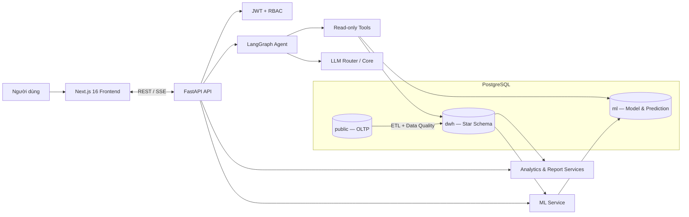

# EduInsight — Nền tảng AI Learning Analytics cho Khoa và Nhà trường

EduInsight biến dữ liệu học vụ rời rạc thành thông tin có thể hành động. Hệ thống kết hợp dashboard phân tích nhiều cấp, cây cơ cấu đào tạo, cảnh báo sớm bằng Machine Learning, báo cáo tự động và AI Agent để giúp nhà trường trả lời ba câu hỏi: **điều gì đang xảy ra, vì sao xảy ra và nên ưu tiên xử lý ở đâu**.

> Triết lý sản phẩm: **Nhìn tổng thể → drill-down chi tiết → hỏi bằng ngôn ngữ tự nhiên → hành động dựa trên bằng chứng.**

## 1. Đặt vấn đề

Trong một cơ sở đào tạo, dữ liệu sinh viên, điểm, lớp học phần, chuẩn đầu ra và chương trình đào tạo thường nằm ở nhiều bảng hoặc nhiều quy trình khác nhau. Người quản lý vì vậy gặp các khó khăn:

- khó nhìn thấy sức khỏe đào tạo từ cấp trường xuống khoa, ngành, chuyên ngành, môn, lớp và sinh viên;
- phát hiện sinh viên hoặc môn học có rủi ro quá muộn;
- phải tổng hợp báo cáo thủ công, khó truy vết số liệu và so sánh giữa các học kỳ;
- dashboard truyền thống cho biết “con số”, nhưng chưa hỗ trợ giải thích nguyên nhân;
- dùng LLM trực tiếp để dự đoán dễ tạo ra xác suất không kiểm chứng được;
- quyền xem dữ liệu giữa ban quản lý, giảng viên và người chỉ đọc cần được kiểm soát theo đúng phạm vi nghiệp vụ.

## 2. Sản phẩm giải quyết bài toán như thế nào?

EduInsight xây một luồng phân tích thống nhất:

```text
Dữ liệu học vụ vận hành
→ ETL và kiểm tra chất lượng
→ Data Warehouse phục vụ phân tích
→ mô hình ML chấm điểm rủi ro
→ dashboard / Academic Tree / báo cáo
→ AI Agent giải thích bằng ngôn ngữ tự nhiên
→ người phụ trách ra quyết định
```

Điểm cốt lõi là tách rõ trách nhiệm:

- **DWH** là nguồn dữ liệu lịch sử và KPI phân tích, không dùng trực tiếp các bảng CRUD như một kho dữ liệu.
- **ML** tạo prediction có phiên bản, thời điểm chấm và các yếu tố giải thích.
- **LLM/Agent** chỉ truy xuất và diễn giải dữ liệu DWH/ML; không tự bịa xác suất pass, trượt hoặc dropout.
- **Backend** là nơi xác thực quyền cuối cùng; việc ẩn menu ở frontend không thay thế kiểm tra RBAC tại API.

## 3. Đối tượng sử dụng và chức năng

| Actor | Phạm vi | Chức năng chính |
|:--|:--|:--|
| **Superadmin** | Toàn hệ thống | Quản trị tài khoản, toàn bộ dữ liệu, DWH/ML, báo cáo và nhật ký observability |
| **Admin** | Toàn hệ thống | Quản lý dữ liệu học vụ, tài khoản, cấu trúc đào tạo và vận hành báo cáo |
| **Manager** | Khoa/đơn vị được phân công | Xem analytics, quản lý dữ liệu trong phạm vi, theo dõi ngành, môn, lớp và rủi ro |
| **Lecturer** | Lớp giảng dạy hoặc lớp chủ nhiệm được gán rõ ràng | Xem lớp, sinh viên, điểm, phân tích môn/lớp; sử dụng Chat AI và báo cáo trong phạm vi |
| **Viewer** | Chỉ đọc theo phạm vi được cấp | Xem cơ cấu và dữ liệu được phép, không thực hiện thao tác ghi |

Sinh viên hiện là **đối tượng được phân tích**, chưa phải actor đăng nhập riêng. Quan hệ lớp giảng dạy và lớp chủ nhiệm được tách biệt; hệ thống không suy đoán trách nhiệm chủ nhiệm từ lớp học phần.

## 4. Các phân hệ chính

### Academic Tree và cơ cấu đào tạo

Cây học vụ chuẩn hóa theo cấu trúc:

```text
Trường → Khoa → Ngành/Chương trình → Chuyên ngành → Môn học
```

Người dùng có thể mở từng nhánh, xem KPI/health score, tìm kiếm, drill-down và chuyển ngữ cảnh sang Chat AI. Một môn có thể thuộc nhiều ngành hoặc chuyên ngành; sinh viên chưa đủ dữ liệu chuyên ngành được giữ ở trạng thái chưa phân loại thay vì suy đoán.

### Dashboard Learning Analytics

Các màn hình phân tích đi từ tổng quan tới chi tiết:

- toàn trường và khoa: quy mô, GPA, pass rate, xu hướng và đơn vị cần chú ý;
- ngành/chương trình: hiệu quả theo khóa, học kỳ và nhóm môn;
- môn học: phân bố điểm, tỷ lệ đạt/trượt và xu hướng;
- lớp học phần: hiệu quả lớp, tiến độ điểm và nhóm sinh viên cần hỗ trợ;
- lớp chủ nhiệm/sinh viên: hồ sơ học tập và tín hiệu rủi ro trong đúng phạm vi giảng viên.

Dashboard dùng aggregate API từ DWH cho các luồng chính, hỗ trợ bộ lọc học kỳ, khoa/ngành và liên kết drill-down giữa các cấp.

### Cảnh báo sớm bằng Machine Learning

Pipeline ML huấn luyện, đánh giá và chấm điểm nguy cơ dropout từ feature học vụ như GPA, tỷ lệ trượt, tín chỉ và lịch sử học tập. Prediction được lưu trong schema `ml` cùng model run, version, metric đánh giá, thời điểm chấm và yếu tố đóng góp.

Ngoài dropout risk, kiến trúc hỗ trợ prediction pass/trượt theo enrollment và tổng hợp expected passed/failed credits theo sinh viên–học kỳ. Agent chỉ đọc kết quả đã được mô hình tính sẵn.

### Contextual AI Chat

Chatbot sử dụng LangGraph và mô hình ReAct để định tuyến câu hỏi, gọi công cụ và trả lời theo ngữ cảnh. Các khả năng hiện có gồm:

- truy vấn dữ liệu học vụ bằng SQL chỉ đọc;
- tra cứu sinh viên và tính mức đạt CLO;
- đọc prediction dropout từ schema `ml`;
- giải thích KPI, so sánh kỳ và chuyển người dùng tới dashboard phù hợp;
- stream phản hồi bằng SSE, lưu phiên hội thoại và hỗ trợ chat toàn cục.

Agent có xử lý lỗi ba tầng: lỗi công cụ, retry node với lỗi tạm thời và khôi phục ở graph/tool loop.

### Report Center và Report Agent

Hệ thống lưu báo cáo dưới dạng snapshot có version thay vì tính lại và ghi đè lịch sử. Người dùng có thể tạo báo cáo theo trường/khoa/ngành/môn/lớp, xem narrative, bằng chứng, chất lượng dữ liệu, biểu đồ và gợi ý hành động.

Report Agent hỗ trợ hiểu yêu cầu tự nhiên, lập bản nháp và xem trước dữ liệu. Mọi thao tác ghi phải qua bước xác nhận; báo cáo tự động có scheduler và audit trail.

### Quản lý dữ liệu và chuẩn đầu ra

Các API/UI quản lý khoa, ngành, chuyên ngành, môn học, sinh viên, giảng viên, lớp học phần, học kỳ, khóa, enrollment và điểm. Hệ thống có mô hình CLO/PLO, mapping điểm thành phần và materialization kết quả đạt chuẩn phục vụ analytics và báo cáo.

### RBAC và Observability

- JWT authentication và phân quyền theo role, khoa, giảng viên, lớp học phần, sinh viên và báo cáo.
- Session, trace ID, structured event log, HTTP/chat/tool events và dashboard giám sát dành cho superadmin.
- Theo dõi người dùng hoạt động, thời lượng phiên, tỷ lệ lỗi, route lỗi và event log có bộ lọc.

## 5. Kiến trúc hệ thống



Một PostgreSQL instance được tách schema theo workload để giữ hạ tầng MVP gọn nhưng vẫn có ranh giới rõ:

| Schema | Trách nhiệm |
|:--|:--|
| `public` | OLTP: người dùng, cơ cấu đào tạo, sinh viên, lớp, điểm, CLO/PLO, chat và báo cáo |
| `dwh` | Dimensions, facts, dữ liệu lịch sử, ETL run và data-quality result |
| `ml` | Model run, prediction theo enrollment/sinh viên và kết quả tổng hợp |
| `staging` | Vùng tạm tùy chọn khi tích hợp nguồn dữ liệu thô phức tạp |

## 6. Công nghệ sử dụng

| Tầng | Công nghệ |
|:--|:--|
| Frontend | Next.js 16, React 19, TypeScript, Tailwind CSS 4, shadcn/ui/Base UI |
| Trực quan hóa | Recharts, cây học vụ và component dashboard tùy biến |
| Backend API | Python 3.11+, FastAPI, Uvicorn, Pydantic v2 |
| Database | PostgreSQL 16, SQLAlchemy 2 async, asyncpg, Alembic |
| AI Agent | LangGraph, LangChain Core, OpenAI-compatible/Gemini integration, SSE |
| Machine Learning | scikit-learn, XGBoost, pandas, NumPy, joblib |
| Auth & bảo mật | JWT, python-jose, passlib, CORS, role/row-level scope |
| Kiểm thử | pytest, pytest-asyncio, pytest-cov, Vitest, Testing Library, Playwright |
| Chất lượng code | Ruff, ESLint, TypeScript, GitHub Actions/verify scripts |
| Đóng gói & chạy | Docker, Docker Compose, Ngrok cho môi trường demo |

## 7. Tối ưu hóa và độ tin cậy

- **Async I/O:** FastAPI, SQLAlchemy async và SSE giúp các luồng API/chat không chặn lẫn nhau.
- **Đọc aggregate thay vì kéo raw data:** dashboard ưu tiên DWH và aggregate API; các index DWH hỗ trợ bộ lọc phổ biến.
- **Cache có phạm vi:** cache dashboard, Academic Tree, CLO health score và current user; dữ liệu dashboard được pre-warm khi backend khởi động và prefetch theo điều hướng frontend.
- **ETL idempotent:** chạy lại không tạo dòng trùng, có reconciliation và nhật ký chất lượng dữ liệu.
- **Model tiering:** router và core model cấu hình độc lập để cân bằng latency, chi phí và năng lực suy luận.
- **Giới hạn context:** SQL tool chỉ cho phép `SELECT`, kết nối read-only và giới hạn số dòng trả về để giảm rủi ro và token.
- **Version hóa dữ liệu:** Alembic là đường thay đổi schema duy nhất; report snapshot và ML model run giữ lịch sử có thể audit.
- **Quan sát xuyên suốt:** session ID, request/trace ID và event log nối frontend, API, chat và tool call.

## 8. Trạng thái hiện tại

Đã triển khai nền tảng chính gồm CRUD học vụ, Academic Tree 5 cấp, dashboard nhiều cấp, DWH/ETL, CLO/PLO, train/score dropout ML, Chat Agent, Report Center, RBAC và observability.

Các hướng đang tiếp tục hoàn thiện:

- workflow giao việc/can thiệp/follow-up từ insight thành đối tượng nghiệp vụ đầy đủ;
- mở rộng aggregate API và loại bỏ hoàn toàn việc aggregate raw data ở frontend;
- siết thêm write scope ở một số luồng quản trị;
- RAG corpus và retrieval production;
- data-quality center, model calibration/drift và export báo cáo hoàn chỉnh.

Tài liệu sprint và code là nguồn để xác định trạng thái chi tiết; không nên xem toàn bộ backlog trong PRD là tính năng đã phát hành.

## 9. Chạy dự án

### Yêu cầu

- Git
- Docker Desktop và Docker Compose v2
- Node.js 20+
- Python 3.11+ nếu chạy backend ngoài Docker

### Khởi động lần đầu trên Windows PowerShell

```powershell
git clone <repository-url>
cd C2-App-056

Copy-Item .env.example .env
Copy-Item backend/.env.example backend/.env
# Cập nhật SECRET_KEY và cấu hình LLM trong backend/.env khi cần dùng AI.

docker compose up --build -d

cd frontend
npm install
npm run dev
```

Migrations được chạy tự động khi backend container khởi động. Nếu database trống, seed runner sẽ nạp dữ liệu mẫu; không dùng `docker compose down -v` trong quy trình hằng ngày vì lệnh này xóa volume database.

| Dịch vụ | Địa chỉ |
|:--|:--|
| Frontend | <http://localhost:3000> |
| Backend API | <http://localhost:8000/api/v1> |
| Swagger UI | <http://localhost:8000/api/docs> |
| ReDoc | <http://localhost:8000/api/redoc> |
| Health check | <http://localhost:8000/health> |
| PostgreSQL | `localhost:5433` |

### Một số lệnh vận hành

```powershell
# Xem trạng thái và log
docker compose ps
docker compose logs -f backend

# Kiểm tra migration
docker compose exec backend alembic current

# Đồng bộ OLTP sang DWH
docker compose exec backend python -m app.analytics.etl

# Dừng dịch vụ nhưng giữ database
docker compose down
```

### Public URL bằng Ngrok

Xem [scripts/setup-ngrok.ps1](./scripts/setup-ngrok.ps1):

```powershell
# Production, ít bandwidth hơn dev/HMR
.\scripts\setup-ngrok.ps1 -Production

# Dev mode
.\scripts\setup-ngrok.ps1
```

Script sẽ cấu hình authtoken, mở tunnel port 3000, ghi `frontend/.env.local` và cập nhật `docs/12-Evaluation/demo-day-phase1.md`. Frontend (`npm run dev`) và backend (Docker hoặc uvicorn `:8000`) cần chạy trước khi smoke public URL.

## 10. Kiểm thử và chất lượng

```powershell
# Toàn bộ backend lint/test và frontend lint/test
.\scripts\verify.ps1

# Chỉ lint nhanh
.\scripts\verify.ps1 -Quick

# Bao gồm agent evaluation chậm và có thể tốn API token
.\scripts\verify.ps1 -AgentEval
```

Hoặc chạy riêng từng tầng:

```powershell
cd backend
ruff check .
pytest -q -m "not slow and not eval"

cd ../frontend
npm run lint
npm test
npm run test:e2e
```

## 11. Cấu trúc repository

```text
.
├── backend/                  # FastAPI, LangGraph, DWH/ETL, ML, reports
│   ├── app/
│   │   ├── agent/            # Graph, prompts, guardrails và tools
│   │   ├── analytics/        # ETL, metrics, CLO/PLO và dashboard queries
│   │   ├── api/v1/           # REST/SSE endpoints
│   │   ├── ml/               # Train, evaluate, score và aggregate prediction
│   │   ├── models/           # SQLAlchemy ORM — nguồn schema chuẩn
│   │   └── reports/          # Report service và scheduler
│   ├── migrations/           # Alembic revisions
│   └── tests/                # Backend tests
├── frontend/                 # Next.js App Router, dashboards, CRUD, chat, reports
├── docs/                     # PRD, kiến trúc, ADR, sprint và tài liệu nghiệp vụ
├── scripts/                  # Verify, setup và helper scripts
└── docker-compose.yml        # PostgreSQL + backend local stack
```

## 12. Tài liệu nên đọc

1. [Chỉ mục và thứ tự thẩm quyền tài liệu](docs/README.md)
2. [Product Requirements Document](docs/02-PRD/PRD.md)
3. [Kiến trúc hệ thống](docs/10-References/SystemArchitecture.md)
4. [Kiến trúc ML và Data Warehouse](docs/10-References/ML_DWH_Architecture.md)
5. [Kế hoạch hiện đại hóa database](docs/10-References/DatabaseModernizationPlan.md)
6. [Sprint đang hoạt động](docs/07-Sprint-Planning/Sprint3.md)
7. [Architecture Decision Records](docs/decisions/README.md)
8. [Hướng dẫn setup chi tiết](docs/10-References/ProjectSetup.md)

## 13. Nguyên tắc phát triển quan trọng

- Không tạo xác suất ML bằng LLM; Agent chỉ giải thích prediction từ schema `ml`.
- Không dùng bảng CRUD `public` trực tiếp như DWH cho analytics lịch sử.
- Không sửa migration đã áp dụng ở môi trường dùng chung; tạo Alembic revision mới.
- Không suy đoán chuyên ngành hoặc lớp chủ nhiệm từ tên lớp, tên môn hay phân công giảng dạy.
- Mọi thay đổi database, API contract hoặc hành vi Agent phải đọc ADR liên quan trước.
