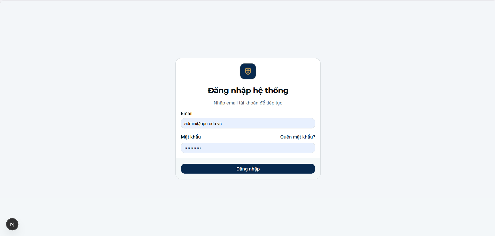
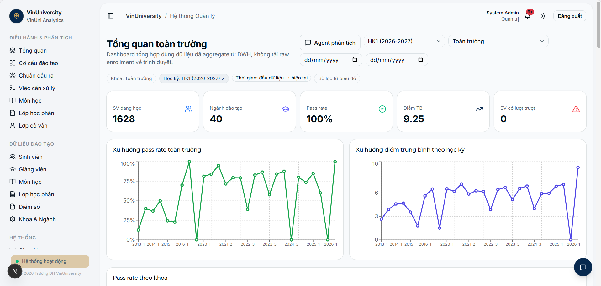
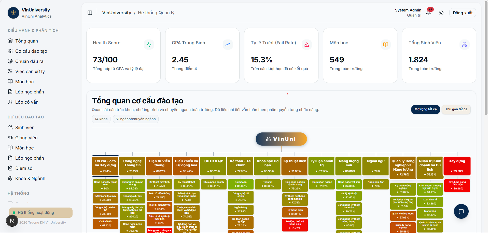
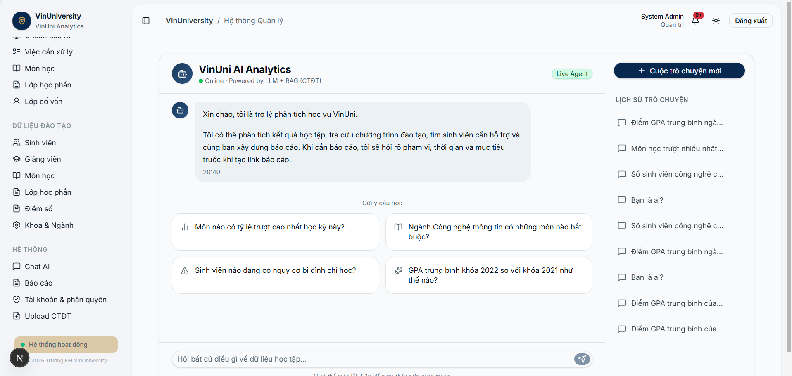
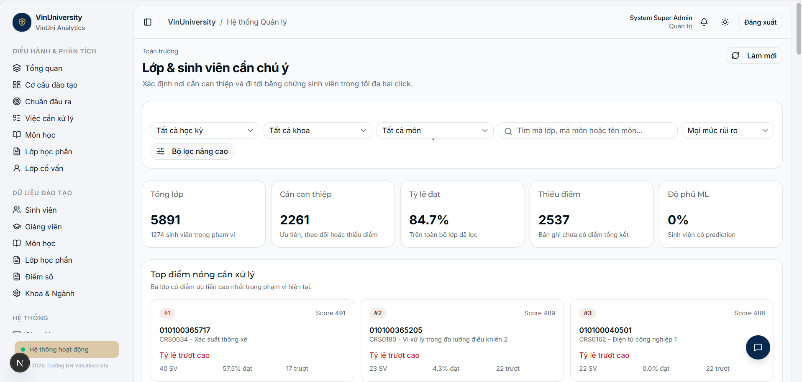
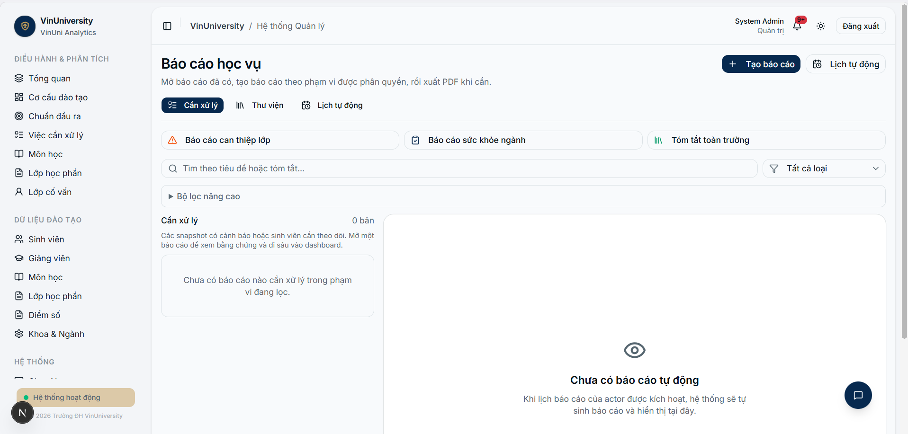
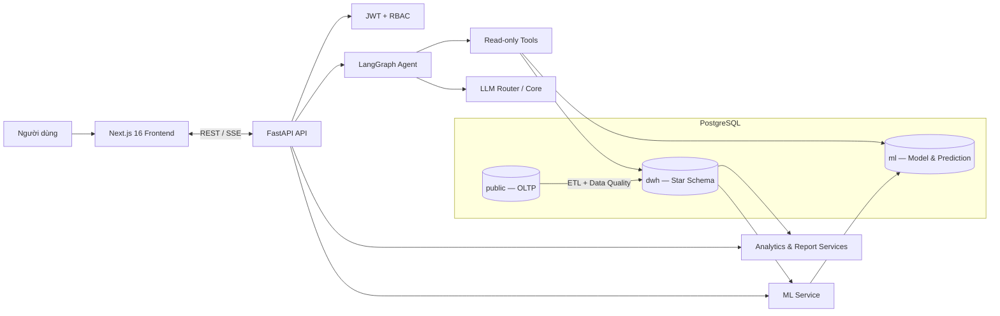

# EduInsight — Nền tảng AI Learning Analytics cho Khoa và Nhà trường

EduInsight biến dữ liệu học vụ rời rạc thành thông tin có thể hành động. Hệ thống kết hợp dashboard phân tích nhiều cấp, cây cơ cấu đào tạo, cảnh báo sớm bằng Machine Learning, báo cáo tự động và AI Agent để giúp nhà trường trả lời ba câu hỏi: **điều gì đang xảy ra, vì sao xảy ra và nên ưu tiên xử lý ở đâu**.

> Triết lý sản phẩm: **Nhìn tổng thể → drill-down chi tiết → hỏi bằng ngôn ngữ tự nhiên → hành động dựa trên bằng chứng.**

## Bản demo trực tuyến (Live)

| Thành phần | URL |
|:--|:--|
| **Ứng dụng (Frontend)** | <https://c2-app-056.vercel.app> |
| **Backend API** | <https://edu-insight.duckdns.org/api/v1> |
| **Swagger UI** | <https://edu-insight.duckdns.org/api/docs> |
| **Health check** | <https://edu-insight.duckdns.org/health> |

**Tài khoản demo:** `admin@epu.edu.vn` / `123456`

> Frontend chạy trên **Vercel** (region Singapore); backend trên **AWS EC2 Singapore** (Docker: FastAPI + PostgreSQL pgvector 18 + Caddy auto-TLS), database được backup tự động hằng đêm. Dashboard phục vụ từ cache prewarm dùng chung — đo thực tế **0.3–0.5s** từ Việt Nam. Uptime theo dõi bằng UptimeRobot. Chi tiết vận hành: [deploy/README.md](deploy/README.md).

## Ảnh chụp màn hình

|  |  |
|:--:|:--:|
|  |  |
| *Đăng nhập theo vai trò (RBAC)* | *Dashboard Learning Analytics — KPI, chart, bộ lọc* |
|  |  |
| *Academic Tree 5 cấp + panel insight* | *Chat AI hỏi đáp bằng tiếng Việt* |
|  |  |
| *Cảnh báo sinh viên rủi ro + luồng liên hệ GV* | *Report Center — báo cáo snapshot có version* |

> Bộ ảnh đầy đủ mọi màn hình demo: [docs/21-Release-Readiness/screenshots/](docs/21-Release-Readiness/screenshots/)

## 1. Bài toán

Dữ liệu sinh viên, điểm, lớp học phần, chuẩn đầu ra và chương trình đào tạo trong một cơ sở đào tạo thường nằm rải rác ở nhiều bảng, nhiều quy trình. Hệ quả:

- khó nhìn thấy sức khỏe đào tạo từ cấp trường xuống khoa, ngành, chuyên ngành, môn, lớp và sinh viên;
- phát hiện sinh viên hoặc môn học có rủi ro quá muộn;
- tổng hợp báo cáo thủ công, khó truy vết số liệu và so sánh giữa các học kỳ;
- dashboard truyền thống cho biết "con số" nhưng không giải thích nguyên nhân;
- dùng LLM trực tiếp để dự đoán tạo ra xác suất không kiểm chứng được;
- quyền xem dữ liệu giữa quản lý, giảng viên và người chỉ đọc cần kiểm soát theo đúng phạm vi nghiệp vụ.

## 2. Cách EduInsight giải quyết

Một luồng phân tích thống nhất:

```text
Dữ liệu học vụ vận hành
→ ETL và kiểm tra chất lượng
→ Data Warehouse phục vụ phân tích
→ mô hình ML chấm điểm rủi ro
→ dashboard / Academic Tree / báo cáo
→ AI Agent giải thích bằng ngôn ngữ tự nhiên
→ người phụ trách ra quyết định
```

Điểm cốt lõi là tách rõ trách nhiệm:

- **DWH** là nguồn dữ liệu lịch sử và KPI phân tích; không dùng trực tiếp bảng CRUD làm kho phân tích.
- **ML** tạo prediction có phiên bản, thời điểm chấm và yếu tố giải thích.
- **LLM/Agent** chỉ truy xuất và diễn giải dữ liệu DWH/ML; không tự bịa xác suất pass, trượt hoặc dropout.
- **Backend** là nơi xác thực quyền cuối cùng; ẩn menu ở frontend không thay thế kiểm tra RBAC tại API.

## 3. Đối tượng sử dụng

| Actor | Phạm vi | Chức năng chính |
|:--|:--|:--|
| **Superadmin** | Toàn hệ thống | Quản trị tài khoản, toàn bộ dữ liệu, DWH/ML, báo cáo và observability |
| **Admin** | Toàn hệ thống | Quản lý dữ liệu học vụ, tài khoản, cơ cấu đào tạo và vận hành báo cáo |
| **Manager** | Khoa/đơn vị được phân công | Analytics, quản lý dữ liệu trong phạm vi, theo dõi ngành, môn, lớp và rủi ro |
| **Lecturer** | Lớp giảng dạy / lớp chủ nhiệm được gán | Xem lớp, sinh viên, điểm, phân tích môn/lớp; Chat AI và báo cáo trong phạm vi |
| **Viewer** | Chỉ đọc theo phạm vi được cấp | Xem cơ cấu và dữ liệu được phép, không thao tác ghi |

Sinh viên hiện là **đối tượng được phân tích**, chưa phải actor đăng nhập riêng. Lớp giảng dạy và lớp chủ nhiệm được tách biệt; hệ thống không suy đoán trách nhiệm chủ nhiệm từ lớp học phần.

## 4. Các phân hệ chính

### Academic Tree và cơ cấu đào tạo

Cây học vụ 5 cấp: `Trường → Khoa → Ngành/Chương trình → Chuyên ngành → Môn học`. Người dùng mở từng nhánh, xem KPI/health score, tìm kiếm, drill-down và chuyển ngữ cảnh sang Chat AI. Một môn có thể thuộc nhiều ngành/chuyên ngành; sinh viên chưa đủ dữ liệu chuyên ngành được giữ ở trạng thái chưa phân loại thay vì suy đoán.

### Dashboard Learning Analytics

Các màn hình phân tích đi từ tổng quan tới chi tiết: toàn trường/khoa (quy mô, GPA, pass rate, xu hướng), ngành/chương trình (hiệu quả theo khóa, học kỳ, nhóm môn), môn học (phân bố điểm, tỷ lệ đạt/trượt), lớp học phần (tiến độ điểm, nhóm sinh viên cần hỗ trợ) và lớp chủ nhiệm/sinh viên (hồ sơ học tập, tín hiệu rủi ro trong đúng phạm vi giảng viên). Dashboard đọc aggregate API từ DWH, hỗ trợ bộ lọc học kỳ, khoa/ngành và deep link giữa các cấp.

### Cảnh báo sớm bằng Machine Learning

Pipeline ML huấn luyện, đánh giá và chấm điểm nguy cơ dropout từ feature học vụ (GPA, tỷ lệ trượt, tín chỉ, lịch sử học tập). Prediction lưu trong schema `ml` cùng model run, version, metric đánh giá, thời điểm chấm và yếu tố đóng góp. Kiến trúc cũng hỗ trợ prediction pass/trượt theo enrollment và tổng hợp expected credits theo sinh viên–học kỳ. Agent chỉ đọc kết quả mô hình đã tính sẵn.

### Contextual AI Chat (LangGraph Agent)

Chatbot xây trên **LangGraph** theo mô hình **ReAct** với model tiering (router model định tuyến, core model suy luận):

- truy vấn dữ liệu học vụ bằng SQL chỉ đọc (chỉ `SELECT`, kết nối read-only, giới hạn số dòng);
- tra cứu sinh viên, tính mức đạt CLO, đọc prediction dropout từ schema `ml`;
- giải thích KPI, so sánh kỳ và điều hướng người dùng tới dashboard phù hợp;
- stream phản hồi bằng SSE, lưu phiên hội thoại, chat toàn cục và chat theo ngữ cảnh màn hình;
- xử lý lỗi ba tầng: lỗi công cụ, retry node với lỗi tạm thời, khôi phục ở graph/tool loop.

Chi tiết kiến trúc và luồng hoạt động: [AgentFlowDiagram.md](docs/10-References/AgentFlowDiagram.md) · phương pháp đánh giá agent: [agent_eval_methodology.md](docs/12-Evaluation/agent_eval_methodology.md).

### Report Center và Report Agent

Báo cáo lưu dạng snapshot có version thay vì tính lại và ghi đè lịch sử. Người dùng tạo báo cáo theo trường/khoa/ngành/môn/lớp với narrative, bằng chứng, chất lượng dữ liệu, biểu đồ và gợi ý hành động. Report Agent hiểu yêu cầu tự nhiên, lập bản nháp và xem trước dữ liệu; mọi thao tác ghi phải qua bước xác nhận; báo cáo tự động có scheduler và audit trail.

### Quản lý dữ liệu và chuẩn đầu ra

API/UI quản lý khoa, ngành, chuyên ngành, môn học, sinh viên, giảng viên, lớp học phần, học kỳ, khóa, enrollment và điểm. Mô hình CLO/PLO với mapping điểm thành phần và materialization kết quả đạt chuẩn phục vụ analytics và báo cáo.

### RBAC và Observability

JWT authentication, phân quyền theo role và phạm vi (khoa, giảng viên, lớp học phần, sinh viên, báo cáo). Session, trace ID, structured event log, HTTP/chat/tool events và dashboard giám sát cho superadmin: người dùng hoạt động, thời lượng phiên, tỷ lệ lỗi, route lỗi.

## 5. Kiến trúc hệ thống



Một PostgreSQL instance tách schema theo workload — hạ tầng gọn nhưng ranh giới rõ:

| Schema | Trách nhiệm |
|:--|:--|
| `public` | OLTP: người dùng, cơ cấu đào tạo, sinh viên, lớp, điểm, CLO/PLO, chat và báo cáo |
| `dwh` | Dimensions, facts, dữ liệu lịch sử, ETL run và data-quality result |
| `ml` | Model run, prediction theo enrollment/sinh viên và kết quả tổng hợp |

Các quyết định kiến trúc quan trọng được ghi thành ADR: [danh mục ADR](docs/decisions/README.md) — tiêu biểu [LangGraph thay vì LangChain thuần](docs/decisions/0002-langgraph-over-langchain.md), [model tiering](docs/decisions/0003-openai-model-tiering.md), [một PostgreSQL đa schema](docs/decisions/0005-single-postgres-multi-schema.md), [ranh giới ML–Agent](docs/decisions/0006-ml-agent-boundary.md), [giới hạn concurrency agent](docs/decisions/0011-agent-concurrency-limiter.md), [EC2 production hosting](docs/decisions/0012-aws-ec2-production-hosting.md).

## 6. Công nghệ sử dụng

| Tầng | Công nghệ |
|:--|:--|
| Frontend | Next.js 16, React 19, TypeScript, Tailwind CSS 4, shadcn/ui, Recharts |
| Backend API | Python 3.11+, FastAPI, Uvicorn, Pydantic v2 |
| Database | PostgreSQL (pgvector 16 local / 18 production), SQLAlchemy 2 async, asyncpg, Alembic |
| AI Agent | LangGraph, LangChain Core, OpenAI-compatible/Gemini, SSE streaming |
| Machine Learning | scikit-learn, XGBoost, pandas, NumPy, joblib |
| Auth & bảo mật | JWT, python-jose, passlib, CORS, role/row-level scope |
| Kiểm thử | pytest, pytest-asyncio, pytest-cov, Vitest, Testing Library, Playwright |
| Chất lượng code | Ruff, ESLint, TypeScript, verify scripts |
| Triển khai | Docker Compose; Vercel (frontend) + AWS EC2 với Caddy auto-TLS (backend) |

## 7. Độ tin cậy và tối ưu

- **Async I/O xuyên suốt:** FastAPI, SQLAlchemy async và SSE — các luồng API/chat không chặn lẫn nhau.
- **Đọc aggregate từ DWH** thay vì kéo raw data; cache có phạm vi cho dashboard, Academic Tree, CLO health score; dữ liệu dashboard pre-warm khi backend khởi động.
- **ETL idempotent:** chạy lại không tạo dòng trùng, có reconciliation và nhật ký chất lượng dữ liệu.
- **Version hóa:** Alembic là đường thay đổi schema duy nhất; report snapshot và ML model run giữ lịch sử audit được.
- **Observability:** session ID, request/trace ID và event log nối frontend, API, chat và tool call.
- **Backup:** pg_dump tự động hằng đêm trên production, kèm script verify ([deploy/](deploy/)).

## 8. Chạy dự án local

### Yêu cầu

- Git, Docker Desktop (Compose v2), Node.js 20+
- Python 3.11+ nếu chạy backend ngoài Docker

### Khởi động lần đầu (Windows PowerShell)

```powershell
git clone <repository-url>
cd C2-App-056

Copy-Item .env.example .env
Copy-Item backend/.env.example backend/.env
# Cập nhật SECRET_KEY và cấu hình LLM trong backend/.env khi cần dùng AI.

docker compose up --build -d

cd frontend
npm install
npm run dev
```

Migrations chạy tự động khi backend container khởi động; database trống sẽ được seed dữ liệu mẫu. Không dùng `docker compose down -v` trong quy trình hằng ngày vì lệnh này xóa volume database.

| Dịch vụ | Địa chỉ |
|:--|:--|
| Frontend | <http://localhost:3000> |
| Backend API | <http://localhost:8000/api/v1> |
| Swagger UI | <http://localhost:8000/api/docs> |
| Health check | <http://localhost:8000/health> |
| PostgreSQL | `localhost:5433` |

### Một số lệnh vận hành

```powershell
docker compose logs -f backend                          # log backend
docker compose exec backend alembic current             # kiểm tra migration
docker compose exec backend python -m app.analytics.etl # đồng bộ OLTP → DWH
docker compose down                                     # dừng, giữ database
```

## 9. Kiểm thử và chất lượng

```powershell
.\scripts\verify.ps1            # toàn bộ backend + frontend lint/test
.\scripts\verify.ps1 -Quick     # chỉ lint nhanh
.\scripts\verify.ps1 -AgentEval # kèm agent evaluation (chậm, tốn API token)
```

Hoặc chạy riêng từng tầng:

```powershell
cd backend
ruff check .
pytest -q -m "not slow and not eval"

cd ../frontend
npm run lint
npm test
npm run test:e2e
```

## 10. Cấu trúc repository

```text
.
├── backend/                  # FastAPI, LangGraph, DWH/ETL, ML, reports
│   ├── app/
│   │   ├── agent/            # Graph, prompts, guardrails và tools
│   │   ├── analytics/        # ETL, metrics, CLO/PLO và dashboard queries
│   │   ├── api/v1/           # REST/SSE endpoints
│   │   ├── ml/               # Train, evaluate, score và aggregate prediction
│   │   ├── models/           # SQLAlchemy ORM — nguồn schema chuẩn
│   │   └── reports/          # Report service và scheduler
│   ├── migrations/           # Alembic revisions
│   └── tests/                # Backend tests
├── frontend/                 # Next.js App Router: dashboards, CRUD, chat, reports
├── deploy/                   # Production deploy, Caddyfile, backup scripts
├── docs/                     # PRD, kiến trúc, ADR, sprint và tài liệu nghiệp vụ
├── scripts/                  # Verify, setup và helper scripts
└── docker-compose.yml        # PostgreSQL + backend local stack
```

## 11. Tài liệu nên đọc

1. [Chỉ mục và thứ tự thẩm quyền tài liệu](docs/README.md)
2. [Product Requirements Document](docs/02-PRD/PRD.md)
3. [Kiến trúc hệ thống](docs/10-References/SystemArchitecture.md)
4. [Kiến trúc AI Agent — Agent Flow Diagram](docs/10-References/AgentFlowDiagram.md)
5. [Kiến trúc ML và Data Warehouse](docs/10-References/ML_DWH_Architecture.md)
6. [Architecture Decision Records](docs/decisions/README.md)
7. [Đánh giá agent — phương pháp và kết quả](docs/12-Evaluation/agent_eval_methodology.md)
8. [Hướng dẫn setup chi tiết](docs/10-References/ProjectSetup.md)

## 12. Nguyên tắc phát triển quan trọng

- Không tạo xác suất ML bằng LLM; Agent chỉ giải thích prediction từ schema `ml`.
- Không dùng bảng CRUD `public` trực tiếp như DWH cho analytics lịch sử.
- Không sửa migration đã áp dụng ở môi trường dùng chung; tạo Alembic revision mới.
- Không suy đoán chuyên ngành hoặc lớp chủ nhiệm từ tên lớp, tên môn hay phân công giảng dạy.
- Mọi thay đổi database, API contract hoặc hành vi Agent phải đọc ADR liên quan trước.
