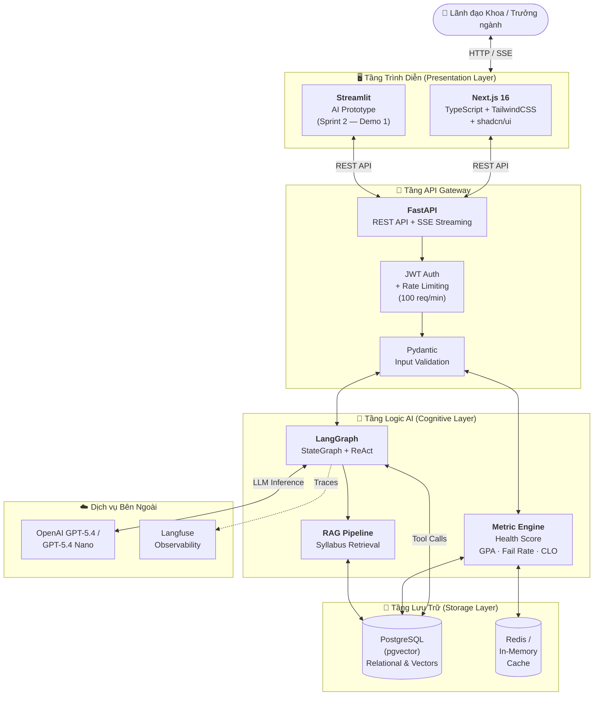
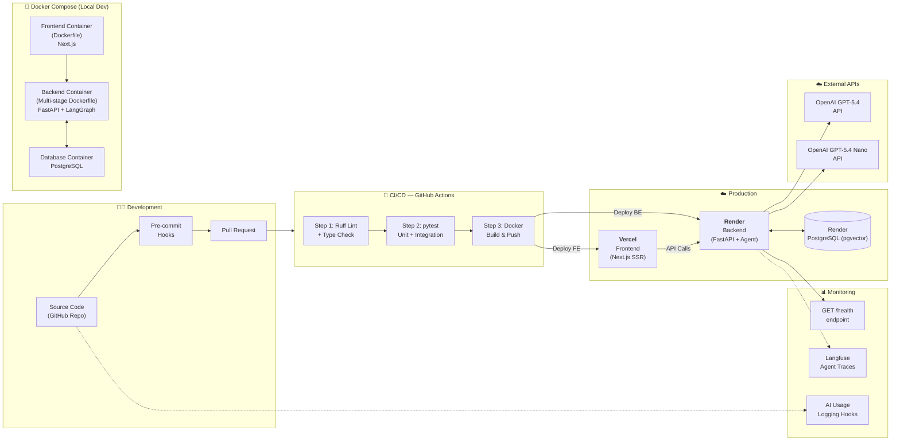
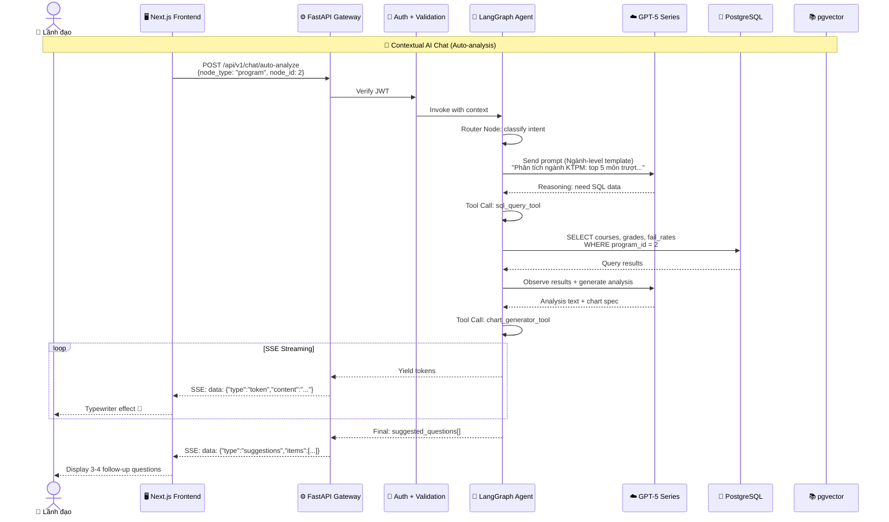
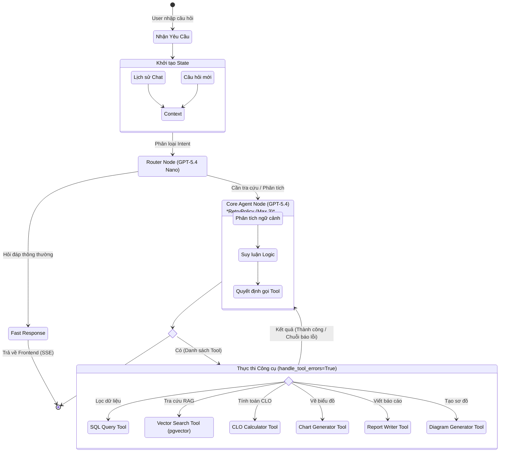

# Starter Code Template — Cohort 2

Empty starter template for AI20K Build Cohort 2 team repositories. Includes pre-configured AI usage logging hooks for Claude Code, Cursor, Codex, Gemini CLI, Antigravity, and GitHub Copilot.

## Structure

```
├── scripts/
│   ├── _pyrun.sh             # Cross-platform Python launcher (bash)
│   ├── _pyrun.cmd            # Cross-platform Python launcher (Windows)
│   ├── setup_hooks.sh        # One-time pre-push hook installer (POSIX)
│   ├── setup_hooks.ps1       # One-time pre-push hook installer (Windows)
│   ├── log_hook.py           # AI tool hook handler (Claude / Cursor / Codex / Gemini / Copilot)
│   ├── log_antigravity.py    # Auto-log hook for Antigravity
│   ├── log_manual.py         # Manual log for ChatGPT / web tools
│   └── submit_log.py         # Submits logs on git push
├── .agents/                  # Antigravity rules + workflows
├── .claude/  .codex/  .cursor/  .gemini/  .github/hooks/   # Per-tool hook configs
├── .env.example
├── JOURNAL.md                # Weekly journal — product journey & learnings
└── WORKLOG.md                # Technical decisions, task assignments, brainstorming
```

## Getting Started

### 1. Clone and install pre-push hook

**Linux / macOS / Git Bash:**
```bash
git clone <repo-url>
cd <repo>
bash scripts/setup_hooks.sh
```

**Windows PowerShell:**
```powershell
git clone <repo-url>
cd <repo>
powershell -ExecutionPolicy Bypass -File scripts\setup_hooks.ps1
```

### 2. Configure environment

```bash
cp .env.example .env       # macOS / Linux / Git Bash
# copy .env.example .env   # Windows cmd
```

Fill in `AI_LOG_SERVER` and `AI_LOG_API_KEY` (provided by the course).

### 3. Run the application (Local Environment)

To reproduce the full stack locally:

1. **Backend & Database**:
   ```powershell
   # Run at project root directory
   docker-compose up -d
   ```
2. **Frontend (Next.js)**:
   ```powershell
   cd frontend
   # Note for Windows users: if PowerShell blocks npm script execution, use npm.cmd
   npm.cmd run dev   # or "npm run dev" on macOS/Linux
   ```
3. **Ngrok Tunnel (Public Server Access)**:
   ```powershell
   # Run at project root directory to use the local ngrok executable
   .\ngrok_dir\ngrok.exe http 3000
   ```
   **Public Server URL:** [https://spectrum-dullness-ambiguous.ngrok-free.dev](https://spectrum-dullness-ambiguous.ngrok-free.dev)

## Weekly Journal

Update **[JOURNAL.md](./JOURNAL.md)** at the end of every week:

- Features shipped
- AI tools used and how they helped
- Hardest problem of the week and how you solved it
- What you'd do differently
- Plan for next week

> JOURNAL.md **must be updated** before each PR — it is your learning record for the course.

## Worklog

Update **[WORKLOG.md](./WORKLOG.md)** whenever your team makes a technical decision or changes direction:

- **Technical decisions** — why this approach over alternatives?
- **Task assignments** — who does what, by when
- **Brainstorming** — options considered, pros / cons, conclusion
- **Important bugs** — root cause and fix

## AI Logging

Prompts and tool calls are **automatically logged** when you use any supported AI tool (Claude Code, Cursor, Codex, Gemini, Antigravity, Copilot). No manual steps needed after running `setup_hooks`.

For ChatGPT or other web tools, log manually:

```bash
# POSIX
bash scripts/_pyrun.sh scripts/log_manual.py --tool chatgpt --prompt "<what you did>"

# Windows
scripts\_pyrun.cmd scripts\log_manual.py --tool chatgpt --prompt "<what you did>"
```

### Python requirements

The hook system needs **one** of: `python3`, `python`, or `py` on PATH.

| OS | Recommended install |
|---|---|
| Windows | Python 3 from [python.org](https://www.python.org/downloads/) — installer adds both `python` and `py` to PATH |
| Ubuntu / Debian | `sudo apt install python3` (already preinstalled on most distros) |
| macOS | `brew install python3` or use system Python 3 |

The `scripts/_pyrun.*` wrappers detect whichever is available — students do not need to alias `python3` → `python`.

## System Architecture

Dự án EduInsight sử dụng kiến trúc 4 tầng, tối ưu cho RAG và AI Agent với PostgreSQL (`pgvector`) đóng vai trò trung tâm cho cả dữ liệu quan hệ và vector.

### 1. High-Level System Overview



### 2. Deployment & DevOps Topology



### 3. Data Flow — Contextual AI Chat



### 4. Agent Flow Diagram


