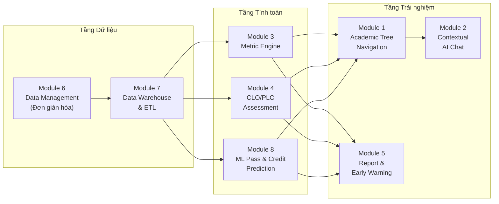
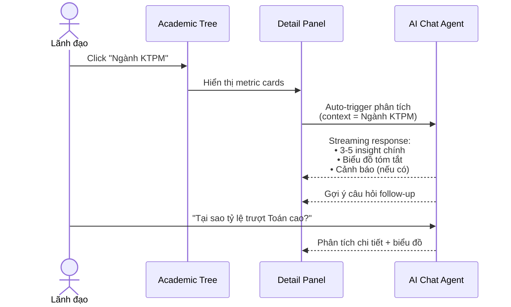
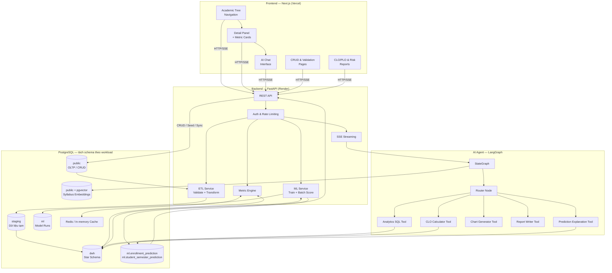
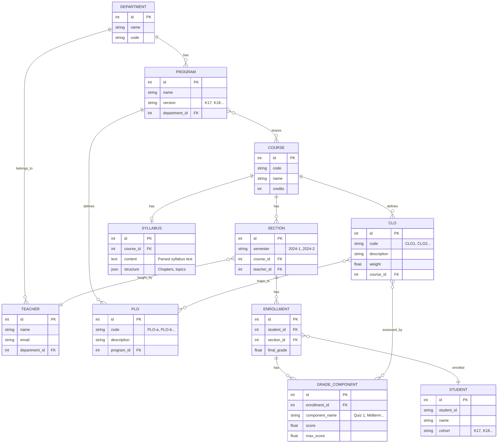
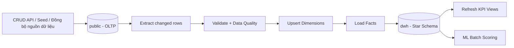
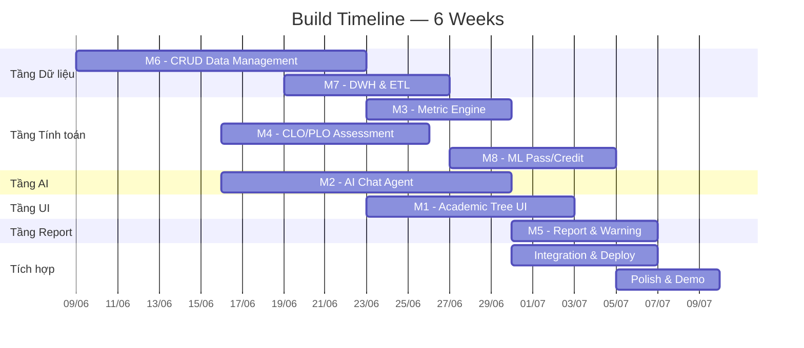

# 📄 Product Requirements Document (PRD) — AI Phân Tích Học Tập

> **Phiên bản:** v2.0 · Ngày tạo: 06/06/2026 · Cập nhật: 07/06/2026

## Tổng quan sản phẩm

**EduInsight** là hệ thống AI phân tích học tập dành cho cấp Khoa/Nhà trường. Sản phẩm lấy **Academic Tree** làm trung tâm — một cây phân cấp trực quan (Trường → Khoa → Ngành → Môn học) mà mỗi node đều gắn metric sức khỏe đào tạo. Khi click vào bất kỳ node nào, hệ thống tự động phân tích và mở giao diện chatbot theo ngữ cảnh, cho phép lãnh đạo đặt câu hỏi bằng ngôn ngữ tự nhiên.

### Triết lý thiết kế

> **"Nhìn tổng thể — Drill-down chi tiết — Hỏi bằng ngôn ngữ tự nhiên"**

Thay vì tách biệt Dashboard và AI Chat thành 2 trang riêng, EduInsight hợp nhất chúng thành một trải nghiệm liền mạch: **Navigate → See → Ask → Act**.

---

## 1. Feature Specifications

### Tổng quan kiến trúc tính năng

Hệ thống được chia thành **8 module**, có thể phát triển song song và tích hợp dần. Module 7-8 là phần bổ sung bắt buộc để sản phẩm có nền tảng DWH và predictive analytics đúng với định vị learning analytics:



> Mỗi module có thể chạy và test độc lập. Khi tích hợp, chúng tạo thành trải nghiệm Academic Tree hoàn chỉnh.

---

### Module 1: Academic Tree Navigation 🌳

**Mục đích:** Cung cấp cây phân cấp trực quan làm backbone điều hướng toàn hệ thống.

**Cấu trúc cây:**

```
🏫 University (root)
├── 🏛️ Khoa CNTT
│   ├── 📚 Ngành Khoa học Máy tính    [🟢 85%]
│   ├── 📚 Ngành Kỹ thuật Phần mềm    [🟡 72%]
│   └── 📚 Ngành Trí tuệ Nhân tạo     [🔴 58%]
├── 🏛️ Khoa Điện tử
│   ├── 📚 Ngành Điện tử Viễn thông   [🟢 80%]
│   └── 📚 Ngành Tự động hóa          [🟡 68%]
└── ...
```

| Feature | Mô tả | Độc lập? | Priority |
|:--------|:-------|:--------:|:--------:|
| Tree Rendering | Hiển thị cây phân cấp dạng collapsible tree hoặc treemap, expand/collapse từng nhánh | ✅ | P0 |
| Health Badge | Mỗi node hiển thị badge màu (🟢🟡🔴) dựa trên composite score từ Module 3 | Cần M3 | P0 |
| Node Detail Panel | Click node → mở panel bên phải hiển thị metric cards tóm tắt (GPA avg, tỷ lệ trượt, CLO achievement %) | Cần M3 | P0 |
| Breadcrumb Navigation | Thanh breadcrumb hiển thị đường đi: University > Khoa CNTT > Ngành KTPM | ✅ | P0 |
| Search & Filter | Tìm kiếm nhanh node theo tên, lọc theo health status | ✅ | P1 |
| Responsive Layout | Tree sidebar (desktop) → drawer (mobile) | ✅ | P1 |

**Trạng thái node:**

| Màu | Composite Score | Ý nghĩa |
|:---:|:---------------:|:---------|
| 🟢 Xanh | ≥ 75% | Đào tạo hiệu quả, đạt chuẩn |
| 🟡 Vàng | 50% – 74% | Cần theo dõi, có điểm yếu |
| 🔴 Đỏ | < 50% | Cần can thiệp, nhiều chỉ số chưa đạt |

---

### Module 2: Contextual AI Chat 💬

**Mục đích:** Khi click vào bất kỳ node nào trên Academic Tree, hệ thống mở giao diện chat đã được gắn ngữ cảnh (contextual), tự động phân tích tình hình và cho phép hỏi thêm.

**User Flow:**



| Feature | Mô tả | Độc lập? | Priority |
|:--------|:-------|:--------:|:--------:|
| Auto-Analysis on Node Click | Click node → AI tự động chạy phân tích overview, streaming output | Cần M1, M3 | P0 |
| Suggested Questions | Sau auto-analysis, hiển thị 3-4 câu hỏi gợi ý dựa trên context | ✅ | P0 |
| Natural Language Query | User gõ câu hỏi tự nhiên: "Môn nào trượt nhiều nhất K18?", "So sánh GPA K17 vs K18" | ✅ | P0 |
| Streaming Response (SSE) | Response hiển thị theo kiểu typewriter, giảm thời gian chờ cảm nhận | ✅ | P0 |
| Inline Chart Generation | AI tự tạo biểu đồ (bar, line, pie) nhúng trực tiếp trong câu trả lời | ✅ | P0 |
| Inline Diagram (Mermaid) | AI sinh sơ đồ quan hệ, flow diagram dạng Mermaid nhúng trong response (tham khảo NotebookLM) | ✅ | P1 |
| Context Switching | Khi chuyển sang node khác, chat session mới với context mới, session cũ lưu lại | Cần M1 | P1 |
| Tool Calling (ReAct) | Agent tự gọi tools: query DB, tính CLO, generate chart, theo pattern Plan → Execute → Observe | ✅ | P0 |
| Conversation Memory | Nhớ context trong session, cho phép câu hỏi nối tiếp | ✅ | P1 |
| Source Citation | Trích dẫn nguồn dữ liệu (bảng, cột, query) trong câu trả lời | ✅ | P2 |

**Prompt Templates theo cấp:**

| Cấp | Auto-Analysis Prompt | Ví dụ output |
|:----|:---------------------|:-------------|
| Khoa | "Phân tích tổng quan Khoa {name}: số ngành, GPA trung bình, ngành mạnh/yếu, xu hướng 3 năm" | Tóm tắt 5 dòng + bar chart so sánh ngành |
| Ngành | "Phân tích ngành {name}: top 5 môn trượt, CLO achievement, so sánh khóa gần nhất" | Bảng môn trượt + trend chart + cảnh báo |
| Môn học | "Phân tích môn {name}: điểm trung bình theo khóa, phân bố điểm, CLO nào chưa đạt" | Histogram + CLO heatmap |

---

### Module 3: Metric Engine 📊

**Mục đích:** Tính toán và cache các chỉ số sức khỏe đào tạo cho từng node trên cây. Đây là "bộ não số liệu" cung cấp dữ liệu cho cả Tree, Chat và Report.

| Feature | Mô tả | Độc lập? | Priority |
|:--------|:-------|:--------:|:--------:|
| Composite Health Score | Tính điểm tổng hợp cho mỗi node: `0.4 × GPA_norm + 0.3 × (1 - fail_rate) + 0.3 × CLO_achievement` | Cần M6 | P0 |
| GPA Aggregation | Tính GPA trung bình theo nhiều chiều: khoa, ngành, khóa, học kỳ, giảng viên | Cần M6 | P0 |
| Fail Rate Calculation | Tỷ lệ trượt theo môn, ngành, khóa. Hỗ trợ drill-down | Cần M6 | P0 |
| Trend Detection | Phát hiện xu hướng tăng/giảm GPA, tỷ lệ trượt qua các học kỳ | Cần M6 | P0 |
| Anomaly Detection | Phát hiện bất thường: tỷ lệ trượt tăng đột biến, GPA drop > 0.5 so với baseline | Cần M6 | P1 |
| Cross-Cohort Comparison | So sánh K17 vs K18 vs K19 theo mọi metric | Cần M6 | P1 |
| Metric Caching | Cache kết quả tính toán, invalidate khi data thay đổi. Giảm latency khi click node | ✅ | P1 |
| Bottleneck Identification | Xác định môn "nút thắt": trượt nhiều và ảnh hưởng chuỗi tiên quyết | Cần M6 | P2 |

**Công thức Composite Health Score:**

```
health_score = w1 × GPA_normalized + w2 × (1 - fail_rate) + w3 × CLO_achievement_rate

Trong đó:
  - GPA_normalized = GPA_avg / 4.0 (thang 4)
  - fail_rate = số SV trượt / tổng SV (threshold: điểm < 5.0 hoặc F)
  - CLO_achievement_rate = số CLO đạt / tổng CLO (threshold cấu hình)
  - w1 = 0.4, w2 = 0.3, w3 = 0.3 (cấu hình được)
```

---

### Module 4: CLO/PLO Assessment 🎯

**Mục đích:** Tự động hóa quy trình đánh giá chuẩn đầu ra theo chuẩn ABET/AUN, từ mapping điểm → CLO → PLO.

| Feature | Mô tả | Độc lập? | Priority |
|:--------|:-------|:--------:|:--------:|
| CLO Definition | Định nghĩa CLO cho từng môn học (code, mô tả, trọng số) | ✅ | P0 |
| PLO Definition | Định nghĩa PLO cho từng chương trình đào tạo | ✅ | P0 |
| CLO-PLO Mapping Matrix | Ma trận mapping CLO ↔ PLO, UI dạng checkbox/matrix | ✅ | P0 |
| Grade Component → CLO Mapping | Mapping câu hỏi thi / bài kiểm tra ↔ CLO đánh giá | Cần M6 | P0 |
| Auto CLO Calculation | Tính mức đạt CLO từ điểm thành phần của sinh viên | Cần M6 | P0 |
| CLO → PLO Aggregation | Tự động aggregate mức đạt CLO lên PLO theo ma trận | Cần M6 | P0 |
| Achievement Threshold Config | Cấu hình ngưỡng đạt/không đạt (mặc định ≥ 50%) | ✅ | P0 |
| CLO Heatmap | Heatmap hiển thị mức đạt từng CLO theo khóa/học kỳ | Cần M6 | P1 |
| Historical CLO/PLO Trend | Xu hướng mức đạt CLO/PLO qua các học kỳ | Cần M6 | P1 |
| Achievement Report Export | Sinh báo cáo minh chứng đạt chuẩn (PDF) cho kiểm định | Cần M6 | P2 |

**Flow tính CLO/PLO:**


---

### Module 5: Report & Early Warning 📋

**Mục đích:** Sinh báo cáo cải tiến chương trình và cảnh báo sớm, phục vụ kiểm định và ra quyết định.

| Feature | Mô tả | Độc lập? | Priority |
|:--------|:-------|:--------:|:--------:|
| Auto Improvement Report | AI sinh báo cáo cải tiến CTĐT dựa trên dữ liệu (điểm mạnh, yếu, đề xuất) | Cần M2, M3 | P1 |
| At-risk Course Alert | Cảnh báo môn học có tỷ lệ trượt tăng đột biến so với baseline | Cần M3 | P1 |
| CLO Gap Alert | Cảnh báo CLO/PLO chưa đạt ngưỡng | Cần M4 | P1 |
| Dashboard Notification | Badge thông báo trên Tree node khi có cảnh báo | Cần M1 | P1 |
| Export PDF/Word | Xuất báo cáo định dạng PDF/Word cho kiểm định | ✅ | P2 |
| Scheduled Report | Tự động sinh báo cáo cuối học kỳ | ✅ | P2 |

---

### Module 6: Data Management (Đã tinh gọn) 🗄️

**Mục đích:** Quản lý CRUD và validation cho các entity cốt lõi. Không triển khai Import Excel/CSV, Bulk Operations hoặc Import History trong MVP.

| Entity | Chức năng | Priority |
|:-------|:----------|:--------:|
| Khoa (Departments) | CRUD, gắn vào University | P0 |
| Chương trình / Ngành (Programs) | CRUD, gắn vào Khoa, định nghĩa PLO | P0 |
| Môn học (Courses) | CRUD, gắn vào Ngành, định nghĩa CLO, đề cương (syllabus) | P0 |
| Sinh viên (Students) | CRUD, validation | P0 |
| Giảng viên (Teachers) | CRUD, gắn vào Khoa | P0 |
| Lớp học phần (Sections) | CRUD, gắn Môn + GV + Học kỳ | P0 |
| Điểm (Grades) | CRUD, validation, điểm thành phần | P0 |
| Đề cương môn học (Syllabus) | Upload PDF/text đề cương, parse cấu trúc chương/mục | P1 |

| Feature | Mô tả | Priority |
|:--------|:-------|:--------:|
| Data Validation | Kiểm tra ràng buộc: điểm 0-10, mã SV unique, FK hợp lệ | P0 |

---

## 2. Kiến trúc Hệ thống

### 2.1 Architecture Overview



**Nguyên tắc đọc/ghi dữ liệu:**

- CRUD, seed và sync job được kiểm soát ghi vào schema `public` (OLTP).
- ETL đồng bộ dữ liệu đã kiểm tra sang schema `dwh`.
- Dashboard, trend, cross-cohort và Analytics SQL Tool ưu tiên đọc từ DWH.
- ML Service huấn luyện từ dữ liệu lịch sử trong DWH, ghi prediction từng môn và tổng tín chỉ pass/trượt kỳ vọng vào schema `ml`.
- LLM/Agent chỉ diễn giải KPI và prediction; không tự tính xác suất rủi ro.

### 2.2 Technology Stack

| Layer | Technology | Lý do chọn |
|:------|:-----------|:-----------|
| **Frontend** | Next.js 16 + TypeScript + TailwindCSS + shadcn/ui | SSR, component library, dark mode |
| **Tree UI** | react-d3-tree hoặc custom SVG tree | Flexible, interactive tree rendering |
| **Charts** | Recharts / Nivo | React-native charts, responsive |
| **Backend** | FastAPI + Pydantic | Async, type-safe, auto-docs |
| **AI Agent** | LangGraph + LangChain | State machine, tool calling, ReAct |
| **LLM** | Google Gemini API / Mistral AI | Free tier, đủ cho demo |
| **OLTP Database** | PostgreSQL schema `public` | CRUD và dữ liệu nghiệp vụ chuẩn hóa |
| **Data Warehouse** | PostgreSQL schema `dwh` + star schema | Phân tích lịch sử, drill-down và cross-cohort |
| **ETL** | Python + SQLAlchemy/Pandas + scheduled batch job | Validate, transform và đồng bộ OLTP → DWH |
| **Machine Learning** | scikit-learn | Baseline model có thể giải thích, phù hợp MVP |
| **ML Metadata** | PostgreSQL schema `ml` + serialized artifact | Lưu model version, feature set và evaluation metrics |
| **Vector Store** | pgvector (PostgreSQL extension) | Hybrid search, kiến trúc đơn giản |
| **Monitoring** | Langfuse | Open-source, unlimited |
| **Deploy** | Vercel (FE) + Render (BE) | Free tier |
| **CI/CD** | GitHub Actions | Ruff + pytest + Docker build |

### 2.3 OLTP Data Model (Core Entities)



### 2.4 Data Warehouse Model (Star Schema)

**Grain trung tâm:** một dòng trong `FACT_ENROLLMENT_OUTCOME` đại diện cho kết quả của một sinh viên trong một lớp học phần. Mô hình này giúp aggregate nhanh theo nhiều chiều mà không phải join toàn bộ schema CRUD cho mỗi dashboard request.

```mermaid
erDiagram
    DIM_STUDENT ||--o{ FACT_ENROLLMENT_OUTCOME : student
    DIM_COURSE ||--o{ FACT_ENROLLMENT_OUTCOME : course
    DIM_SECTION ||--o{ FACT_ENROLLMENT_OUTCOME : section
    DIM_SEMESTER ||--o{ FACT_ENROLLMENT_OUTCOME : semester
    DIM_PROGRAM ||--o{ FACT_ENROLLMENT_OUTCOME : program
    DIM_COHORT ||--o{ FACT_ENROLLMENT_OUTCOME : cohort

    DIM_STUDENT {
        int student_key PK
        int student_id NK
        string cohort
        string program
        string status
    }
    DIM_COURSE {
        int course_key PK
        int course_id NK
        string course_code
        string course_name
        int credits
    }
    DIM_SECTION {
        int section_key PK
        int section_id NK
        string section_code
        string lecturer
    }
    DIM_SEMESTER {
        int semester_key PK
        int semester_id NK
        int year
        int term
    }
    DIM_PROGRAM {
        int program_key PK
        int program_id NK
        string program_code
        string program_name
        string department
    }
    DIM_COHORT {
        int cohort_key PK
        int cohort_id NK
        string cohort_code
        int year_start
    }
    FACT_ENROLLMENT_OUTCOME {
        int enrollment_id NK
        int student_key FK
        int course_key FK
        int section_key FK
        int semester_key FK
        int program_key FK
        int cohort_key FK
        float final_grade
        float grade_4
        boolean is_passed
        int attempt_number
    }
```

**Các bảng trong DWH MVP:**

| Loại | Bảng | Grain / mục đích |
|:-----|:-----|:-----------------|
| Dimension | `dim_student`, `dim_course`, `dim_section`, `dim_semester`, `dim_program`, `dim_cohort` | Các chiều dùng để filter, group và drill-down |
| Fact chính | `fact_enrollment_outcome` | Một sinh viên trong một lớp học phần |
| Fact tổng hợp | `fact_student_semester` | Một sinh viên trong một học kỳ; tổng tín chỉ đăng ký/pass/trượt |
| Fact mở rộng | `fact_grade_component` | Một điểm thành phần của một enrollment |
| Fact mở rộng | `fact_clo_achievement` | Một enrollment và một CLO |
| Metadata | `etl_run`, `data_quality_result` | Theo dõi lần refresh và kết quả đối soát |

`fact_grade_component` và `fact_clo_achievement` có thể triển khai sau fact chính nhưng cần có trong thiết kế để hỗ trợ topic-level analytics và CLO/PLO trend.

**Luồng refresh DWH:**



Với MVP, ETL chạy theo lịch, theo thay đổi dữ liệu hoặc được admin kích hoạt thủ công. Job phải idempotent và có đối soát KPI giữa OLTP/DWH.

### 2.5 API Endpoints

#### Tree & Metrics

| Method | Endpoint | Mô tả |
|:-------|:---------|:-------|
| `GET` | `/api/v1/tree` | Lấy toàn bộ cây Academic Tree với health badges |
| `GET` | `/api/v1/tree/{node_type}/{node_id}/metrics` | Lấy metric chi tiết của 1 node (khoa/ngành/môn) |
| `GET` | `/api/v1/tree/{node_type}/{node_id}/trends` | Xu hướng metric của node qua các kỳ |

#### Analytics & Data Warehouse

| Method | Endpoint | Mô tả |
|:-------|:---------|:-------|
| `GET` | `/api/v1/analytics/overview` | KPI tổng quan đọc từ DWH |
| `GET` | `/api/v1/analytics/trends` | Trend theo semester/cohort/program/course |
| `GET` | `/api/v1/analytics/refresh-status` | Trạng thái và thời điểm refresh DWH gần nhất |
| `POST` | `/api/v1/admin/dwh/refresh` | Chạy ETL OLTP → DWH thủ công |

#### ML Prediction

| Method | Endpoint | Mô tả |
|:-------|:---------|:-------|
| `GET` | `/api/v1/predictions/students/{id}/semesters/{semester_id}` | Tổng tín chỉ pass/trượt kỳ vọng |
| `GET` | `/api/v1/predictions/enrollments/{id}` | Probability pass/trượt và explanation từng môn |
| `POST` | `/api/v1/admin/ml/train` | Huấn luyện và đánh giá model |
| `POST` | `/api/v1/admin/ml/score` | Batch scoring enrollment đang học |

#### AI Chat

| Method | Endpoint | Mô tả |
|:-------|:---------|:-------|
| `POST` | `/api/v1/chat/stream` | AI Chat streaming (SSE), gửi kèm `node_context` |
| `POST` | `/api/v1/chat/auto-analyze` | Auto-analysis khi click node, streaming |
| `GET` | `/api/v1/chat/suggestions/{node_type}/{node_id}` | Lấy câu hỏi gợi ý theo context |

#### CLO/PLO Assessment

| Method | Endpoint | Mô tả |
|:-------|:---------|:-------|
| `GET` | `/api/v1/assessment/clo/{course_id}` | Kết quả đánh giá CLO |
| `GET` | `/api/v1/assessment/plo/{program_id}` | Kết quả đánh giá PLO |
| `POST` | `/api/v1/assessment/clo-plo-matrix` | Cập nhật ma trận CLO-PLO |
| `GET` | `/api/v1/assessment/report/{program_id}` | Sinh báo cáo kiểm định |

#### Data Management (CRUD)

| Method | Endpoint | Mô tả |
|:-------|:---------|:-------|
| `CRUD` | `/api/v1/departments` | Quản lý khoa |
| `CRUD` | `/api/v1/programs` | Quản lý ngành/chương trình |
| `CRUD` | `/api/v1/courses` | Quản lý môn học |
| `CRUD` | `/api/v1/students` | Quản lý sinh viên |
| `CRUD` | `/api/v1/teachers` | Quản lý giảng viên |
| `CRUD` | `/api/v1/sections` | Quản lý lớp học phần |
| `CRUD` | `/api/v1/grades` | Quản lý điểm |

#### System

| Method | Endpoint | Mô tả |
|:-------|:---------|:-------|
| `GET` | `/api/v1/health` | Health check |
| `POST` | `/api/v1/auth/login` | Đăng nhập |
| `GET` | `/api/v1/auth/me` | Thông tin user hiện tại |

---

## 3. Non-Functional Requirements

| Yêu cầu | Thông số |
|:---------|:---------|
| **Performance** | API response < 500ms (CRUD), Tree render < 1s, AI chat first token < 3s |
| **Availability** | 99% uptime (free tier limitation) |
| **Security** | JWT auth, rate limiting (100 req/min), CORS whitelist, no hardcoded secrets |
| **Scalability** | Hỗ trợ ≥ 5,000 sinh viên, ≥ 200 môn học, ≥ 10 ngành |
| **Accessibility** | Dark mode, responsive (tablet+), tiếng Việt native |
| **Data Privacy** | Dữ liệu sinh viên ẩn danh hóa khi demo, không upload lên third-party |
| **Code Quality** | 100% type hints, Ruff lint pass, test coverage ≥ 60% |

---

## 4. Release Plan (Mapped to 6-Week Timeline)

### Chiến lược build: Bottom-up, từng module độc lập → tích hợp

| Tuần | Sprint Goal | Module Focus | Deliverables |
|:----:|:------------|:------------:|:-------------|
| **W1** | Kick-off & Foundation | M6 | ✅ Repo setup, DB schema, FastAPI skeleton, CRUD APIs, seed data |
| **W2** | Data Foundation | M6 + M7 | Chốt ORM, Alembic baseline và DWH/ETL foundation |
| **W3** | AI Agent, CLO & ML Baseline | M2 + M4 + M8 | LangGraph agent, CLO/PLO, model pass/trượt từng môn |
| **W4** | Frontend, Tree & Analytics | M1 + M2 + M7 + M8 | Tree, Chat, DWH metrics, prediction UI và tổng tín chỉ |
| **W5** | Integration & Deploy | M1-M8 | Tích hợp Tree↔Chat↔DWH↔ML, deploy, reconciliation và testing |
| **W6** | Polish & Demo | All | Report export, final QA, README, Pitch Deck, Video Demo |

### Dependency Map



---

## 5. Risks & Mitigations

| Risk | Impact | Likelihood | Mitigation |
|:-----|:------:|:----------:|:-----------|
| LLM API rate limit / cost | High | Medium | Cache auto-analysis results, mock in tests, dùng Gemini Flash cho routing |
| Dữ liệu thực không đủ | High | High | Dùng dataset crawl thực tế từ 700 sinh viên |
| Tree UI phức tạp | Medium | Medium | Bắt đầu với simple list/accordion, nâng cấp thành D3 tree sau |
| Auto-analysis chậm (>10s) | Medium | High | Cache kết quả, chỉ re-analyze khi data thay đổi, streaming giảm perceived latency |
| Scope creep | Medium | High | Tuân thủ PRD, mỗi tuần review, strict priority (P0 trước, P1/P2 nếu kịp) |
| Free tier downtime | Medium | Medium | Health check ping, fallback message, monitoring alerts |

---

## 6. Open Questions

> [!IMPORTANT]
> Các câu hỏi cần thảo luận và quyết định:

1. **Tree UI library:** Dùng `react-d3-tree` (interactive tree) hay custom accordion/list (đơn giản hơn, dễ responsive)?
2. **Nguồn dữ liệu demo:** Đã chốt dùng dữ liệu crawl thực tế (ẩn danh) của 700 sinh viên.
3. **LLM Provider:** Gemini API (free tier lớn) hay Mistral (generous free tier)?
4. **Health Score weights:** `0.4 GPA + 0.3 Fail + 0.3 CLO` có hợp lý? Cần cho phép admin cấu hình?
5. **Auto-analysis scope:** Phân tích mặc định bao nhiêu khóa gần nhất? (gợi ý: 3 khóa)
6. **Authentication:** JWT + 2 roles (lecturer view-only, manager full) hay đơn giản hơn?

---

## 7. Product Addendum v2.1 — Predictive Analytics và Data Warehouse

### 7.1 Điều chỉnh định vị sản phẩm

EduInsight không chỉ là dashboard + AI Chat. Sản phẩm cung cấp đủ ba lớp analytics:

| Lớp | Câu hỏi | Thành phần |
|:----|:--------|:-----------|
| Descriptive/Diagnostic | Điều gì đã xảy ra và vì sao? | DWH + Metric Engine |
| Predictive | Môn nào có khả năng pass/trượt và tổng tín chỉ kỳ vọng là bao nhiêu? | ML pass/credit model |
| Narrative/Conversational | Diễn giải và hỏi đáp kết quả thế nào? | LangGraph Agent + LLM |

LLM không thay thế mô hình ML. Xác suất rủi ro phải đến từ model đã được đánh giá và có version.

### 7.2 Module 7: Data Warehouse & ETL

**Mục đích:** tạo nguồn dữ liệu phân tích thống nhất, tối ưu cho trend, cross-cohort và báo cáo lịch sử.

| Feature | Mô tả | Priority |
|:--------|:------|:--------:|
| Star Schema | Dimension student/course/semester và fact enrollment outcome | P0 |
| Batch ETL | Đồng bộ idempotent từ OLTP sang schema `dwh` | P0 |
| Data Quality Checks | Kiểm tra grain, duplicate, khóa ngoại và đối soát KPI | P0 |
| Analytics Views | View/materialized view cho GPA, fail rate, cohort trend | P1 |
| Refresh Metadata | Hiển thị thời điểm refresh và trạng thái ETL | P1 |

### 7.3 Module 8: ML Pass & Credit Prediction

**Mục đích:** dự đoán xác suất pass/trượt từng enrollment trước khi kết thúc học kỳ, sau đó tổng hợp tổng tín chỉ pass/trượt kỳ vọng.

| Feature | Mô tả | Priority |
|:--------|:------|:--------:|
| Baseline Model | Logistic Regression làm baseline có thể giải thích | P0 |
| Time-aware Evaluation | Chia train/test theo học kỳ, tránh data leakage | P0 |
| Enrollment Prediction | Sinh xác suất pass/trượt cho từng môn đang học | P0 |
| Credit Aggregation | Tổng hợp expected passed/failed credits theo sinh viên-học kỳ | P0 |
| Prediction Explanation | Trả về yếu tố ảnh hưởng chính và model version | P0 |
| Model Monitoring | Theo dõi metric theo cohort/học kỳ | P1 |

### 7.4 API bổ sung

| Method | Endpoint | Mô tả |
|:-------|:---------|:------|
| `GET` | `/api/v1/analytics/overview` | KPI từ DWH |
| `GET` | `/api/v1/analytics/trends` | Trend đa chiều |
| `GET` | `/api/v1/predictions/students/{id}/semesters/{semester_id}` | Tổng tín chỉ pass/trượt kỳ vọng |
| `GET` | `/api/v1/predictions/enrollments/{id}` | Chi tiết prediction từng môn |
| `POST` | `/api/v1/admin/dwh/refresh` | Chạy ETL thủ công |
| `POST` | `/api/v1/admin/ml/train` | Huấn luyện model |
| `POST` | `/api/v1/admin/ml/score` | Batch scoring |

### 7.5 Success Metrics bổ sung

| Metric | Target MVP |
|:-------|:-----------|
| DWH reconciliation | KPI chính khớp OLTP 100% trên dataset demo |
| ETL repeatability | Chạy lại không tạo duplicate |
| Fail-class recall | Báo cáo rõ và tốt hơn baseline rule-based |
| Prediction traceability | 100% prediction có model version + scored time |
| Data leakage | Không có feature dùng thông tin phát sinh sau thời điểm dự đoán |

Thiết kế chi tiết: [ML_DWH_Architecture.md](../10-References/ML_DWH_Architecture.md).
Kế hoạch sửa database và rollout cho team: [DatabaseModernizationPlan.md](../10-References/DatabaseModernizationPlan.md).
