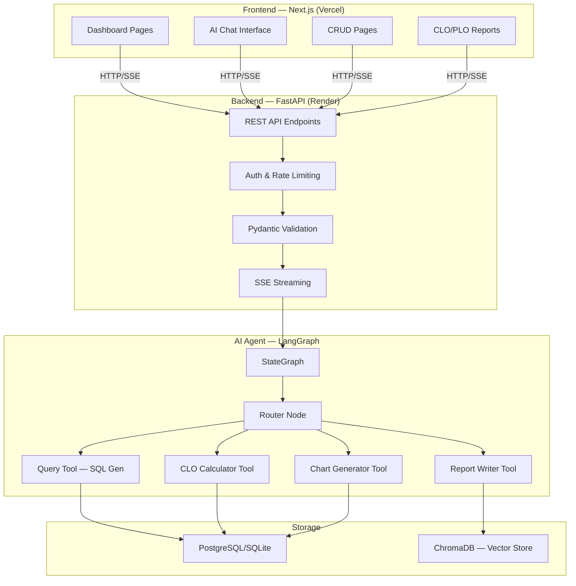
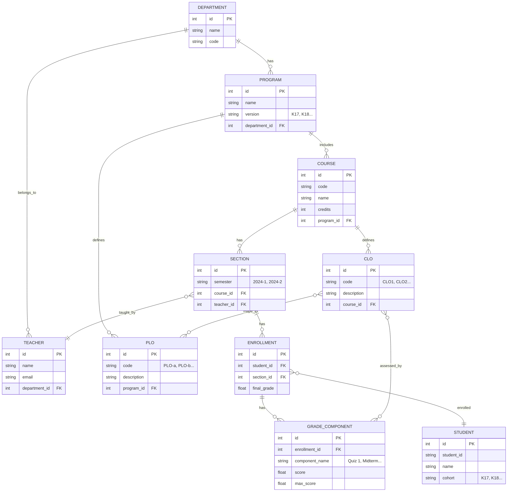

# 📄 Product Requirements Document (PRD) — AI Phân Tích Học Tập

> **Phiên bản:** v1.0 · Ngày tạo: 06/06/2026

## 1. Feature Specifications

### Module 1: Dashboard Phân tích Tổng quan

**Mục đích:** Cung cấp cái nhìn tổng quan về dữ liệu học tập ở cấp Khoa/Ngành.

| Feature | Mô tả | Priority |
|:--------|:-------|:--------:|
| KPI Cards | Tổng SV, GPA trung bình, Tỷ lệ trượt, Tổng môn học — cập nhật realtime | P0 |
| GPA Trend Chart | Biểu đồ xu hướng GPA theo học kỳ, so sánh qua các khóa | P0 |
| Top Failed Courses | Bảng xếp hạng môn trượt nhiều nhất, drill-down đến từng môn | P0 |
| Course Difficulty Heatmap | Heatmap mức khó của các môn theo chương/topic | P1 |
| Filter & Drill-down | Lọc theo Khoa, Ngành, Khóa, Học kỳ, Giảng viên | P0 |

### Module 2: AI Chat Agent

**Mục đích:** Cho phép người dùng hỏi đáp bằng ngôn ngữ tự nhiên để rút trích insight từ dữ liệu.

| Feature | Mô tả | Priority |
|:--------|:-------|:--------:|
| Natural Language Query | "Môn nào có tỷ lệ trượt cao nhất K18?", "So sánh GPA K17 vs K18" | P0 |
| Streaming Response | SSE streaming cho trải nghiệm mượt | P0 |
| Tool Calling | Agent tự gọi tools: query DB, tính CLO, generate chart | P0 |
| ReAct Pattern | Plan → Execute → Observe → Reflect cho câu hỏi phức tạp | P1 |
| Conversation Memory | Nhớ context trong session | P1 |
| Source Citation | Trích dẫn nguồn dữ liệu trong câu trả lời | P2 |

### Module 3: Đánh giá Chuẩn đầu ra (CLO/PLO Assessment)

**Mục đích:** Tự động hóa quy trình mapping điểm → CLO → PLO theo chuẩn ABET/AUN.

| Feature | Mô tả | Priority |
|:--------|:-------|:--------:|
| CLO Matrix Input | Upload/nhập mapping câu hỏi thi ↔ CLO | P0 |
| Auto CLO Calculation | Tính mức đạt CLO từ điểm thành phần | P0 |
| CLO → PLO Mapping | Tự động aggregate CLO lên PLO theo ma trận chương trình | P0 |
| Achievement Report | Sinh báo cáo minh chứng đạt chuẩn (PDF/Word) | P1 |
| Threshold Config | Cấu hình ngưỡng đạt/không đạt (VD: ≥ 50%) | P0 |
| Historical Trend | Xu hướng mức đạt CLO/PLO qua các học kỳ | P1 |

### Module 4: Phân tích Cross-Cohort

**Mục đích:** So sánh hiệu quả CTĐT qua các khóa, hỗ trợ ra quyết định cải tiến.

| Feature | Mô tả | Priority |
|:--------|:-------|:--------:|
| Cohort Comparison | So sánh K17 vs K18 theo GPA, tỷ lệ trượt, CLO/PLO | P0 |
| Prerequisite Analysis | Phân tích SV qua môn tiên quyết → kết quả môn hậu quyết | P1 |
| Curriculum Bottleneck | Xác định môn "nút thắt" — trượt nhiều, ảnh hưởng chuỗi | P1 |
| Impact Prediction | Dự báo tác động nếu thay đổi CTĐT (AI-powered) | P2 |

### Module 5: Hệ thống Cảnh báo sớm (Early Warning)

**Mục đích:** Phát hiện kịp thời SV yếu và môn học có vấn đề.

| Feature | Mô tả | Priority |
|:--------|:-------|:--------:|
| At-risk Student Alert | Cảnh báo SV có nguy cơ trượt dựa trên điểm giữa kỳ | P1 |
| Anomaly Detection | Phát hiện tỷ lệ trượt tăng đột biến so với baseline | P1 |
| Email/Dashboard Notification | Thông báo qua Dashboard + (optional) Email | P2 |

### Module 6: CRUD Quản lý Dữ liệu

**Mục đích:** Quản lý các entity cốt lõi.

| Entity | Chức năng | Priority |
|:-------|:----------|:--------:|
| Sinh viên (Students) | CRUD, import Excel/CSV | P0 |
| Giảng viên (Teachers) | CRUD | P0 |
| Môn học (Courses) | CRUD, CLO definition | P0 |
| Chương trình (Programs) | CRUD, PLO definition, CLO-PLO matrix | P0 |
| Bộ môn (Departments) | CRUD | P0 |
| Điểm (Grades) | CRUD, import Excel, validation | P0 |

---

## 2. Kiến trúc Hệ thống

### 2.1 Architecture Overview

### 2.2 Technology Stack

| Layer | Technology | Lý do chọn |
|:------|:-----------|:-----------|
| **Frontend** | Next.js 16 + TypeScript + TailwindCSS + shadcn/ui | SSR, component library, dark mode |
| **Backend** | FastAPI + Pydantic | Async, type-safe, auto-docs |
| **AI Agent** | LangGraph + LangChain | State machine, tool calling, ReAct |
| **LLM** | Google Gemini API / Mistral AI | Free tier, đủ cho demo |
| **Database** | SQLite (dev) → PostgreSQL (prod) | Đơn giản → Scale |
| **Vector Store** | ChromaDB | Self-hosted, không giới hạn |
| **Monitoring** | Langfuse | Open-source, unlimited |
| **Deploy** | Vercel (FE) + Render (BE) | Free tier |
| **CI/CD** | GitHub Actions | Ruff + pytest + Docker build |

### 2.3 Data Model (Core Entities)

### 2.4 API Endpoints (Core)

| Method | Endpoint | Mô tả |
|:-------|:---------|:-------|
| `GET` | `/api/v1/health` | Health check |
| `POST` | `/api/v1/chat` | AI Chat (non-streaming) |
| `POST` | `/api/v1/chat/stream` | AI Chat (SSE streaming) |
| `GET` | `/api/v1/dashboard/overview` | Dashboard KPIs |
| `GET` | `/api/v1/dashboard/gpa-trend` | GPA trend data |
| `GET` | `/api/v1/dashboard/top-fail-courses` | Top failed courses |
| `CRUD` | `/api/v1/students` | Quản lý sinh viên |
| `CRUD` | `/api/v1/teachers` | Quản lý giảng viên |
| `CRUD` | `/api/v1/courses` | Quản lý môn học |
| `CRUD` | `/api/v1/programs` | Quản lý chương trình |
| `CRUD` | `/api/v1/departments` | Quản lý bộ môn |
| `CRUD` | `/api/v1/grades` | Quản lý điểm |
| `POST` | `/api/v1/grades/import` | Import điểm từ Excel |
| `GET` | `/api/v1/assessment/clo/{course_id}` | CLO assessment results |
| `GET` | `/api/v1/assessment/plo/{program_id}` | PLO assessment results |
| `GET` | `/api/v1/analysis/cohort-compare` | So sánh cross-cohort |

---

## 3. Non-Functional Requirements

| Yêu cầu | Thông số |
|:---------|:---------|
| **Performance** | API response < 500ms (CRUD), AI chat < 10s (p95) |
| **Availability** | 99% uptime (free tier limitation) |
| **Security** | JWT auth, rate limiting (100 req/min), CORS whitelist, no hardcoded secrets |
| **Scalability** | Hỗ trợ ≥ 5,000 sinh viên, ≥ 200 môn học |
| **Accessibility** | Dark mode, responsive (tablet+), tiếng Việt native |
| **Data Privacy** | Dữ liệu sinh viên ẩn danh hóa khi demo, không upload lên third-party |
| **Code Quality** | 100% type hints, Ruff lint pass, test coverage ≥ 60% |

---

## 4. Release Plan (Mapped to 6-Week Timeline)

| Tuần | Sprint Goal | Deliverables |
|:----:|:------------|:-------------|
| **W1** (28/05–03/06) | Kick-off & Setup | ✅ Repo, env, AI logging, Brief + PRD |
| **W2** (04/06–10/06) | Architecture & Foundation | Architecture diagrams, DB schema, FastAPI skeleton, CI/CD, Docker |
| **W3** (11/06–17/06) | Core Agent & API | LangGraph agent (3+ tools), API endpoints, Streamlit prototype |
| **W4** (18/06–24/06) | Frontend & Integration | Next.js Dashboard + Chat UI, CLO/PLO module, full CRUD |
| **W5** (25/06–01/07) | Deploy & Evaluate | Deploy Vercel+Render, RAGAS metrics, test coverage, monitoring |
| **W6** (02/07–09/07) | Polish & Demo Day | README, Pitch Deck, Video Demo, Journal, final QA |

---

## 5. Risks & Mitigations

| Risk | Impact | Likelihood | Mitigation |
|:-----|:------:|:----------:|:-----------|
| LLM API rate limit/cost | High | Medium | Cache responses, mock in tests, use cheap model for routing |
| Dữ liệu thực không đủ | High | High | Tạo synthetic dataset chất lượng cao, mô phỏng 5 khóa × 200 SV |
| Scope creep | Medium | High | Tuân thủ PRD, review hàng tuần, nói "không" với feature ngoài scope |
| Free tier downtime | Medium | Medium | Health check ping, fallback message, monitoring alerts |
| Team member unavailable | Medium | Low | Cross-training, pair programming, tài liệu rõ ràng |

---

## 6. Open Questions

> [!IMPORTANT]
> Các câu hỏi cần team thảo luận và quyết định:

1. **Nguồn dữ liệu demo:** Sử dụng dữ liệu synthetic hoàn toàn hay lấy dữ liệu thực (ẩn danh) từ Bách Khoa?
2. **LLM Provider:** Chọn Gemini API (dễ setup) hay Mistral (generous free tier)?
3. **Database prod:** Supabase (PostgreSQL + pgvector) hay self-hosted trên Render?
4. **Scope CLO/PLO:** Làm đầy đủ mapping matrix hay chỉ demo auto-calculate từ preset mapping?
5. **Authentication:** Đơn giản (static token) hay full JWT + user roles (lecturer vs manager)?
