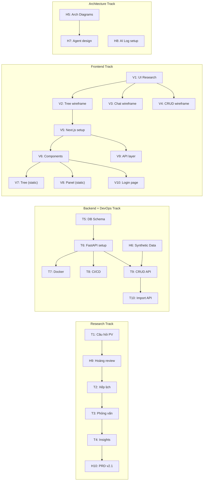

# 🏃 Sprint 1 — Foundation & Research

> **Thời gian:** 28/05 – 10/06 (2 tuần — W1 + W2)
> **Sprint Goal:** _Setup nền tảng kỹ thuật hoàn chỉnh (Docker, CI/CD, DB, API, FE skeleton) + thu thập yêu cầu từ stakeholder + chuẩn bị sẵn sàng để Sprint 2 build core features và Demo 1._
> **Tham chiếu:** [SprintPlanning.md](file:///c:/Users/Admin/AI%20in%20Action/Project/C2-App-056/docs/07-Sprint-Planning/SprintPlanning.md) · [ProgramRequirements.md](file:///c:/Users/Admin/AI%20in%20Action/Project/C2-App-056/docs/00-Requirements/ProgramRequirements.md)

> [!IMPORTANT]
> **Infrastructure First** — Bài học từ top teams Cohort 1: Docker + CI/CD phải có từ Sprint 1.
> **Demo 1 là cuối W3 (14/06)** — Sprint 1 phải xong nền tảng để Sprint 2 tập trung build agent + prototype cho Demo 1.

---

## Deliverables cần hoàn thành trong Sprint 1

| Deliverable BTC | Yêu cầu Sprint 1 | Status |
|:----------------|:-----------------|:------:|
| D1 — Source Code | Repo structure theo template AI20K, ruff + type hints enforced | ⬜ |
| D3 — Architecture Diagram | 3 Mermaid diagrams: System, Agent Flow, Data Flow | ⬜ |
| D4 — AI Logs | Setup AI Usage Logging Hooks (1 lần) | ✅ Done |
| D8 — Journal + Worklog | Bắt đầu ghi worklog hàng ngày | ⬜ |
| DevOps foundation | Docker + docker-compose + CI/CD (GitHub Actions) | ⬜ |

---

## 🟠 Hoàng — AI/Data Engineer + PM/PO

| # | Task | Mô tả chi tiết | Deadline | Status |
|:-:|:-----|:----------------|:--------:|:------:|
| H1 | ✅ Project Brief v1.0 | Viết brief ban đầu | 30/05 | ✅ Done |
| H2 | ✅ PRD v1.0 → v2.0 | Viết PRD, cập nhật Academic Tree concept | 07/06 | ✅ Done |
| H3 | ✅ Tạo Team Skills Survey | Google Form khảo sát năng lực team | 06/06 | ✅ Done |
| H4 | ✅ Sprint Planning & phân công | Lập bảng sprint, phân task cho team | 07/06 | ✅ Done |
| H5 | Architecture Diagrams (D3) | Vẽ 3 Mermaid diagrams: System Overview, Agent Flow, Data Flow. Đưa vào README | 09/06 | ⬜ |
| H6 | Thiết kế bộ Synthetic Data | Script Python sinh dữ liệu giả: 1 trường, 2 khoa, 5 ngành, 30 môn, 5 khóa × 100 SV, điểm + CLO mapping. Output: SQL seed hoặc CSV | 10/06 | ⬜ |
| H7 | Thiết kế AI Agent Architecture | LangGraph state diagram, định nghĩa State schema (TypedDict), Router Node, ≥ 3 Tools (SQL query, CLO calc, chart gen), prompt templates theo cấp (Khoa/Ngành/Môn) | 10/06 | ⬜ |
| H8 | ✅ Setup AI Usage Logging (D4) | Cấu hình AI Usage Logging Hooks theo template AI20K (bắt buộc, 1 lần) | 08/06 | ✅ Done |
| H9 | ✅ Review bộ câu hỏi phỏng vấn | Review câu hỏi của Hưng, góp ý trước khi interview | 08/06 | ✅ Done |
| H10 | Cập nhật PRD sau interview | Dựa trên kết quả interview → cập nhật PRD v2.1 (features, priority) | 10/06 | ⬜ |

**Tổng: 10 task · Trọng tâm: Architecture + Data + AI Design + Product**

---

## 🟢 Hưng — Backend Developer + DevOps + Stakeholder Contact

| # | Task | Mô tả chi tiết | Deadline | Status |
|:-:|:-----|:----------------|:--------:|:------:|
| T1 | Chốt bộ câu hỏi phỏng vấn | Finalize từ `interview_questions.html`, gửi Hoàng review | 08/06 | ✅ Done |
| T2 | Liên hệ & xếp lịch phỏng vấn | Contact 3–5 thầy cô / quản lý khoa. Mục tiêu: ≥ 3 sessions trong W2 | 08/06 | ✅ Done |
| T3 | Tiến hành phỏng vấn | Phỏng vấn + ghi notes vào `05-Meeting-Notes/` | 08–10/06 | ⬜ |
| T4 | Tổng hợp Interview Insights | Key findings: pain points, feature mong muốn, data hiện có | 10/06 | ⬜ |
| T5 | DB Schema Design (SQL) | Schema chi tiết: tables, indexes, constraints. Dựa trên Data Model trong PRD | 08/06 | ✅ Done |
| T6 | FastAPI Project Setup | Folder structure theo template AI20K, `pyproject.toml`, Pydantic models, SQLAlchemy/SQLModel, alembic. **Type hints + docstrings bắt buộc** | 09/06 | ✅ Done |
| T7 | Docker + docker-compose (DevOps) | Multi-stage Dockerfile cho backend + docker-compose (app + db). README hướng dẫn chạy | 09/06 | ⬜ |
| T8 | CI/CD — GitHub Actions (DevOps) | Workflow: Ruff lint + pytest chạy trên mỗi PR. Block merge nếu fail | 09/06 | ⬜ |
| T9 | CRUD API — Core Entities | Implement CRUD: departments, programs, courses, students, teachers, sections, grades. Health check `/health` | 10/06 | ⬜ |
| T10 | Excel Import API | POST `/api/v1/import/grades` + `/api/v1/import/students` — parse Excel, validate, bulk insert | 10/06 | ⬜ |

**Tổng: 10 task · Trọng tâm: Interview + Backend + DevOps (Docker/CI/CD)**

---

## 🔵 Hiếu — Frontend Developer + QA

| # | Task | Mô tả chi tiết | Deadline | Status |
|:-:|:-----|:----------------|:--------:|:------:|
| V1 | Nghiên cứu UI/UX references | Thu thập 5–10 references: Metabase, Grafana, Linear, NotebookLM. Tạo mood board | 08/06 | ⬜ |
| V2 | Wireframe — Academic Tree + Detail Panel | Wireframe (Figma/tay): Tree sidebar, Detail Panel khi click node, layout tổng thể | 09/06 | ⬜ |
| V3 | Wireframe — Chat Interface | Wireframe: Chat panel, auto-analysis output, suggested questions, inline chart | 09/06 | ⬜ |
| V4 | Wireframe — CRUD + Login Pages | Wireframe: Danh sách entities, form CRUD, import Excel, trang login | 09/06 | ⬜ |
| V5 | Next.js Project Setup | Init Next.js 16 + TypeScript + TailwindCSS + shadcn/ui. Theme config, dark mode, layout | 09/06 | ⬜ |
| V6 | UI Component Library | Base components: Sidebar, Breadcrumb, Card, Table, Modal, Form (shadcn/ui) | 10/06 | ⬜ |
| V7 | Academic Tree Component (Static) | Tree component với mock JSON. Collapsible nodes, badge màu (🟢🟡🔴), click handler | 10/06 | ⬜ |
| V8 | Detail Panel Component (Static) | Panel hiển thị metric cards khi click node. Mock data. Responsive layout | 10/06 | ⬜ |
| V9 | API Service Layer | Axios/fetch wrapper, TypeScript interfaces cho entities, mock API responses | 10/06 | ⬜ |
| V10 | Login Page (Static) | Trang login UI hoàn chỉnh (chưa cần auth logic, chỉ cần UI) | 10/06 | ⬜ |

**Tổng: 10 task · Trọng tâm: Design + Frontend Foundation + Login UI**

---

## Timeline trực quan

```
W1 (28/05–07/06) — Kick-off & Setup
━━━━━━━━━━━━━━━━━━━━━━━━━━━━━━━━━━━━━
Hoàng  ████ H1-H4 (Brief, PRD, Survey, Sprint Plan)
Hưng   ░░░░ Prep interview
Hiếu   ░░░░ Prep

        ↓ Hiện tại: 07/06 ↓

W2 (08–10/06) — Sprint 1 chính (3 ngày còn lại)
━━━━━━━━━━━━━━━━━━━━━━━━━━━━━━━━━━━━━
         08(CN)  09(T2)  10(T3)
         ──────  ──────  ──────

Hoàng    H8,H9   H5      H6,H7,H10
         AI log  Arch    Synth data
         Review  Diag    + Agent design
                         + PRD update

Hưng     T1,T2   T5,T6   T9,T10
         T3───────────    T4
         Câu hỏi  DB     CRUD + Import
         + PV    +API    + Insights
                T7,T8
                Docker
                CI/CD

Hiếu     V1      V2-V5   V6-V10
         Ref     Wire    Components
                 +Setup  +Tree+Panel
                         +Login+API
```

---

## Dependencies giữa các task



---

## Definition of Done — Sprint 1

Khi kết thúc Sprint 1 (10/06), team phải có:

| Category | Checklist | Owner |
|:---------|:----------|:-----:|
| **Research** | ≥ 3 interview transcripts + 1 tài liệu tổng hợp insights | Hưng |
| **PRD** | v2.1 đã validate bằng interview | Hoàng |
| **Architecture** | 3 Mermaid diagrams hoàn chỉnh (D3) | Hoàng |
| **Backend** | FastAPI chạy local, CRUD API, health check, seed data | Hưng |
| **DevOps** | Docker + docker-compose chạy được. CI/CD (GitHub Actions) active | Hưng |
| **Frontend** | Next.js chạy, Tree component (static), Detail Panel, Login page | Hiếu |
| **AI Design** | LangGraph architecture doc + prompt templates | Hoàng |
| **AI Logs** | AI Usage Logging Hooks đã setup (D4) | Hoàng |
| **Worklog** | Journal cập nhật hàng ngày (D8) | Cả team |
| **Code Quality** | Ruff lint pass, type hints trong mọi file mới | Cả team |

---

## Risks Sprint 1

| Risk | Likelihood | Impact | Mitigation |
|:-----|:----------:|:------:|:-----------|
| Thầy cô bận, khó xếp lịch PV | Cao | Cao | Liên hệ sớm (08/06), backup list 5+ người, cho phép PV online/async |
| Chỉ còn 3 ngày làm việc (08-10/06) | Cao | Cao | Ưu tiên P0: Docker/CI/CD → DB/API → FE skeleton. Bỏ qua polish |
| CRUD scope rộng (7 entities) | Trung bình | Trung bình | Ưu tiên: departments → programs → courses → students → grades |
| Setup CI/CD phức tạp | Thấp | Trung bình | Dùng template GitHub Actions có sẵn cho Python + Ruff |

---

## Sprint Review

**Ngày:** Thứ 3, 10/06/2026 (cuối ngày)
**Nội dung:**
1. Demo: FastAPI CRUD chạy trên Swagger + Docker
2. Demo: CI/CD pipeline chạy trên GitHub
3. Demo: Next.js Tree component với mock data
4. Trình bày interview insights (nếu có)
5. Review Architecture Diagrams
6. **Plan Sprint 2** — Tập trung chuẩn bị Demo 1 (14/06)

> [!WARNING]
> **Demo 1 với đối tác là 14/06** — chỉ còn 4 ngày sau Sprint 1. Sprint 2 cần bắt đầu build agent + Streamlit prototype ngay lập tức.
