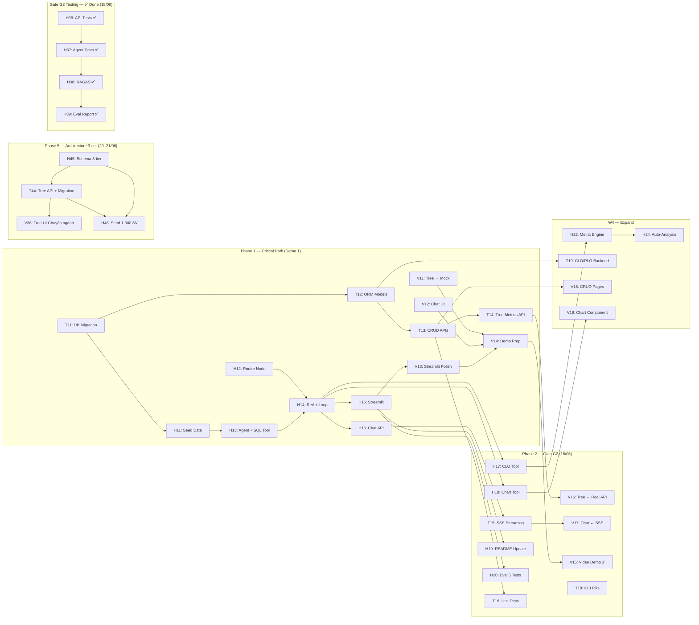

# Sprint 2 - Core Agent & Demo 1 (Gate G2: First Working Agent MVP)

> **Thời gian:** 11/06 – 24/06 (2 tuần — W3 + W4)
> **Sprint Goal:** _Xây dựng AI Agent chạy được end-to-end với LLM thực tế, pass Gate G2 (18/06) và hoàn thiện Demo 1. Agent phải nhận input → xử lý → trả output có ý nghĩa cho ít nhất 1 user flow chính._
> **Tham chiếu:** [SprintPlanning.md](./SprintPlanning.md) · [LangGraphAgent.md](../10-References/LangGraphAgent.md) · [AgentFlowDiagram.md](../10-References/AgentFlowDiagram.md)
> **Cập nhật lần cuối:** 20/06/2026 (Gate G2 đã nộp · Sprint 2 đóng scope · Gate G3 chuyển sang Sprint 3)

> [!IMPORTANT]
> **Trạng thái hiện tại:** Sprint 2 được xem là **đã đóng scope từ 20/06/2026** sau khi Gate G2 đã nộp. Toàn bộ công việc phục vụ **Gate G3** và **Demo 2** không còn dùng Sprint 2 làm nguồn chuẩn.
>
> **Nguồn chuẩn mới:** [Sprint3.md](./Sprint3.md)
>
> **Ý nghĩa của file này:** lưu lịch sử Sprint 2, Gate G2, và các quyết định/draft planning trước khi tách Sprint 3.

> [!NOTE]
> **Gate G2 — ✅ ĐÃ SUBMIT (18/06/2026).** Tất cả 5 deliverables đã nộp. Eval: 10 test cases AI chatbot + báo cáo tại [gate2_eval_report.md](../12-Evaluation/gate2_eval_report.md).

> [!IMPORTANT]
> **Gate G2 Deadline: 18/06/2026 (23:59)** — Deliverables bắt buộc:
> 1. ✅ MVP Demo — video 3 phút show user flow end-to-end
> 2. ✅ Architecture diagram — sơ đồ components, data flow
> 3. ✅ Repo có >= 10 PR merged
> 4. ✅ README.md — setup instructions, env vars, sample queries
> 5. ✅ Eval evidences — ít nhất 5 test case manual với output thực tế

> [!WARNING]
> **Demo 1 với đối tác: 14/06** — ĐÃ QUA. MVP Streamlit đã demo thành công.
> **Chiến lược 3 giai đoạn:** Phase 1 (11–14/06) MVP ✅ Done · Phase 2 (15–18/06) Gate G2 · Phase 3 (16–24/06) **Hoàn thiện Demo 1: Academic Tree + Dashboard + Chat AI**

---

## Gate G2 — Mapping Deliverables → Tasks

| # | Gate G2 Deliverable | Hiện trạng | Task phụ trách | Deadline | Status |
|:-:|:--------------------|:-----------|:---------------|:--------:|:------:|
| G2-1 | MVP Demo video 3 phút | Video đã quay, user flow end-to-end trên Next.js + Streamlit | V15 (Hiếu quay + edit), H32 (Hoàng kịch bản), cả team demo | 17/06 | ✅ |
| G2-2 | Architecture diagram | **3 Mermaid diagrams** hoàn thiện trong README (system, deployment, agent flow) | Hoàng | 18/06 | ✅ |
| G2-3 | Repo >= 10 PR merged | 14+ PR merged trên GitHub | T18 + cả team tạo PR đúng quy trình | 18/06 | ✅ |
| G2-4 | README.md (setup, env, queries) | Setup, env vars, sample queries đã bổ sung | H19 (Hoàng) | 16/06 | ✅ |
| G2-5 | Eval evidences (10 test cases) | **10 test cases AI chatbot** đã chạy + báo cáo tại `docs/12-Evaluation/gate2_eval_report.md` | Hoàng | 18/06 | ✅ |

> **Gate G2:** ✅ Hoàn thành và submit. H36–H39 (tests/RAGAS formal) coi như done cùng G2-5.

### Gate G2 — Task index nhanh

| Task | Owner | Mô tả ngắn | Deadline | Status |
|:-----|:-----:|:-----------|:--------:|:------:|
| H19 | Hoàng | README setup/env/queries | 16/06 | ✅ |
| H21 | Hoàng | Prompt tuning + error handling 3 tầng | 18/06 | ✅ |
| H32 | Hoàng | Kịch bản video demo G2 | 17/06 | ✅ |
| V15 | Hiếu | Quay + edit video 3 phút | 17/06 | ✅ |
| T18 | Hưng | ≥ 10 PR merged | 18/06 | ✅ |
| H36–H39 | Hoàng | Tests + RAGAS + eval report (G2-5) | 18/06 | ✅ |

---

## Phân chia Sprint thành 2 Phase

### Phase 1: MVP Sprint (11–14/06) — Demo 1 + Gate G2 Core ✅

> Mục tiêu: Agent chạy end-to-end trên Streamlit, có seed data thật trong DB, demo được 1 user flow hoàn chỉnh. **→ ĐÃ HOÀN THÀNH**

### Phase 2: Gate G2 Deliverables (15–18/06) — Video, Eval, PRs, README

> Mục tiêu: Video demo, eval evidences, 10 PRs, README hoàn chỉnh.

### Phase 3: Demo 1 Completion (16–20/06) — Hoàn thiện chức năng chính 🎯

> Mục tiêu: Academic Tree kết hợp Dashboard, click node → Chat AI + tạo báo cáo, SSE streaming, phân quyền login, evaluation chatbot. (Gấp rút hoàn thành trong 16/06 để quay video 17/06)

---

## 🟠 Hoàng — AI/Data Engineer + PM/PO

### Phase 1: MVP Agent (11–14/06)

| # | Task | Mô tả chi tiết | Deadline | Status |
|:-:|:-----|:----------------|:--------:|:------:|
| H11 | Seed Data vào PostgreSQL | Chạy script tiền xử lý data crawl → load SQL seed của 700 sinh viên thực tế vào Docker PostgreSQL. Đảm bảo map đúng schema: trường, khoa, ngành, môn, điểm + CLO | 11/06 | [x] |
| H12 | Implement AgentState + Router Node | Code `AgentState(TypedDict)`, `router_node` dùng GPT-5.4 Nano phân loại intent (simple → fast_response, complex → core_agent). Theo pattern trong `LangGraphAgent.md` | 12/06 | [x] |
| H13 | Implement Core Agent Node + SQL Tool | Code `core_agent_node` dùng GPT-5.4 + `sql_query_tool` kết nối PostgreSQL thật. Agent phải query được điểm, tỷ lệ trượt từ DB | 12/06 | [x] |
| H14 | Implement ReAct Loop + ToolNode | Ghép `ToolNode(handle_tool_errors=True)`, conditional edges, vòng lặp ReAct. Compile graph hoàn chỉnh | 13/06 | [x] |
| H15 | Streamlit Prototype | Tạo app Streamlit đơn giản: input câu hỏi → gọi LangGraph agent → hiển thị output. Streaming nếu kịp | 13/06 | [x] |
| H16 | FastAPI Chat Endpoint | `POST /api/v1/chat` nhận message, invoke LangGraph agent, trả response (JSON hoặc SSE) | 14/06 | [x] |

### Phase 2: Expand + Gate G2 Deliverables (15–18/06)

| # | Task | Mô tả chi tiết | Deadline | Status |
|:-:|:-----|:----------------|:--------:|:------:|
| H17 | Thêm CLO Calculator Tool | Tool tính toán CLO achievement rate từ DB. Agent có thể trả lời "CLO nào đạt thấp nhất ở môn X?" | 15/06 | ✅ |
| H19 | Cập nhật README.md cho Gate G2 | Bổ sung: setup instructions chi tiết, danh sách env vars, 3–5 sample queries với expected output | 16/06 | ✅ |
| H21 | Prompt Tuning + Error Handling | Tinh chỉnh prompt templates theo cấp (Khoa/Ngành/Môn). Kiểm tra error handling 3 tầng hoạt động đúng | 18/06 | ✅ |
| H32 | Kịch bản Video Demo G2 | Viết scripts chi tiết (luồng flow, câu thoại, màn hình) cho Hiếu quay và edit video demo MVP dài 3 phút | 17/06 | ✅ |

> *Ghi chú: Task H18 (Chart Tool) đã gộp vào T28 (Report Tool), H20 (Eval) đã gộp vào H29 (RAGAS Eval - Phase 3).*

### Phase 2 mở rộng: W4 (19–24/06)

| # | Task | Mô tả chi tiết | Deadline | Status |
|:-:|:-----|:----------------|:--------:|:------:|
| H22 | Metric Engine — Health Score | Build logic tính Health Score tổng hợp (GPA, Fail Rate, CLO) cho từng node (Khoa/Ngành/Môn) | 20/06 | ✅ |
| H27 | Cấu hình Ngrok Public Tunnel | Cấu hình ngrok tunnel cho local, bypass cảnh báo trình duyệt phục vụ truy cập Demo 1 và Gate G2 | 14/06 | ✅ |
| H31 | Health Score UI Integration | Tích hợp gọi Health Score API hiển thị trên Academic Tree Dashboard | 16/06 | ✅ |
| H33 | Course Health Score UI | Tích hợp biểu diễn đồ hoạ Health Score trên giao diện Phân tích môn học, fix lỗi SQL Views không hiển thị | 17/06 | ✅ |
| H34 | Chuẩn hóa cấu trúc Khoa - Môn (OBE) | Dùng LLM map tự động 480 môn học vào 12 Khoa, cấu trúc lại DB, views và update Giao diện (thêm department_id) | 17/06 | ✅ |

> *Ghi chú: H23 (Vector Search RAG) **đã hủy** — chuyển Sprint 3. H24 (Auto-Analysis) đã chuyển cho Hưng (T28, T29 - Phase 3).*

### 🏗 Phase 5: Architecture 3-tier + Data Scale (20–21/06)

| # | Task | Mô tả chi tiết | Deadline | Status | Depends on |
|:-:|:-----|:----------------|:--------:|:------:|:-----------|
| H45 | Nâng architecture 3-tier | Thiết kế và triển khai cấu trúc **Khoa → Ngành → Chuyên ngành**: entity model, Alembic migration, cập nhật views/metrics, sửa agent prompts + README diagram. Chốt spec drill-down Tree (Khoa mở ra Chuyên ngành) cho V36 | 20/06 | ➜ Sprint 3 | — |
| H46 | Seed đủ 1.300 sinh viên | Mở rộng seed từ ~700 → **≥ 1.300 SV** từ data crawl: map đúng chuyên ngành, cohort, enrollment, grades. Verify row counts + sample queries | 21/06 | ➜ Sprint 3 | H45, T44 |

### 🎯 Phase 3: Demo 1 Completion — Hoàng (16–20/06)

| # | Task | Mô tả chi tiết | Deadline | Status | Priority |
|:-:|:-----|:----------------|:--------:|:------:|:--------:|
| H28 | SSE Streaming Response | Upgrade `/api/v1/chat` từ JSON → SSE (Server-Sent Events) streaming, token-by-token. Frontend nhận realtime typewriter effect | 16/06 | ✅ | **P0** |
| H30 | Agent Safety & Tools Evaluation | Đánh giá agents có tools: jailbreak resistance, PII detection, bias check. Tạo test suite safety | 28/06 | ➜ Sprint 3 | **P2** |

> [!NOTE]
> H30 (Agent Safety) là **ưu tiên thấp** — chỉ làm nếu còn kịp thời gian.

### 🚀 Phase 4: Sprint 2 Hoàn thiện — Hoàng (18–24/06)

| # | Task | Mô tả chi tiết | Deadline | Status | Priority |
|:-:|:-----|:----------------|:--------:|:------:|:--------:|
| H40 | Schema Update 3-Tier Hierarchy | Sửa schema DB quản lý 3 cấp (Khoa -> Ngành -> Chuyên ngành), sinh viên trỏ vào Program. Đồng thời đổi tên trường đại học. | 19/06 | ⬜ | **P0** |
| H35 | Thêm session lưu lịch sử chat | Implement session management lưu lịch sử chat: tạo/load/list sessions, persist messages theo thread_id vào DB, UI hiển thị sidebar danh sách sessions cũ | 18/06 | [x] | **P0** |
| H36 | Unit Tests — API Endpoints | Viết unit tests cho các API endpoints chính (chat, health, tree, auth) theo pattern trong Test.md: conftest.py fixtures, AsyncClient, mock LLM. Mục tiêu: ≥ 10 test cases, coverage ≥ 60% | 18/06 | ✅ | **P0** |
| H37 | Unit Tests — Agent Nodes & Routing | Viết tests cho từng LangGraph node (router, core_agent, format_response) và conditional routing logic. Dùng parametrize cho nhiều intent cases | 18/06 | ✅ | **P0** |
| H38 | RAGAS Evaluation — 10 Test Cases | Chạy RAGAS evaluation (Faithfulness, Answer Relevancy, Context Precision, Context Recall) trên ≥ 10 test cases thực tế từ domain đào tạo. Tạo eval dataset JSON | 18/06 | ✅ | **P1** |
| H39 | Evaluation Evidence Report | Tạo báo cáo Evaluation Evidence hoàn chỉnh: pytest output + coverage, RAGAS metrics table, performance metrics, code traceability. Lưu trong `docs/12-Evaluation/` | 18/06 | ✅ | **P1** |

> [!NOTE]
> H36–H39 ✅ done — nộp cùng Gate G2-5. Báo cáo: [gate2_eval_report.md](../12-Evaluation/gate2_eval_report.md).

---

## 🟢 Hưng — Backend Developer + DevOps

### Phase 1: Backend Foundation cho Agent (11–14/06)

| # | Task | Mô tả chi tiết | Deadline | Status |
|:-:|:-----|:----------------|:--------:|:------:|
| T11 | Database Migration + Seed Runner | Alembic migration từ `schema.sql`. Script seed data runner chạy trên Docker. Đảm bảo DB sẵn sàng cho Agent | 11/06 | ✅ |
| T12 | SQLAlchemy Models + DB Session | ORM models cho core entities (Department, Program, Course, Student, Grade, Section, CLO). DB session factory | 12/06 | ✅ |
| T13 | CRUD API — Core Entities (P0) | Implement CRUD: `/departments`, `/programs`, `/courses`, `/students`, `/grades`. Swagger docs tự động | 13/06 | ✅ |
| T14 | Tree Metrics API | `GET /api/v1/tree` — trả về tree structure với metrics (student count, avg GPA, fail rate) cho từng node. Hỗ trợ Academic Tree component | 14/06 | ✅ |

### Phase 2: Mở rộng + DevOps (15–18/06)

| # | Task | Mô tả chi tiết | Deadline | Status |
|:-:|:-----|:----------------|:--------:|:------:|
| T16 | Unit Tests — Backend | Viết unit tests cho CRUD APIs + DB models. Mục tiêu: ≥ 10 test cases, chạy qua CI/CD | 16/06 | ✅ |
| T17 | Chốt ORM + Alembic Baseline | Đồng bộ ORM với thiết kế OLTP, tạo migration baseline, seed được database sạch và ghi hướng dẫn rollout | 17/06 | ✅ |
| T18 | PR Cleanup — đảm bảo ≥ 10 PRs | Review + merge các PRs tồn đọng. Tạo PRs mới cho các features đã code trực tiếp. Đảm bảo repo có ≥ 10 merged PRs | 18/06 | ✅ |

> *Ghi chú: Task T15 (SSE Streaming) đã chuyển cho Hoàng (H28 - Phase 3).*

### Phase 2 mở rộng: W4 (19–24/06)

| # | Task | Mô tả chi tiết | Deadline | Status |
|:-:|:-----|:----------------|:--------:|:------:|
| T19 | CLO/PLO Backend Logic | Implement tính toán CLO/PLO achievement: query grades × CLO mapping → tính tỷ lệ đạt | 20/06 | ✅ |
| T27 | Overview KPI Dashboard | Xây dựng UI (Frontend) và API (Backend) hiển thị Dashboard tổng quan metric sức khỏe đào tạo trước khi vào Tree | 20/06 | ✅ |

### 🎯 Phase 3: Demo 1 Completion — Hưng (16–20/06)

| # | Task | Mô tả chi tiết | Deadline | Status | Priority |
|:-:|:-----|:----------------|:--------:|:------:|:--------:|
| T28 | Report Tool Backend | Implement `report_tool` cho Agent: nhận node context (ngành/khoa) → query DB → sinh báo cáo phân tích tự động | 16/06 | ✅ | **P0** |
| T29 | Prompt Engineering Report | Thiết kế prompt templates theo cấp (Khoa/Ngành/Môn) cho auto-report khi click node. Phối hợp Hiếu (UI) + Hoàng (Agent) | 16/06 | ✅ | **P0** |
| T30 | Auth Login Backend | `POST /api/v1/auth/login` + `GET /api/v1/auth/me` + JWT token + role-based middleware (manager full / lecturer view-only) | 16/06 | ✅ | **P0** |

> [!NOTE]
> T31 (Failure Analysis + Guardrails) đã chuyển sang Sprint 3.

### 🚀 Phase 4: Sprint 2 Hoàn thiện — Hưng (18–24/06)

| # | Task | Mô tả chi tiết | Deadline | Status | Priority |
|:-:|:-----|:----------------|:--------:|:------:|:--------:|
| T32 | Tool Report CLO — Cải thiện môn học | Implement tool report CLO cho agent: phân tích CLO achievement → đề xuất cải thiện môn học. Direct kết quả tới tab Báo cáo trên frontend. Hiển thị dạng artifact (markdown rendered), có khả năng lưu (persist to DB) và chỉnh sửa (inline edit) | 18/06 | ✅ | **P0** |

### 🏗 Phase 5: Architecture 3-tier — Hưng (20–21/06)

| # | Task | Mô tả chi tiết | Deadline | Status | Depends on |
|:-:|:-----|:----------------|:--------:|:------:|:-----------|
| T44 | Tree API + Migration 3-tier — ownership chuyển sang Hoàng ngày 21/06 | Alembic migration `specializations`, cập nhật ORM + `GET /api/v1/tree`: Khoa → Ngành → Chuyên ngành → Môn. CRUD endpoints liên quan | 21/06 | ✅ Sprint 3 | H45 |

---

## 🔵 Hiếu — Frontend Developer + QA

### Phase 1: Streamlit Hỗ trợ + FE Preparation (11–14/06)

| # | Task | Mô tả chi tiết | Deadline | Status |
|:-:|:-----|:----------------|:--------:|:------:|
| V11 | Academic Tree ↔ Mock API | Kết nối Tree component với mock JSON API (chuẩn bị cho khi BE API sẵn sàng). Click node → hiện Detail Panel | 12/06 | ✅ |
| V12 | Chat UI Component (Static) | Build Chat interface: input box, message list (user/AI), typing indicator, suggested questions area | 13/06 | ✅ |
| V13 | Streamlit UI Polish | Hỗ trợ Hoàng polish Streamlit prototype: thêm sidebar, format output đẹp hơn, thêm example queries | 14/06 | ✅ |
| V14 | Demo 1 Preparation | Chuẩn bị script demo, test flow end-to-end trên Streamlit. Kiểm tra mọi thứ chạy ổn định | 14/06 | ✅ |

### Phase 2: Gate G2 + Next.js Integration (15–18/06)

| # | Task | Mô tả chi tiết | Deadline | Status |
|:-:|:-----|:----------------|:--------:|:------:|
| V15 | Quay Video Demo 3 phút | Quay + edit video MVP Demo cho Gate G2. Show: user mở app → nhập câu hỏi → agent xử lý → trả output. Có voiceover/subtitle | 17/06 | ✅ |
| V16 | Academic Tree ↔ Real API | Kết nối Tree component với `/api/v1/tree` thật. Dynamic data, loading states, error handling | 18/06 | ✅ |

> *Ghi chú: Task V17 (Chat SSE) đã gộp vào V25 (Phase 3).*

### 🎯 Phase 3: Demo 1 Completion — Hiếu (16–20/06)

| # | Task | Mô tả chi tiết | Deadline | Status | Priority |
|:-:|:-----|:----------------|:--------:|:------:|:--------:|
| V24 | Tree Node → Chat AI Navigation | Click 1 node trong Academic Tree → điều hướng tới Chat AI page với context ngành/khoa. Tự động trigger báo cáo về node đó | 16/06 | ✅ | **P0** |
| V25 | Chat UI ↔ SSE Streaming | Kết nối Chat component với SSE endpoint từ Hoàng. Typewriter effect, loading states, error handling | 16/06 | ✅ | **P0** |
| V26 | Login UI ↔ Auth Backend | Kết nối Login page với `/api/v1/auth/login` từ Hưng. Store JWT token, protected routes, redirect unauthorized | 16/06 | ✅ | **P0** |

### Phase 2 mở rộng (deprioritized)

| # | Task | Mô tả chi tiết | Deadline | Status | Priority |
|:-:|:-----|:----------------|:--------:|:------:|:--------:|
| V18 | CRUD Pages (Courses, Students) | Trang quản lý: danh sách, thêm/sửa/xóa. Dùng shadcn/ui Table + Dialog + Form | 22/06 | ➜ Sprint 3 | P1 |
| V19 | Chart Component | Render biểu đồ từ chart spec (JSON) trả về bởi Agent. Dùng Recharts hoặc Chart.js | 23/06 | ➜ Sprint 3 | P1 |
| V20 | Prediction UI | Hiển thị xác suất pass/trượt từng môn và tổng tín chỉ pass/trượt kỳ vọng | 23/06 | ➜ Sprint 3 | P1 |
| V21 | Responsive + Dark Mode | Đảm bảo layout responsive trên mobile/tablet. Toggle dark mode hoạt động đúng | 24/06 | ➜ Sprint 3 | P1 |
| V22 | FE Unit Tests | Viết tests cho core components: Tree, Chat, DetailPanel. Mục tiêu: ≥ 5 test suites | 24/06 | ➜ Sprint 3 | P1 |

### 🚀 Phase 4: Sprint 2 Hoàn thiện — Hiếu (18–24/06)

| # | Task | Mô tả chi tiết | Deadline | Status | Priority |
|:-:|:-----|:----------------|:--------:|:------:|:--------:|
| V27 | Lấy thêm token data sinh viên | Bổ sung token data API về thông tin sinh viên (SV count, demographics, enrollment status) để enrich context cho chatbot và dashboard | 18/06 | ✅ | **P0** |
| V28 | Sửa UI Academic Tree — Multi-prompt | Click vào từng ngành/khoa trong Academic Tree sẽ hiển thị danh sách nhiều câu hỏi prompt gợi ý (3-5 câu) để chuyển hướng sang chatbot. Thay vì chỉ 1 câu mẫu, chưa hiển thị khi click | 18/06 | ✅ | **P0** |
| V29 | Tạo widget thông tin cho các chỉ số | Thiết kế và implement các widget cards hiển thị KPI chỉ số (Health Score, GPA avg, Fail Rate, CLO Attainment) trên dashboard, với micro-animations và responsive layout | 20/06 | ✅ | **P1** |
| V30 | UX hướng dẫn người dùng theo workflow | Implement guided UX flow (onboarding tour / step-by-step wizard) hướng dẫn người dùng mới: Login → Dashboard → Tree → Chat → Báo cáo. Dùng tooltip hoặc overlay guide | 22/06 | ✅ | **P1** |

### 🏗 Phase 5: Architecture 3-tier — Hiếu (21/06)

| # | Task | Mô tả chi tiết | Deadline | Status | Depends on |
|:-:|:-----|:----------------|:--------:|:------:|:-----------|
| V36 | Academic Tree — Khoa → Chuyên ngành | Sửa Academic Tree: expand node **Khoa** hiển thị danh sách **Chuyên ngành** (không còn nhảy thẳng Ngành). Cập nhật labels, drill-down, multi-prompt, context chat | 21/06 | ✅ | T44 |

---

---

## Timeline trực quan (lịch sử Sprint)

```
Phase 1: MVP Sprint (11–14/06) — ⚡ DEMO 1 ✅ DONE
━━━━━━━━━━━━━━━━━━━━━━━━━━━━━━━━━━━━━━━━━
         11(T4)   12(T5)   13(T6)   14(T7)
         ──────   ──────   ──────   ──────

Hoàng    H11 ✅   H12,H13  H14,H15  H16
         Seed     Agent✅  ReAct✅  Chat API✅
         Data     +Router  +Tools   +Demo
                  +SQL     +Strmlt

Hưng     T11 ✅   T12 ✅   T13 ✅   T14
         DB       ORM      CRUD     Tree
         Migrate  Models   APIs     Metrics

Hiếu     (prep)   V11 ✅   V12,V13  V14 ✅
                   Tree↔    Chat UI  Demo
                   API      +Strmlt✅ Prep

         ═══════════════════════════════════
              ✅ DEMO 1 MVP: 14/06 (DONE)
         ═══════════════════════════════════

Phase 2: Gate G2 Deliverables (15–18/06)
━━━━━━━━━━━━━━━━━━━━━━━━━━━━━━━━━━━━━━━━━
         15(CN)   16(T2)   17(T3)   18(T4)
         ──────   ──────   ──────   ──────

Hoàng    H17      H19      (Buffer) H21
         CLO      README            Prompt
         Tool                       Tuning

Hưng     (Buffer) T16      T17      T18
                  Unit     ORM      PRs
                  Tests    Baseline ≥ 10

Hiếu     (Buffer) V16      V15      (Buffer)
                  Tree↔    Video
                  Real API Demo 3'

         ═══════════════════════════════════
              🚀 GATE G2 DEADLINE: 18/06
         ═══════════════════════════════════

🎯 Phase 3: Demo 1 Completion (16–20/06) — FAST TRACK
━━━━━━━━━━━━━━━━━━━━━━━━━━━━━━━━━━━━━━━━━
         16(T2)   17(T3)   18-19    20(T7)
         ──────   ──────   ──────   ──────

Hoàng    H28      H29      (Buffer) H30
         SSE      RAGAS             Agent
         Stream   Eval              Safety(P2)

Hưng     T28,T29  T14      (Buffer)
         Report   Tree              Guardrails
         +Auth(T30)Metrics          Analysis

Hiếu     V24,V25  V15      (Buffer) (Buffer)
         +V26     Video
         Tree/Chat Demo 3'

         ═══════════════════════════════════
           🎯 DEMO 1 COMPLETE: 17/06
         ═══════════════════════════════════
```

---

## Dependencies giữa các task



---

## User Flow chính cho Demo 1 Completion

> Flow end-to-end hoàn thiện cho Demo 1:

```
1. User đăng nhập (Login page → JWT auth → phân quyền manager/lecturer)
2. User xem Overview KPI Dashboard (tổng quan sức khỏe đào tạo)
3. User mở Academic Tree → navigate **Khoa → Chuyên ngành → Ngành → Môn**
4. User click 1 node (VD: "Chuyên ngành Công nghệ phần mềm")
5. Hệ thống điều hướng tới Chat AI page với context = chuyên ngành / ngành đã chọn
6. Agent tự động tạo báo cáo phân tích về ngành đó (report_tool)
7. Response streaming qua SSE → typewriter effect trên UI
8. User có thể hỏi thêm câu hỏi follow-up
9. Hiển thị 3 suggested follow-up questions
```

> Flow cũ (Streamlit MVP — đã hoàn thành):

```
1. User mở Streamlit app
2. User nhập câu hỏi → Agent xử lý → trả output
```

---

## Eval Evidences — 10 Test Cases Plan

| # | Input Query | Expected Tool Calls | Pass Criteria |
|:-:|:------------|:-------------------|:--------------|
| TC1 | "Top 5 môn trượt cao nhất ngành CNTT?" | `sql_query_tool` | Đúng 5 môn, đúng % |
| TC2 | "GPA trung bình K21 CNTT?" | `sql_query_tool` | GPA chính xác |
| TC3 | "So sánh trượt Cơ sở dữ liệu K21 vs K22" | `sql_query_tool` (2 lần) | So sánh 2 khóa |
| TC4 | "Chào bạn, chức năng chính là gì?" | Không gọi tool | Router → fast_response |
| TC5 | "CLO thấp nhất môn Tiếng Anh 1?" | `sql_query_tool` | Trả về mã CLO + % |
| TC6 | "K21 CNTT có bao nhiêu sinh viên?" | `sql_query_tool` | Trả về đúng số SV |
| TC7 | "3 sinh viên GPA cao nhất ngành TTNT?" | `sql_query_tool` | Tên + GPA top 3 |
| TC8 | "Tỷ lệ pass Hệ quản trị CSDL?" | `sql_query_tool` | Đúng tỷ lệ % pass |
| TC9 | "Điểm Toán cao cấp 1: K22 vs K21?" | `sql_query_tool` (2 lần) | So sánh điểm 2 khóa |
| TC10| "Môn đk nhiều nhất ngành Cơ điện tử?" | `sql_query_tool` | Đúng tên môn + số SV |

> Mỗi test case sẽ được chụp screenshot output thực tế + đánh giá (Pass/Fail/Partial). Lưu trong `docs/09-Evaluation/gate2_eval_evidences.md`.

---

## Definition of Done — Sprint 2

### Change Request: Database Modernization + Analytics Foundation

Để toàn team cùng đi trên một database thống nhất, Sprint 2 thực hiện theo thứ tự: chốt ORM → migration baseline → reset local một lần → DWH/ETL → ML prediction → UI.

| # | Task | Owner | Deadline | Status |
|:-:|:-----|:-----:|:--------:|:------:|
| T23 | Đồng bộ ORM với schema, chốt Program-Course many-to-many, bỏ model source trùng | Hưng | 19/06 | ✅ |
| T24 | Sửa seed cohort/import điểm thành phần và tạo Alembic baseline | Hưng | 20/06 | ✅ |
| T25 | Điều phối một lần reset DB local và xác minh revision/row counts toàn team | Hưng + cả team | 20/06 | ✅ |
| T26 | Tạo schema `dwh`, ETL idempotent và data quality checks | Hưng | 23/06 | ✅ |
| T50 | Nhận ownership schema `ml`, migration và prediction storage tables | Hưng | 23/06 | ➜ Sprint 3 |
| H25 | Feature engineering + baseline dự đoán pass/trượt từng môn, chống leakage | Hoàng | 26/06 | ➜ Sprint 3 |
| H26 | Tổng hợp expected passed/failed credits và báo cáo evaluation | Hoàng | 28/06 | ➜ Sprint 3 |
| V23 | UI prediction từng môn và tổng tín chỉ pass/trượt kỳ vọng | Hiếu | 24/06 | ➜ Sprint 3 |

**Definition of Done bổ sung:**

- Chỉ còn một ORM model source và có Alembic baseline migration.
- Cả team xác nhận cùng migration revision sau đợt reset local.
- Một KPI dashboard được đọc từ DWH và đối soát khớp OLTP.
- Có file/report metric của model; tối thiểu gồm Recall, Precision, F1 và PR-AUC.
- Prediction lưu xác suất pass/trượt từng môn, model version, cutoff và explanation.
- API/UI hiển thị expected passed/failed credits theo sinh viên-học kỳ.
- Demo được luồng seed/import -> refresh DWH -> batch score -> xem prediction.

Tham khảo [DatabaseModernizationPlan.md](../10-References/DatabaseModernizationPlan.md) và [ML_DWH_Architecture.md](../10-References/ML_DWH_Architecture.md).

### Gate G2 Checklist (Deadline: 18/06)

| # | Deliverable | Checklist | Owner | Status |
|:-:|:------------|:----------|:-----:|:------:|
| G2-1 | MVP Demo Video | Video 3 phút, quay rõ user flow end-to-end, có voiceover/subtitle | Hiếu | ✅ |
| G2-2 | Architecture Diagram | 3 Mermaid diagrams trong README (system, deployment, agent flow) | Hoàng | ✅ |
| G2-3 | ≥ 10 PR Merged | Đếm trên GitHub, bổ sung nếu thiếu, mỗi PR có description + review | Cả team | ✅ |
| G2-4 | README.md | Setup instructions, env vars list, ≥ 3 sample queries | Hoàng | ✅ |
| G2-5 | Eval Evidences | 10 test cases AI chatbot + [gate2_eval_report.md](../12-Evaluation/gate2_eval_report.md) | Hoàng | ✅ |

### Sprint 2 Overall Checklist (Deadline: 24/06)

| Category | Checklist | Owner |
|:---------|:----------|:-----:|
| **Agent** | LangGraph agent chạy end-to-end, ≥ 3 tools (SQL, CLO, Chart), ReAct loop, error handling 3 tầng | Hoàng |
| **Backend** | CRUD APIs hoạt động, Tree Metrics API, Chat endpoint, SSE streaming | Hưng |
| **Frontend** | Chat UI + Tree component kết nối API thật, CRUD pages cơ bản | Hiếu |
| **Data** | Seed data trong PostgreSQL, **≥ 1.300 students** với grades thật | Hoàng (H46 + T44) |
| **Testing** | ≥ 10 unit tests BE, ≥ 5 FE test suites, 10 eval evidences | Cả team |
| **DevOps** | Docker chạy đầy đủ services, CI/CD pass trên mọi PR | Hưng |
| **Docs** | README cập nhật, architecture diagrams đúng, Journal + Worklog | Cả team |

---

## Risks Sprint 2

| Risk | Likelihood | Impact | Mitigation |
|:-----|:----------:|:------:|:-----------|
| OpenAI API key chưa có / rate limited | Trung bình | Cao | Chuẩn bị API key sớm (11/06). Có fallback: dùng model rẻ hơn (GPT-5.4 Nano cho cả 2 node) |
| Agent output không ổn định / hallucinate | Cao | Cao | Prompt engineering kỹ, SQL tool chỉ cho SELECT, test 5 cases sớm (trước 17/06) |
| Chỉ có 4 ngày cho Demo 1 (11–14/06) | Cao | Cao | Streamlit MVP first (không Next.js). Chỉ cần 1 flow chạy được |
| DB seed data chưa đủ / sai format | Trung bình | Trung bình | Chạy seed script ngày đầu (11/06), verify data trước khi build agent |
| Không đủ 10 PR merged | Thấp | Trung bình | Tạo PR cho mọi feature, kể cả docs changes. Review nhanh trong team |
| Migration 3-tier làm break Tree/API cũ | Trung bình | Cao | H45→T44→V36 tuần tự 20–21/06; reset DB có kiểm soát sau T44 |
| Seed 1.300 SV chưa đủ data crawl | Trung bình | Trung bình | H46 chạy sau migration; verify counts trước deploy 22/06 |

---

## Sprint Review

**Ngày:** Thứ 3, 24/06/2026 (cuối ngày)
**Nội dung:**
1. ✅ Review Gate G2 deliverables đã nộp (18/06)
2. Demo: Agent chạy trên Streamlit + Next.js (nếu kịp)
3. Demo: CRUD APIs + Tree Metrics API trên Swagger
4. Demo: Chat UI streaming trên Next.js
5. Review eval evidences + test coverage
6. **Retrospective:** Rút kinh nghiệm Demo 1, điều chỉnh cho Sprint 3
7. **Plan Sprint 3** — Tập trung Deploy + Demo 2 (28/06)

> [!CAUTION]
> **Demo 2 với đối tác là 28/06** — chỉ 4 ngày sau Sprint 2. Sprint 3 cần tập trung deploy production (Vercel + Render) và polish UX.
