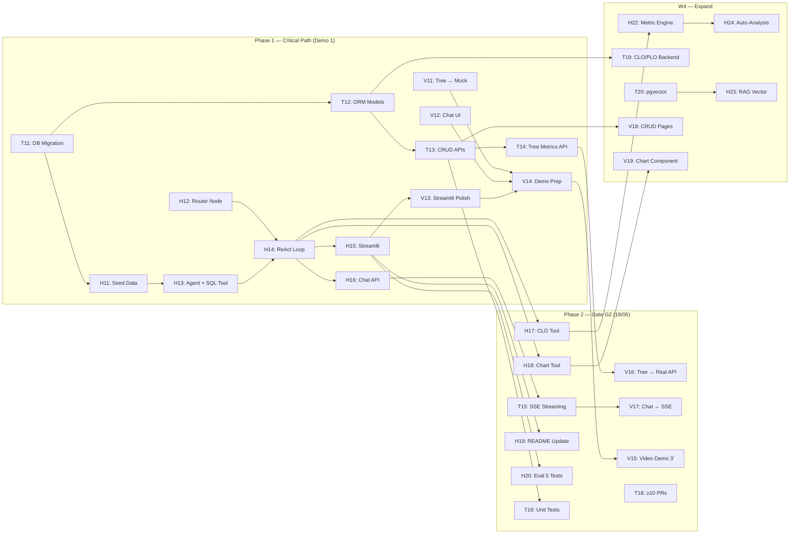

# 🏃 Sprint 2 — Core Agent & Demo 1 (Gate G2: First Working Agent MVP)

> **Thời gian:** 11/06 – 24/06 (2 tuần — W3 + W4)
> **Sprint Goal:** _Xây dựng AI Agent chạy được end-to-end với LLM thực tế, pass Gate G2 (18/06) và Demo 1 (14/06). Agent phải nhận input → xử lý → trả output có ý nghĩa cho ít nhất 1 user flow chính._
> **Tham chiếu:** [SprintPlanning.md](./SprintPlanning.md) · [LangGraphAgent.md](../10-References/LangGraphAgent.md) · [AgentFlowDiagram.md](../10-References/AgentFlowDiagram.md)

> [!IMPORTANT]
> **Gate G2 Deadline: 18/06/2026 (23:59)** — Deliverables bắt buộc:
> 1. ✅ MVP Demo — video 3 phút show user flow end-to-end
> 2. ✅ Architecture diagram — sơ đồ components, data flow
> 3. ✅ Repo có >= 10 PR merged
> 4. ✅ README.md — setup instructions, env vars, sample queries
> 5. ✅ Eval evidences — ít nhất 5 test case manual với output thực tế

> [!WARNING]
> **Demo 1 với đối tác: 14/06** — chỉ 4 ngày từ khi bắt đầu Sprint 2. Ưu tiên tuyệt đối: Agent chạy được trên Streamlit.
> **Chiến lược 2 giai đoạn:** W3 (11–14/06) tập trung MVP cho Demo 1 + Gate G2. W4 (15–24/06) mở rộng tính năng và tích hợp Next.js.

---

## Gate G2 — Mapping Deliverables → Tasks

| # | Gate G2 Deliverable | Hiện trạng | Task phụ trách | Deadline |
|:-:|:--------------------|:-----------|:---------------|:--------:|
| G2-1 | MVP Demo video 3 phút | ⬜ Chưa có | Hiếu quay + edit, cả team demo | 18/06 |
| G2-2 | Architecture diagram | ✅ Đã có 3 Mermaid diagrams trong README | Hoàng cập nhật nếu cần | 14/06 |
| G2-3 | Repo >= 10 PR merged | ⬜ Cần đếm + bổ sung | Cả team tạo PR đúng quy trình | 18/06 |
| G2-4 | README.md (setup, env, queries) | 🟡 Có nhưng thiếu setup/env/sample queries | Hoàng bổ sung | 16/06 |
| G2-5 | Eval evidences (5 test cases) | ⬜ Chưa có | Hoàng + Hưng tạo 5 test cases | 17/06 |

---

## Phân chia Sprint thành 2 Phase

### Phase 1: MVP Sprint (11–14/06) — Demo 1 + Gate G2 Core

> Mục tiêu: Agent chạy end-to-end trên Streamlit, có seed data thật trong DB, demo được 1 user flow hoàn chỉnh.

### Phase 2: Expand & Polish (15–24/06) — Hoàn thiện Gate G2 + FE

> Mục tiêu: Video demo, eval evidences, 10 PRs, README hoàn chỉnh. Bắt đầu tích hợp Next.js.

---

## 🟠 Hoàng — AI/Data Engineer + PM/PO

### Phase 1: MVP Agent (11–14/06)

| # | Task | Mô tả chi tiết | Deadline | Status |
|:-:|:-----|:----------------|:--------:|:------:|
| H11 | Seed Data vào PostgreSQL | Chạy script tiền xử lý data crawl → load SQL seed của 700 sinh viên thực tế vào Docker PostgreSQL. Đảm bảo map đúng schema: trường, khoa, ngành, môn, điểm + CLO | 11/06 | [x] |
| H12 | Implement AgentState + Router Node | Code `AgentState(TypedDict)`, `router_node` dùng GPT-5.4 Nano phân loại intent (simple → fast_response, complex → core_agent). Theo pattern trong `LangGraphAgent.md` | 12/06 | [x] |
| H13 | Implement Core Agent Node + SQL Tool | Code `core_agent_node` dùng GPT-5.4 + `sql_query_tool` kết nối PostgreSQL thật. Agent phải query được điểm, tỷ lệ trượt từ DB | 12/06 | [x] |
| H14 | Implement ReAct Loop + ToolNode | Ghép `ToolNode(handle_tool_errors=True)`, conditional edges, vòng lặp ReAct. Compile graph hoàn chỉnh | 13/06 | [x] |
| H15 | Streamlit Prototype | Tạo app Streamlit đơn giản: input câu hỏi → gọi LangGraph agent → hiển thị output. Streaming nếu kịp | 13/06 | [x] |
| H16 | FastAPI Chat Endpoint | `POST /api/v1/chat` nhận message, invoke LangGraph agent, trả response (JSON hoặc SSE) | 14/06 | [x] |

### Phase 2: Expand + Gate G2 Deliverables (15–18/06)

| # | Task | Mô tả chi tiết | Deadline | Status |
|:-:|:-----|:----------------|:--------:|:------:|
| H17 | Thêm CLO Calculator Tool | Tool tính toán CLO achievement rate từ DB. Agent có thể trả lời "CLO nào đạt thấp nhất ở môn X?" | 15/06 | ⬜ |
| H18 | Thêm Chart Generator Tool | Tool sinh chart spec (JSON) từ data. Frontend/Streamlit render thành biểu đồ | 16/06 | ⬜ |
| H19 | Cập nhật README.md cho Gate G2 | Bổ sung: setup instructions chi tiết, danh sách env vars, 3–5 sample queries với expected output | 16/06 | ⬜ |
| H20 | Eval Evidences — 5 Test Cases | Tạo 5 test case manual: input query → chụp output thực tế → đánh giá chất lượng. Lưu vào `docs/09-Evaluation/` | 17/06 | ⬜ |
| H21 | Prompt Tuning + Error Handling | Tinh chỉnh prompt templates theo cấp (Khoa/Ngành/Môn). Kiểm tra error handling 3 tầng hoạt động đúng | 18/06 | ⬜ |

### Phase 2 mở rộng: W4 (19–24/06)

| # | Task | Mô tả chi tiết | Deadline | Status |
|:-:|:-----|:----------------|:--------:|:------:|
| H22 | Metric Engine — Health Score | Build logic tính Health Score tổng hợp (GPA, Fail Rate, CLO) cho từng node (Khoa/Ngành/Môn) | 20/06 | ⬜ |
| H23 | Vector Search Tool (RAG) | Implement `vector_search_tool` dùng pgvector để tra cứu đề cương môn học | 22/06 | ⬜ |
| H24 | Auto-Analysis Feature | Khi user click node trên Academic Tree → agent tự động phân tích và đưa ra insights | 24/06 | ⬜ |

**Tổng: 14 task · Trọng tâm: LangGraph Agent end-to-end + Gate G2 deliverables + Metric Engine**

---

## 🟢 Hưng — Backend Developer + DevOps

### Phase 1: Backend Foundation cho Agent (11–14/06)

| # | Task | Mô tả chi tiết | Deadline | Status |
|:-:|:-----|:----------------|:--------:|:------:|
| T11 | Database Migration + Seed Runner | Alembic migration từ `schema.sql`. Script seed data runner chạy trên Docker. Đảm bảo DB sẵn sàng cho Agent | 11/06 | ✅ |
| T12 | SQLAlchemy Models + DB Session | ORM models cho core entities (Department, Program, Course, Student, Grade, Section, CLO). DB session factory | 12/06 | ✅ |
| T13 | CRUD API — Core Entities (P0) | Implement CRUD: `/departments`, `/programs`, `/courses`, `/students`, `/grades`. Swagger docs tự động | 13/06 | ✅ |
| T14 | Tree Metrics API | `GET /api/v1/tree` — trả về tree structure với metrics (student count, avg GPA, fail rate) cho từng node. Hỗ trợ Academic Tree component | 14/06 | ⬜ |

### Phase 2: Mở rộng + DevOps (15–18/06)

| # | Task | Mô tả chi tiết | Deadline | Status |
|:-:|:-----|:----------------|:--------:|:------:|
| T15 | SSE Streaming Endpoint | Upgrade `/api/v1/chat` sang Server-Sent Events streaming. FE nhận token-by-token | 15/06 | ⬜ |
| T16 | Unit Tests — Backend | Viết unit tests cho CRUD APIs + DB models. Mục tiêu: ≥ 10 test cases, chạy qua CI/CD | 16/06 | ⬜ |
| T17 | Chốt ORM + Alembic Baseline | Đồng bộ ORM với thiết kế OLTP, tạo migration baseline, seed được database sạch và ghi hướng dẫn rollout | 17/06 | ⬜ |
| T18 | PR Cleanup — đảm bảo ≥ 10 PRs | Review + merge các PRs tồn đọng. Tạo PRs mới cho các features đã code trực tiếp. Đảm bảo repo có ≥ 10 merged PRs | 18/06 | ⬜ |

### Phase 2 mở rộng: W4 (19–24/06)

| # | Task | Mô tả chi tiết | Deadline | Status |
|:-:|:-----|:----------------|:--------:|:------:|
| T19 | CLO/PLO Backend Logic | Implement tính toán CLO/PLO achievement: query grades × CLO mapping → tính tỷ lệ đạt | 20/06 | ⬜ |
| T20 | pgvector Setup + Syllabus Embedding | Enable pgvector extension, tạo table embeddings, script embed đề cương môn học | 22/06 | ⬜ |
| T21 | Docker-compose Update | Thêm services: Streamlit container, pgvector-enabled PostgreSQL. Cập nhật docker-compose.yml | 22/06 | ⬜ |
| T22 | Integration Tests | Tests end-to-end: API → Agent → DB → Response. Chạy trên CI | 24/06 | ⬜ |

**Tổng: 12 task · Trọng tâm: Backend APIs + DB setup + DevOps + Testing**

---

## 🔵 Hiếu — Frontend Developer + QA

### Phase 1: Streamlit Hỗ trợ + FE Preparation (11–14/06)

| # | Task | Mô tả chi tiết | Deadline | Status |
|:-:|:-----|:----------------|:--------:|:------:|
| V11 | Academic Tree ↔ Mock API | Kết nối Tree component với mock JSON API (chuẩn bị cho khi BE API sẵn sàng). Click node → hiện Detail Panel | 12/06 | ✅ |
| V12 | Chat UI Component (Static) | Build Chat interface: input box, message list (user/AI), typing indicator, suggested questions area | 13/06 | ✅ |
| V13 | Streamlit UI Polish | Hỗ trợ Hoàng polish Streamlit prototype: thêm sidebar, format output đẹp hơn, thêm example queries | 14/06 | ✅ |
| V14 | Demo 1 Preparation | Chuẩn bị script demo, test flow end-to-end trên Streamlit. Kiểm tra mọi thứ chạy ổn định | 14/06 | ✅ |

### Phase 2: Gate G2 + Next.js Integration (15–18/06)

| # | Task | Mô tả chi tiết | Deadline | Status |
|:-:|:-----|:----------------|:--------:|:------:|
| V15 | Quay Video Demo 3 phút | Quay + edit video MVP Demo cho Gate G2. Show: user mở app → nhập câu hỏi → agent xử lý → trả output. Có voiceover/subtitle | 17/06 | ⬜ |
| V16 | Academic Tree ↔ Real API | Kết nối Tree component với `/api/v1/tree` thật. Dynamic data, loading states, error handling | 18/06 | ⬜ |
| V17 | Chat UI ↔ SSE Streaming | Kết nối Chat component với `/api/v1/chat` SSE endpoint. Typewriter effect, hiển thị suggested questions | 18/06 | ⬜ |

### Phase 2 mở rộng: W4 (19–24/06)

| # | Task | Mô tả chi tiết | Deadline | Status |
|:-:|:-----|:----------------|:--------:|:------:|
| V18 | CRUD Pages (Courses, Students) | Trang quản lý: danh sách, thêm/sửa/xóa. Dùng shadcn/ui Table + Dialog + Form | 20/06 | ⬜ |
| V19 | Chart Component | Render biểu đồ từ chart spec (JSON) trả về bởi Agent. Dùng Recharts hoặc Chart.js | 22/06 | ⬜ |
| V20 | Prediction UI | Hiển thị xác suất pass/trượt từng môn và tổng tín chỉ pass/trượt kỳ vọng | 22/06 | ⬜ |
| V21 | Responsive + Dark Mode | Đảm bảo layout responsive trên mobile/tablet. Toggle dark mode hoạt động đúng | 24/06 | ⬜ |
| V22 | FE Unit Tests | Viết tests cho core components: Tree, Chat, DetailPanel. Mục tiêu: ≥ 5 test suites | 24/06 | ⬜ |

**Tổng: 12 task · Trọng tâm: Chat UI + Video Demo + Next.js ↔ API integration**

---

## Timeline trực quan

```
Phase 1: MVP Sprint (11–14/06) — ⚡ DEMO 1
━━━━━━━━━━━━━━━━━━━━━━━━━━━━━━━━━━━━━━━━━
         11(T4)   12(T5)   13(T6)   14(T7)
         ──────   ──────   ──────   ──────

Hoàng    H11      H12,H13  H14,H15  H16
         Seed     Agent    ReAct    Chat API
         Data     +Router  +Tools   +Demo
                  +SQL     +Strmlt

Hưng     T11      T12      T13      T14
         DB       ORM      CRUD     Tree
         Migrate  Models   APIs     Metrics

Hiếu     (prep)   V11      V12,V13  V14
                   Tree↔    Chat UI  Demo
                   API      +Strmlt  Prep

         ═══════════════════════════════════
                   🎯 DEMO 1: 14/06
         ═══════════════════════════════════

Phase 2: Gate G2 Deliverables (15–18/06)
━━━━━━━━━━━━━━━━━━━━━━━━━━━━━━━━━━━━━━━━━
         15(CN)   16(T2)   17(T3)   18(T4)
         ──────   ──────   ──────   ──────

Hoàng    H17      H18,H19  H20      H21
         CLO      Chart    Eval 5   Prompt
         Tool     +README  Tests    Tuning

Hưng     T15      T16      T17      T18
         SSE      Unit     ORM      PRs
         Stream   Tests    Baseline ≥ 10

Hiếu     (buffer) V16      V15      V17
                   Tree↔    Video    Chat↔
                   Real API Demo 3'  SSE

         ═══════════════════════════════════
              🚀 GATE G2 DEADLINE: 18/06
         ═══════════════════════════════════

Phase 2 mở rộng: W4 (19–24/06)
━━━━━━━━━━━━━━━━━━━━━━━━━━━━━━━━━━━━━━━━━
         19-20    21-22    23-24
         ──────   ──────   ──────

Hoàng    H22      H23      H24
         Metric   RAG      Auto-
         Engine   Vector   Analysis

Hưng     T19      T20,T21  T22
         CLO/PLO  pgvector Integ.
         Backend  +Docker  Tests

Hiếu     V18      V19,V20  V21,V22
         CRUD     Chart+   Responsive
         Pages    Predict  +Tests
```

---

## Dependencies giữa các task



---

## User Flow chính cho Demo 1 & Gate G2

> Flow end-to-end tối thiểu cần demo được:

```
1. User mở Streamlit app
2. User nhập câu hỏi: "Top 5 môn có tỷ lệ trượt cao nhất ngành KTPM?"
3. Router Node (GPT-5.4 Nano) → phân loại: complex → Core Agent
4. Core Agent (GPT-5.4) → reasoning → gọi sql_query_tool
5. sql_query_tool → query PostgreSQL → trả về data thật
6. Core Agent → tổng hợp → sinh câu trả lời có ý nghĩa
7. Streamlit hiển thị output (text + có thể có chart)
8. Hiển thị 3 suggested follow-up questions
```

---

## Eval Evidences — 10 Test Cases Plan

| # | Input Query | Expected Tool Calls | Pass Criteria |
|:-:|:------------|:-------------------|:--------------|
| TC1 | "Top 5 môn trượt cao nhất ngành CNTT?" | `sql_query_tool` | Đúng 5 môn, đúng % |
| TC2 | "GPA trung bình K21 CNTT?" | `sql_query_tool` | GPA chính xác |
| TC3 | "So sánh trượt Cơ sở dữ liệu K21 vs K22" | `sql_query_tool` (2 lần) | So sánh 2 khóa |
| TC4 | "Chào bạn, chức năng chính là gì?" | Không gọi tool | Router → fast_response |
| TC5 | "CLO thấp nhất môn Tiếng Anh 1?" | `sql_query_tool` | Trả về mã CLO + % |
| TC6 | "K21 CNTT có bao nhiêu sinh viên?" | `sql_query_tool` | Trả về đúng số SV |
| TC7 | "3 sinh viên GPA cao nhất ngành TTNT?" | `sql_query_tool` | Tên + GPA top 3 |
| TC8 | "Tỷ lệ pass Hệ quản trị CSDL?" | `sql_query_tool` | Đúng tỷ lệ % pass |
| TC9 | "Điểm Toán cao cấp 1: K22 vs K21?" | `sql_query_tool` (2 lần) | So sánh điểm 2 khóa |
| TC10| "Môn đk nhiều nhất ngành Cơ điện tử?" | `sql_query_tool` | Đúng tên môn + số SV |

> Mỗi test case sẽ được chụp screenshot output thực tế + đánh giá (Pass/Fail/Partial). Lưu trong `docs/09-Evaluation/gate2_eval_evidences.md`.

---

## Definition of Done — Sprint 2

### Change Request: Database Modernization + Analytics Foundation

Để toàn team cùng đi trên một database thống nhất, Sprint 2 thực hiện theo thứ tự: chốt ORM → migration baseline → reset local một lần → DWH/ETL → ML prediction → UI.

| # | Task | Owner | Deadline | Status |
|:-:|:-----|:-----:|:--------:|:------:|
| T23 | Đồng bộ ORM với schema, chốt Program-Course many-to-many, bỏ model source trùng | Hưng | 19/06 | ⬜ |
| T24 | Sửa seed cohort/import điểm thành phần và tạo Alembic baseline | Hưng | 20/06 | ⬜ |
| T25 | Điều phối một lần reset DB local và xác minh revision/row counts toàn team | Hưng + cả team | 20/06 | ⬜ |
| T26 | Tạo schema `dwh`, ETL idempotent và data quality checks | Hưng | 23/06 | ⬜ |
| H25 | Tạo schema `ml`, baseline dự đoán pass/trượt từng môn, chống leakage | Hoàng | 23/06 | ⬜ |
| H26 | Tổng hợp expected passed/failed credits và báo cáo evaluation | Hoàng | 24/06 | ⬜ |
| V23 | UI prediction từng môn và tổng tín chỉ pass/trượt kỳ vọng | Hiếu | 24/06 | ⬜ |

**Definition of Done bổ sung:**

- Chỉ còn một ORM model source và có Alembic baseline migration.
- Cả team xác nhận cùng migration revision sau đợt reset local.
- Một KPI dashboard được đọc từ DWH và đối soát khớp OLTP.
- Có file/report metric của model; tối thiểu gồm Recall, Precision, F1 và PR-AUC.
- Prediction lưu xác suất pass/trượt từng môn, model version, cutoff và explanation.
- API/UI hiển thị expected passed/failed credits theo sinh viên-học kỳ.
- Demo được luồng seed/import -> refresh DWH -> batch score -> xem prediction.

Tham khảo [DatabaseModernizationPlan.md](../10-References/DatabaseModernizationPlan.md) và [ML_DWH_Architecture.md](../10-References/ML_DWH_Architecture.md).

### Gate G2 Checklist (Deadline: 18/06)

| # | Deliverable | Checklist | Owner | Status |
|:-:|:------------|:----------|:-----:|:------:|
| G2-1 | MVP Demo Video | Video 3 phút, quay rõ user flow end-to-end, có voiceover/subtitle | Hiếu | ⬜ |
| G2-2 | Architecture Diagram | 3+ Mermaid diagrams cập nhật trong README, phản ánh đúng code hiện tại | Hoàng | ⬜ |
| G2-3 | ≥ 10 PR Merged | Đếm trên GitHub, bổ sung nếu thiếu, mỗi PR có description + review | Cả team | ⬜ |
| G2-4 | README.md | Setup instructions, env vars list, ≥ 3 sample queries | Hoàng | ⬜ |
| G2-5 | Eval Evidences | 10 test case manual + screenshot output thực tế | Hoàng + Hưng | ⬜ |

### Sprint 2 Overall Checklist (Deadline: 24/06)

| Category | Checklist | Owner |
|:---------|:----------|:-----:|
| **Agent** | LangGraph agent chạy end-to-end, ≥ 3 tools (SQL, CLO, Chart), ReAct loop, error handling 3 tầng | Hoàng |
| **Backend** | CRUD APIs hoạt động, Tree Metrics API, Chat endpoint, SSE streaming | Hưng |
| **Frontend** | Chat UI + Tree component kết nối API thật, CRUD pages cơ bản | Hiếu |
| **Data** | Seed data trong PostgreSQL, ≥ 100 students với grades thật | Hoàng + Hưng |
| **Testing** | ≥ 10 unit tests BE, ≥ 5 FE test suites, 10 eval evidences | Cả team |
| **DevOps** | Docker chạy đầy đủ services, CI/CD pass trên mọi PR | Hưng |
| **Docs** | README cập nhật, architecture diagrams đúng, Journal + Worklog | Cả team |

---

## Risks Sprint 2

| Risk | Likelihood | Impact | Mitigation |
|:-----|:----------:|:------:|:-----------|
| OpenAI API key chưa có / rate limited | Trung bình | Cao | Chuẩn bị API key sớm (11/06). Có fallback: dùng model rẻ hơn (GPT-5.4 Nano cho cả 2 node) |
| Agent output không ổn định / hallucinate | Cao | Cao | Prompt engineering kỹ, SQL tool chỉ cho SELECT, test 5 cases sớm (trước 17/06) |
| Chỉ có 4 ngày cho Demo 1 (11–14/06) | Cao | Cao | Streamlit MVP first (không Next.js). Chỉ cần 1 flow chạy được |
| DB seed data chưa đủ / sai format | Trung bình | Trung bình | Chạy seed script ngày đầu (11/06), verify data trước khi build agent |
| Không đủ 10 PR merged | Thấp | Trung bình | Tạo PR cho mọi feature, kể cả docs changes. Review nhanh trong team |
| SSE streaming phức tạp hơn dự kiến | Trung bình | Thấp | Phase 1 dùng JSON response bình thường. SSE là Phase 2 |

---

## Sprint Review

**Ngày:** Thứ 3, 24/06/2026 (cuối ngày)
**Nội dung:**
1. ✅ Review Gate G2 deliverables đã nộp (18/06)
2. Demo: Agent chạy trên Streamlit + Next.js (nếu kịp)
3. Demo: CRUD APIs + Tree Metrics API trên Swagger
4. Demo: Chat UI streaming trên Next.js
5. Review eval evidences + test coverage
6. **Retrospective:** Rút kinh nghiệm Demo 1, điều chỉnh cho Sprint 3
7. **Plan Sprint 3** — Tập trung Deploy + Demo 2 (28/06)

> [!CAUTION]
> **Demo 2 với đối tác là 28/06** — chỉ 4 ngày sau Sprint 2. Sprint 3 cần tập trung deploy production (Vercel + Render) và polish UX.
