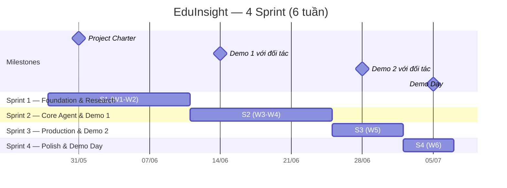

# 📋 Sprint Planning — EduInsight (AI Phân Tích Học Tập)

> **Team 056:** Hoàng (Lead), Hưng, Hiếu
> **Ngày lập:** 07/06/2026 · **Cập nhật:** 07/06/2026
> **Tham chiếu:** [ProgramRequirements.md](../00-Requirements/ProgramRequirements.md)

---

## 1. Phân tích năng lực team

### Skill Matrix (từ Survey 06/06/2026)

| Kỹ năng | Hoàng | Hiếu | Hưng |
|:--------|:-----:|:----:|:----:|
| **React / Next.js** | ⬜ 1 | 🟨 3 | ⬜ 1 |
| **Tailwind / Styling** | ⬜ 1 | 🟨 3 | ⬜ 1 |
| **API Integration (FE)** | 🟦 2 | 🟨 3 | ⬜ 1 |
| **Figma / Wireframe** | ⬜ 1 | 🟨 3 | ⬜ 1 |
| **Python / FastAPI** | 🟩 4 | 🟦 2 | 🟨 3 |
| **Database Design** | 🟨 3 | 🟦 2 | 🟩 4 |
| **Docker / CI-CD** | 🟨 3 | 🟦 2 | 🟨 3 |
| **Deploy** | 🟦 2 | 🟦 2 | 🟦 2 |
| **AI Agent (LangGraph)** | 🟩 4 | 🟦 2 | 🟨 3 |
| **RAG & Vector DB** | 🟩 4 | 🟦 2 | 🟨 3 |
| **Prompt Engineering** | 🟩 4 | 🟦 2 | 🟨 3 |
| **Data Processing** | 🟪 5 | 🟦 2 | 🟩 4 |

> ⬜ 1 Chưa biết · 🟦 2 Biết cơ bản · 🟨 3 Làm được việc · 🟩 4 Tự tin · 🟪 5 Chuyên gia

### Phong cách làm việc

| Thành viên | "Hệ" | Khi gặp bug/công nghệ mới |
|:-----------|:------|:--------------------------|
| **Hoàng** | Kiến trúc sư + Ý tưởng | Hỏi AI (ChatGPT/Claude/Gemini) |
| **Hiếu** | Kiến trúc sư + Ý tưởng | Nhờ đồng đội / pair-programming |
| **Hưng** | Kiến trúc sư | Hỏi AI (ChatGPT/Claude/Gemini) |

### Phân vai chính

| Thành viên | Vai trò chính | Vai trò phụ | Thế mạnh | Tiêu chí chấm phụ trách |
|:-----------|:-------------|:------------|:---------|:------------------------|
| **Hoàng** | AI/Data Engineer, PM/PO | Scrum Master | AI Agent, Prompting, Data, kiến trúc | Agent Quality (10đ), Evaluation (10đ) |
| **Hiếu** | Frontend Developer | QA/Tester | React/Next.js, Tailwind, UI/UX | Presentation (10đ) |
| **Hưng** | Backend Developer | DevOps, AI hỗ trợ | Database, FastAPI, Data processing | DevOps (10đ) |
| **Cả team** | — | — | — | Code Quality (10đ) |

**Lý do phân vai:**

- **Hoàng** có điểm AI/Data cao nhất team (4-5), đồng thời muốn làm PO/PM → phù hợp lead cả product lẫn AI.
- **Hiếu** là người duy nhất có Frontend ≥ 3 → tập trung toàn lực FE. Vai trò QA phụ giúp đảm bảo chất lượng.
- **Hưng** mạnh DB Design (4) + Data Processing (4) + muốn làm Backend/DevOps → phụ trách toàn bộ backend. Đồng thời đang liên hệ thầy cô → kiêm stakeholder contact.

---

## 2. Tổng quan Sprint

### Timeline chương trình (28/05 → 07/07)

> [!IMPORTANT]
> Timeline đã align với **cột mốc bắt buộc** của BTC: Demo 1 (W3), Demo 2 (W5), Demo Day (W6).
> Chiến lược **Infrastructure First** (từ top teams Cohort 1): Docker + CI/CD phải có từ Sprint 1.

### Bảng tổng hợp

| Sprint | Tuần | Ngày | Theme | Milestone | Mục tiêu chính |
|:------:|:----:|:-----|:------|:----------|:---------------|
| **S1** | W1–W2 | 28/05 – 10/06 | Foundation & Research | Project Charter ✅ | Setup env, Docker, CI/CD, DB schema, FastAPI skeleton, FE skeleton, interview stakeholder, crawl data thực tế |
| **S2** | W3–W4 | 11/06 – 24/06 | Core Agent & Analytics Foundation | **🎯 Demo 1 (14/06)** | Agent MVP, ORM/Alembic baseline, DWH/ETL và ML baseline |
| **S3** | W5 | 25/06 – 01/07 | Production & Demo 2 | **🎯 Demo 2 (28/06)** | Deploy, DWH reconciliation, ML evaluation, integration và polish |
| **S4** | W6 | 02/07 – 07/07 | Polish & Demo Day | **🎯 Demo Day (05-07/07)** | README, Pitch Deck, Video Demo, final QA, kiểm tra 10 deliverables |

### Module → Sprint mapping

| Module | S1 | S2 | S3 | S4 |
|:-------|:--:|:--:|:--:|:--:|
| M6 — Data Management & Import | ██ Schema + CRUD | ██ Import + Hoàn thiện | · | · |
| M3 — Metric Engine | · Design | ██ Build | ██ Tune | · |
| M4 — CLO/PLO Assessment | · Design | ██ Build | ██ Tune | · |
| M2 — Contextual AI Chat | · Design | ██ Build (Streamlit→Next.js) | ██ Integration | · Polish |
| M1 — Academic Tree Navigation | · Wireframe | ██ Build | ██ Integration | · Polish |
| M5 — Report & Early Warning | · | · | ██ Build | ██ Polish |
| M7 — Data Warehouse & ETL | · Design | ██ Baseline + Build | ██ Tune | · |
| M8 — ML Pass & Credit Prediction | · Design | ██ Baseline | ██ Integration + Evaluate | · Polish |
| **DevOps** | ██ Docker + CI/CD | · Maintain | ██ Deploy | · Monitor |
| **Testing** | · Setup | · Unit tests | ██ Coverage ≥ 60% | · Final QA |

### Deliverables → Sprint mapping

> [!CAUTION]
> Tất cả 10 deliverables phải sẵn sàng trước Demo Day (07/07).

| # | Deliverable | S1 | S2 | S3 | S4 |
|:-:|:------------|:--:|:--:|:--:|:--:|
| D1 | Source Code | Setup | Build | Refine | ✅ Final |
| D2 | README.md | Draft | Update | Update | ✅ Final |
| D3 | Architecture Diagram | ██ Vẽ | Update | · | ✅ Final |
| D4 | AI Logs | ██ Setup hooks | Liên tục | Liên tục | ✅ Tổng hợp |
| D5 | Live URL | · | · | ██ Deploy | ✅ Verify |
| D6 | Video Demo | · | · | · | ██ Quay |
| D7 | Pitch Deck | · | · | Draft | ██ Final |
| D8 | Journal + Worklog | ██ Bắt đầu | Liên tục | Liên tục | ✅ Tổng hợp |
| D9 | Evaluation Evidence | · | · | ██ RAGAS | ✅ Final |
| D10 | Tests | Setup | ██ Unit tests | ██ Integration | ✅ Coverage |

### Phân công tổng thể qua các Sprint

| Sprint | Hoàng (AI/PM) | Hưng (BE/DevOps) | Hiếu (FE/QA) |
|:------:|:------|:-----|:-----|
| **S1** | Crawl data thực tế, AI agent design, Architecture diagrams, PRD update | Interview stakeholder, DB schema, FastAPI + CRUD, **Docker + CI/CD** | Wireframes, Next.js setup, base components, Tree component (static) |
| **S2** | LangGraph agent, ML baseline từng môn, tổng hợp tín chỉ, prompt tuning | Chốt ORM, Alembic baseline, reset rollout, DWH + ETL | Academic Tree ↔ API, Chat UI, prediction UI |
| **S3** | Auto-analysis, ML evaluation, early warning, AI tuning | **Deploy** Render + Vercel, Auth, integration tests, DWH reconciliation | Integration test, responsive, dark mode, UX fixes, FE tests |
| **S4** | README final, architecture diagram final, evaluation evidence | Final QA, security review, performance check | **Pitch Deck 10 slides**, **Video Demo**, UI polish |

---

## 3. Scoring Strategy — Nhắm 35+/50

> [!IMPORTANT]
> Phân bổ effort để tối ưu điểm dựa trên 5 tiêu chí × 10 điểm mỗi tiêu chí.

| Tiêu chí | Owner | Mục tiêu | Chiến lược |
|:---------|:-----:|:--------:|:-----------|
| **Agent Quality** (10đ) | Hoàng | ≥ 7 | LangGraph StateGraph, ≥ 3 tools, ReAct, error handling 3 tầng, conditional routing |
| **Code Quality** (10đ) | Cả team | ≥ 7 | Ruff lint từ ngày 1 (CI/CD), type hints bắt buộc, PR review, module hóa |
| **DevOps** (10đ) | Hưng | ≥ 7 | Docker multi-stage từ W2, CI/CD (GitHub Actions) từ W2, deploy W5 |
| **Evaluation** (10đ) | Hoàng + Hưng | ≥ 7 | Unit tests liên tục, RAGAS chạy W5, coverage report |
| **Presentation** (10đ) | Hiếu | ≥ 7 | Pitch Deck 10 slides, Video Demo chất lượng, live demo ổn định |

**Tổng mục tiêu: ≥ 35/50**

---

## 4. Quy ước làm việc chung

| Quy ước | Chi tiết |
|:--------|:---------|
| **Standup** | 09:00 hàng ngày trên Discord, format: Done / Doing / Blocked |
| **Giờ core** | 09:00–11:30 và 14:00–17:00 — tất cả online |
| **Branch naming** | `feature/<mã-task>-<tên-ngắn>` — VD: `feature/H5-crawl-data` |
| **Commit** | Tiếng Anh, ngắn gọn: `feat:`, `fix:`, `docs:`, `test:`, `chore:` |
| **PR Review** | Mọi PR cần ≥ 1 review. Hoàng: BE+AI, Hiếu: FE, Hưng: BE |
| **Sprint Review** | Cuối mỗi Sprint — Demo + Retrospective + Plan Sprint tiếp |
| **Mentor Meeting** | T4 tối (chung, bắt buộc) + T7 (riêng team, bắt buộc) |
| **Báo cáo tuần** | Tổng hợp trước T4 tối theo mẫu "Mẫu Báo Cáo Tuần" |
| **Blocked?** | Post Discord #support. Kẹt > 4h → pair-programming |
| **Task ID prefix** | Hoàng: `H1, H2...` · Hưng: `T1, T2...` · Hiếu: `V1, V2...` |
| **Code quality** | Type hints + Ruff lint bắt buộc mọi PR. CI sẽ block merge nếu fail |
| **Database change** | Mọi thay đổi DB phải có Alembic migration, seed/ETL test và ghi breaking change trong PR |
| **DB reset** | Chỉ reset volume khi tech lead thông báo đợt reset có kiểm soát; pull bình thường không dùng `down -v` |

---

## 5. Danh sách Sprint chi tiết

| File | Sprint | Trạng thái |
|:-----|:------:|:----------:|
| [Sprint1.md](./Sprint1.md) | S1 — Foundation & Research (W1–W2) | ✅ Hoàn thành |
| [Sprint2.md](./Sprint2.md) | S2 — Core Agent & Demo 1 (W3–W4) | 🟡 Đang chạy |
| Sprint3.md | S3 — Production & Demo 2 (W5) | ⬜ Chưa lập |
| Sprint4.md | S4 — Polish & Demo Day (W6) | ⬜ Chưa lập |
