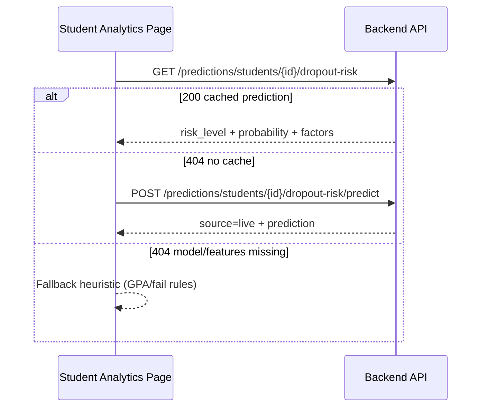

# Story: V20 — Dropout Risk UI (badge + probability)

**Lane:** normal  
**Owner:** Hiếu  
**Sprint:** Sprint 3 · Gate G3-4  
**Depends on:** T52d (ML dropout API — **done**)  
**Status (26/06):** ⬜ Not started — `students/page.tsx` analytics dùng heuristic DWH; chưa có `getDropoutRisk` trong `api.ts`

### Read first

- [Sprint3.md](../Sprint3.md) — V20 row, demo flow G3-4
- [T52.md](./T52.md) — ML pipeline contract, ADR-006 boundary
- [docs/decisions/0006-ml-agent-boundary.md](../../decisions/0006-ml-agent-boundary.md)
- [docs/12-Evaluation/ml-dropout-features.md](../../12-Evaluation/ml-dropout-features.md) — feature meaning
- [docs/12-Evaluation/ml-dropout-baseline.md](../../12-Evaluation/ml-dropout-baseline.md) — risk bands, demo SV
- [frontend/AGENTS.md](../../../frontend/AGENTS.md)

---

## Mục tiêu

Hiển thị **nguy cơ dropout ML** trên dashboard sinh viên: badge mức rủi ro + xác suất + yếu tố giải thích. UI **chỉ đọc API backend** — không tự tính xác suất trên frontend (ADR-006).

**Trang chính:** `frontend/src/app/(dashboard)/manager/analytics/students/page.tsx`  
Hiện có KPI heuristic `Risk level: Cần theo dõi / Ổn định` — V20 **bổ sung hoặc thay thế** bằng ML khi API trả dữ liệu; giữ heuristic làm **fallback**.

---

## Phân biệt quan trọng: `student_code` vs `student_id`

| Khái niệm | Ví dụ | Dùng ở đâu |
|:----------|:------|:-----------|
| `student_code` (MSSV) | `21810310019` | Hiển thị UI, tra cứu người dùng |
| `student_id` (PK nội bộ) | `110` | Một số endpoint predict theo id |

Trên trang analytics students, dropdown đã có `ApiStudent.id` — **ưu tiên gọi API theo `student_id`** khi đã chọn SV.

Nếu cần tra từ MSSV (search box, deep link `?student_code=`):

```http
GET /api/v1/students/by-code/{student_code}
```

---

## API contract (backend sẵn sàng)

Base URL dev: `http://localhost:8000/api/v1`  
Auth: `Authorization: Bearer <token>` (login `admin@epu.edu.vn` / `123456` trên Docker seed).

### 1. Lookup MSSV → record (mới)

```http
GET /api/v1/students/by-code/21810310019
```

**200:**

```json
{
  "id": 110,
  "student_code": "21810310019",
  "full_name": "ĐINH TÂN HOÀNG",
  "status": "expelled",
  "program_id": 1,
  "cohort_id": 1,
  "gpa_cumulative": 4.39,
  ...
}
```

**404:** `Student not found` (hoặc ngoài scope RBAC — cùng message để tránh IDOR).

### 2. Đọc prediction đã batch-score (cache)

```http
GET /api/v1/predictions/students/{student_id}/dropout-risk
```

**200:**

```json
{
  "student_id": 110,
  "dropout_probability": 0.9988,
  "risk_level": "high",
  "top_factors": [
    {"feature": "fail_rate", "impact": 0.5},
    {"feature": "cumulative_gpa", "impact": 4.39},
    {"feature": "dropout_probability", "impact": 0.9988}
  ],
  "scored_at": "2026-06-24T09:40:00Z",
  "model_name": "dropout_classifier",
  "model_version": "v20260624.093920"
}
```

**404:** chưa có batch score → fallback live predict hoặc heuristic.

### 3. Predict on-the-fly (khuyến nghị cho demo)

Theo **internal id**:

```http
POST /api/v1/predictions/students/110/dropout-risk/predict
```

Theo **MSSV** (tiện khi chỉ biết mã SV):

```http
POST /api/v1/predictions/students/by-code/21810310019/dropout-risk/predict
```

Query tùy chọn:

| Param | Default | Mô tả |
|:------|:--------|:------|
| `persist` | `false` | `true` → ghi vào `ml.student_dropout_prediction` |
| `model_run_id` | latest completed | Chọn model run cụ thể |

**200** — thêm field `"source": "live"` so với GET cache.

### 4. Risk bands (hiển thị badge)

| `risk_level` | Điều kiện probability | Gợi ý UI |
|:-------------|:----------------------|:---------|
| `low` | &lt; 0.30 | Badge xanh / secondary |
| `medium` | 0.30 – 0.59 | Badge vàng / warning |
| `high` | ≥ 0.60 | Badge đỏ / destructive |

Hiển thị thêm `dropout_probability` dạng % (1 chữ số thập phân), ví dụ `99.9%`.

### 5. `top_factors` — giải thích ngắn

Map feature → label tiếng Việt:

| `feature` | Label UI |
|:----------|:---------|
| `fail_rate` | Tỷ lệ trượt |
| `cumulative_gpa` | GPA tích lũy |
| `dropout_probability` | Xác suất dropout (model) |

Không diễn giải thêm bằng logic tự chế — có thể link sang global chat để agent giải thích (ADR-006).

---

## Luồng gợi ý trên frontend



**Pseudo-code (`api.ts`):**

```typescript
export interface ApiDropoutRisk {
  student_id: number
  student_code?: string | null
  dropout_probability: number
  risk_level: "low" | "medium" | "high"
  top_factors: { feature: string; impact: number }[]
  model_name?: string
  model_version?: string
  scored_at?: string
  source?: "live" | "batch"
}

async function getDropoutRisk(studentId: number): Promise<ApiDropoutRisk | null> {
  const cached = await fetch(`/api/v1/predictions/students/${studentId}/dropout-risk`)
  if (cached.ok) return cached.json()
  if (cached.status !== 404) throw new Error("dropout-risk failed")

  const live = await fetch(`/api/v1/predictions/students/${studentId}/dropout-risk/predict`, { method: "POST" })
  if (live.ok) return live.json()
  return null // → fallback heuristic
}

async function resolveStudentByCode(code: string): Promise<ApiStudent> {
  const res = await fetch(`/api/v1/students/by-code/${encodeURIComponent(code)}`)
  if (!res.ok) throw new Error("student not found")
  return res.json()
}
```

---

## UI placement (cụ thể)

| Vị trí file | Thay đổi |
|:------------|:---------|
| KPI grid (~dòng 212–218) | Thêm/thay KPI **"Dropout risk (ML)"** với badge `risk_level` + `%` |
| Card header SV (~dòng 250–257) | Badge nhỏ `high/medium/low` cạnh tên |
| Section **Risk Explanation** (~dòng 344–360) | Thêm hàng từ `top_factors`; giữ heuristic rows nếu ML null |
| Loading/error | Skeleton KPI; toast khi 403/503 |

**Không** sửa agent graph, backend ML train/score, migrations.

---

## Fallback heuristic (khi ML không có)

Giữ logic hiện tại trên page (`riskRows`, `gpa_cumulative`, môn trượt). Label rõ:

> *"Ước lượng theo dữ liệu học vụ (chưa có ML)"*

Tham chiếu: [ml-dropout-baseline.md §8](../../12-Evaluation/ml-dropout-baseline.md).

---

## SV demo G3 (đã verify trên Docker)

| MSSV | `student_id` | Kỳ vọng |
|:-----|:-------------|:--------|
| `21810310019` | `110` | `risk_level=high`, probability ~0.99 |

```powershell
# Login
$login = Invoke-RestMethod -Method Post -Uri "http://localhost:8000/api/v1/auth/login" `
  -ContentType "application/x-www-form-urlencoded" `
  -Body "username=admin@epu.edu.vn&password=123456"

# Predict by MSSV (không cần biết id)
Invoke-RestMethod -Method Post `
  -Uri "http://localhost:8000/api/v1/predictions/students/by-code/21810310019/dropout-risk/predict" `
  -Headers @{ Authorization = "Bearer $($login.access_token)" }
```

---

## Do not touch

- `backend/app/ml/*` train/score pipeline (Hoàng / T52)
- Agent graph topology (`nodes.py` edges) — chỉ consume API
- `frontend/` ngoài scope V20 (V41 role UI là task riêng)

---

## Verify

```powershell
cd frontend
npm run lint
npm test
npm run build
```

Manual:

1. Login manager/admin → Analytics → Students
2. Chọn SV `21810310019` → thấy badge **high** + ~99.9%
3. SV không có features → fallback heuristic, không crash
4. Manager khác khoa → 403/404, UI hiển thị lỗi gọn

---

## Done when

- [ ] `api.ts` có `getDropoutRisk` + `getStudentByCode` (hoặc tương đương)
- [ ] Student analytics page hiển thị ML badge + probability + factors
- [ ] Fallback heuristic khi ML 404
- [ ] Loading/error states
- [ ] Checkbox V20 trong [Sprint3.md](../Sprint3.md) được tick

---

## Ghi chú agent (tham khảo, không implement trong V20)

Backend đã có tool `lookup_student_by_code(student_code)` cho chatbot — map MSSV → `student_id`. Frontend dùng REST `GET /students/by-code/...` tương đương.
