## Mục tiêu
- Thu thập 6 tham chiếu UI/UX phù hợp cho dashboard, analytics và trải nghiệm chat AI.
- Xây dựng mood board ý tưởng màu sắc, layout, biểu đồ và component cho giao diện hệ thống quản lý học thuật.
- Thêm ảnh minh họa cho mỗi ứng dụng để dễ hình dung thiết kế cuối cùng.

## Tham chiếu chính

### 1. Metabase
- Mục tiêu: Dashboard tổng quan với cards số liệu, bảng điều khiển nhanh và biểu đồ đơn giản.
- Layout: thanh sidebar nhỏ, header tóm tắt, 3–4 cards chỉ số và lưới chart phía dưới.
- Strengths:
  - Rõ ràng, dễ đọc.
  - Dễ triển khai bằng card + metric + line chart.
  - Phù hợp cho trang `Manager` với KPI tổng sinh viên, GPA trung bình, tỷ lệ trượt.

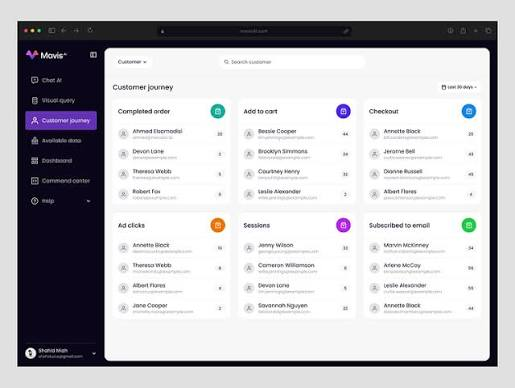
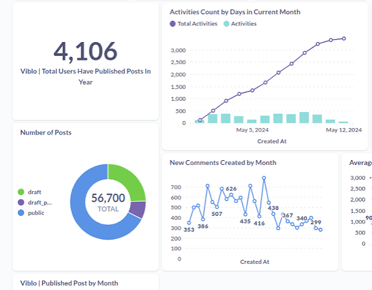
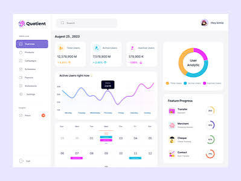

**Borrow**:
- Card summary + biểu đồ trend
- Grid layout 3 cột trên, panel chính dưới
- Các chỉ số màu sắc khác nhau để highlight P0 data

### 2. Grafana
- Mục tiêu: Bảng điều khiển kỹ thuật với nhiều panel dữ liệu và chart liên tục.
- Layout: sidebar filter + area chart + panel thông tin nhỏ, tone dark mode.
- Strengths:
  - Tối ưu cho nhiều dữ liệu cùng lúc.
  - Hiệu quả khi cần hiển thị logs/metrics trong cùng một view.
  - Rất phù hợp cho phần phân tích GPA lịch sử và tỷ lệ trượt theo học kỳ.

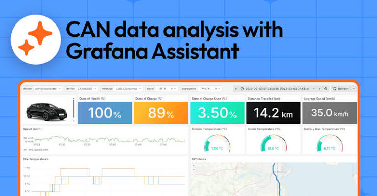
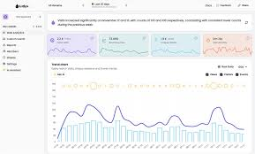

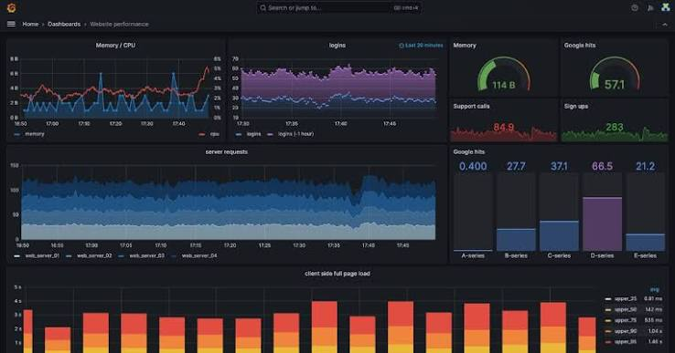

**Borrow**:
- Panel modular, mỗi panel trình bày một metric riêng
- Màu sắc nhấn mạnh dữ liệu hành vi (line chart, pill status)
- Dark dashboard cho góc nhìn enterprise

### 3. Linear
- Mục tiêu: UI nhẹ nhàng cho quản lý task/entity, table và modal input.
- Layout: cards list, form modal, table đơn giản với search/filter.
- Strengths:
  - Tập trung vào usability.
  - Navigation tối giản, typography rõ ràng.
  - Thích hợp cho CRUD và danh sách sinh viên, môn học, giảng viên.

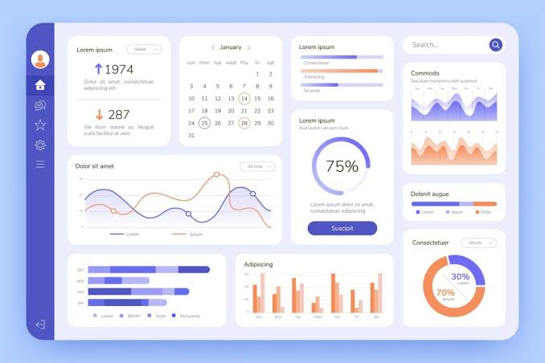
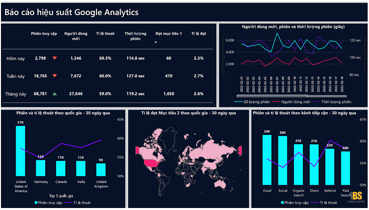
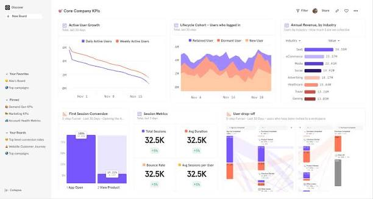

**Borrow**:
- Form modal gọn, labels rõ ràng.
- Table/board clean với khoảng trắng nhiều.
- Các trạng thái action dùng màu nhạt, không gây rối.

### 4. NotebookLM
- Mục tiêu: Trải nghiệm chat AI thân thiện, gợi ý câu hỏi và kết quả phân tích.
- Layout: khung chat lớn bên trái, panel chi tiết bên phải, input cố định dưới.
- Strengths:
  - Hiển thị luồng hội thoại rõ ràng.
  - Dễ mở rộng thêm phần response, chart nhúng và recommended prompts.
  - Phù hợp cho `Chat AI` feature của app.

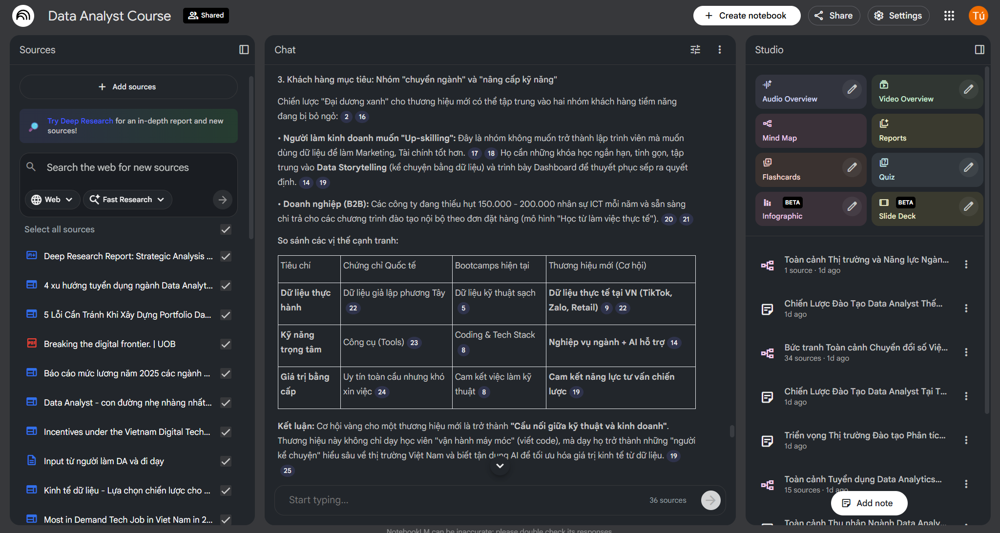
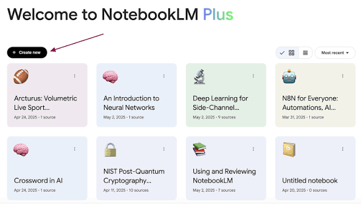
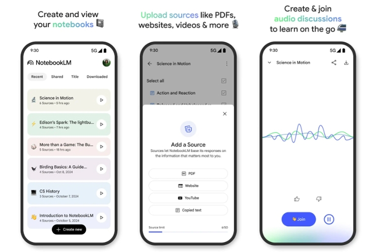

**Borrow**:
- Message bubble rõ ràng, phân biệt user/AI
- Panel detail bên cạnh cho context
- Input luôn cố định ở đáy màn hình

### 5. Ant Design Pro / Superset
- Mục tiêu: Dashboard enterprise chuyên nghiệp, phù hợp hệ thống quản lý học thuật.
- Layout: sidebar menu lớn, header breadcrumbs, phần statistic card và bảng dữ liệu.
- Strengths:
  - Đầy đủ components cho analytics và CRUD.
  - Tối ưu cho phần import Excel, report, danh sách entities.
  - Thiết kế chuyên nghiệp, phù hợp với sản phẩm hướng quản lý.

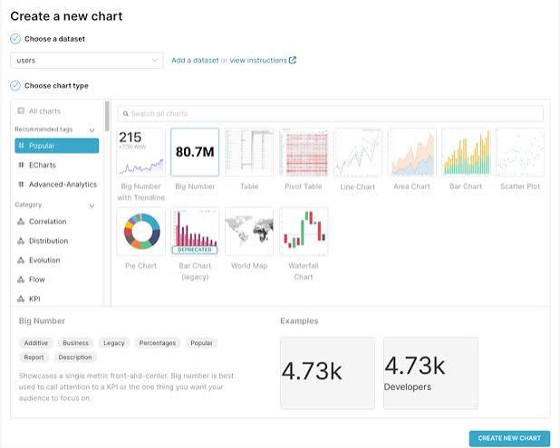
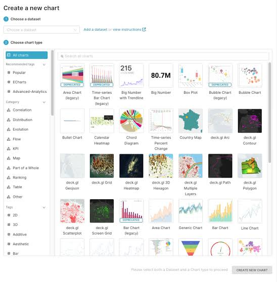

**Borrow**:
- Sidebar + header rõ ràng
- Cards metric nằm trên, bảng/charts bên dưới
- Call-to-action button rõ ràng cho thao tác import / upload

### 6. Figma Community UI Kits
- Mục tiêu: Gợi ý component library, palette màu và hệ thống spacing.
- Layout: card, form, modal, sidebar, tag/badge, table.
- Strengths:
  - Giúp tạo mood board nhanh.
  - Đảm bảo tính nhất quán component và typography.
  - Dễ tham khảo để xây UI design system.

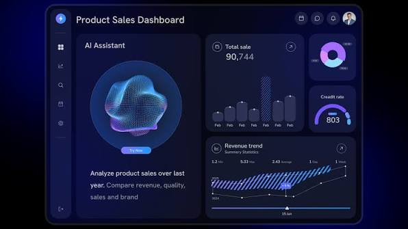

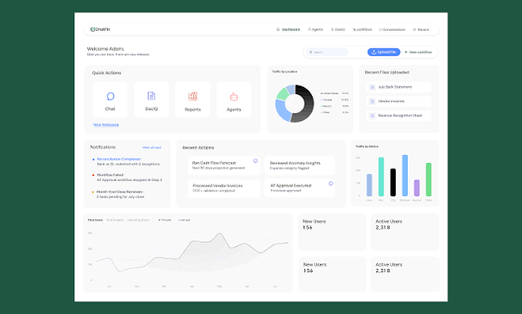

**Borrow**:
- Hệ thống typography: title lớn, text phụ nhẹ
- Màu chủ đạo: xanh dương + trắng + accent vàng/cam
- Spacing chuẩn, border-radius mềm mại

## Mood board ý tưởng
- Màu sắc:
  - `#1f4e79` (xanh dương chủ đạo)
  - `#0f5f89` (xanh secondary)
  - `#fbbf24` (vàng accent)
  - `#e5e7eb` (xám nhạt)
  - `#111827` (nền dark)
- Typography:
  - Chữ đậm cho số liệu lớn
  - Chữ nhỏ nhạt cho mô tả
  - Giữ line-height thoáng, spacing rộng
- Layout:
  - `Sidebar` cố định bên trái với icon + label
  - `Header` nhỏ với breadcrumb hoặc status bar
  - `Main content` gồm 2 cột: trái cho Tree/filter, phải cho Panel/chart
- Component:
  - Card metric (summary)
  - Chart panel dạng line/bar
  - Table dữ liệu và filter
  - Tag/badge trạng thái
  - Modal form CRUD
  - Chat panel + input fixed bottom

## Kết luận
- Hướng UI: Dashboard enterprise + modern analytics.
- Ưu tiên xây dựng:
  1. Sidebar điều hướng rõ ràng.
  2. Cards KPI và chart trend.
  3. Tree / detail panel cho phân tích khoa-ngành.
  4. Chat AI dạng hội thoại kèm gợi ý.
  5. Form CRUD đơn giản, table sắp xếp và filter.
