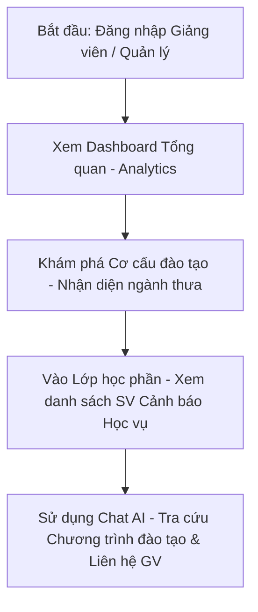

# V58 — README & Screenshot Skeleton cho Demo Day

Tài liệu này đóng vai trò là khung sườn hướng dẫn chuẩn bị tài liệu README, kịch bản Demo trực quan và danh sách ảnh chụp màn hình (screenshots) cần thiết để chuẩn bị cho buổi báo cáo Demo Day.

---

## 1. Checklist Ảnh chụp Giao diện (Screenshots Checklist)

Để báo cáo đạt hiệu quả hình ảnh tốt nhất, cần chuẩn bị các ảnh chụp màn hình có độ phân giải cao, hiển thị rõ luồng tương tác và tính năng chính:

- [ ] **Giao diện Đăng nhập (Login):**
  - Vị trí: `/login`
  - Nội dung: Form đăng nhập hỗ trợ phân quyền người dùng và Actor-first routing.
- [ ] **Bảng Tổng quan Hệ thống (System Overview):**
  - Vị trí: `/manager/analytics`
  - Nội dung: Bản đồ phân tích toàn diện, tỷ lệ dropout trung bình, phân bổ sinh viên và các biểu đồ xu hướng.
- [ ] **Đồ thị Cơ cấu đào tạo (Academic Structure Tree):**
  - Vị trí: `/manager`
  - Nội dung: Bản đồ phân bố sinh viên từ cấp Trường -> Khoa -> Ngành -> Lớp -> Sinh viên.
- [ ] **Danh sách Cảnh báo Học vụ (Student At-Risk Dashboard):**
  - Vị trí: `/manager/analytics/sections` hoặc `/manager/students`
  - Nội dung: Danh sách sinh viên thuộc diện cần can thiệp với các nhãn cảnh báo (at-risk badge).
- [ ] **Trợ lý AI Hỗ trợ Đào tạo (AI Chatbot Co-pilot):**
  - Vị trí: `/chat`
  - Nội dung: Khung chat hỏi đáp thông tin chương trình đào tạo, cơ cấu học phần và hỗ trợ giảng dạy.

---

## 2. Kịch bản Demo 3 phút (3-Minute Demo Flow)

Kịch bản đề xuất cho buổi Demo Day đi theo luồng từ tổng quan đến chi tiết, tập trung vào giải quyết nỗi đau của giảng viên và quản lý đào tạo:



### Chi tiết các bước:
1. **Bước 1 (Giây 0 - 45): Phân vai & Đăng nhập**
   - Đăng nhập tài khoản Giảng viên hoặc Quản trị hệ thống. Trực quan hóa vai trò tiếng Việt đã được đồng bộ hóa trên Header và Sidebar.
2. **Bước 2 (Giây 45 - 90): Phân tích & Phát hiện cảnh báo**
   - Truy cập trang **Tổng quan** để xem các chỉ số thống kê về tỷ lệ sinh viên at-risk và phân bổ ngành học.
   - Chuyển hướng nhanh sang **Cơ cấu đào tạo** để xem heatmap mật độ sinh viên và dữ liệu ngành thưa sau khi đã nạp dữ liệu chuẩn hóa.
3. **Bước 3 (Giây 90 - 150): Can thiệp & Hỗ trợ học vụ**
   - Điều hướng vào danh sách **Lớp học phần** phụ trách.
   - Nhận diện các sinh viên có badge cảnh báo cao. Click nút **Liên hệ** để lưu nhật ký hoặc kích hoạt gửi email hỗ trợ trực tiếp.
4. **Bước 4 (Giây 150 - 180): Grounded Chat AI**
   - Mở cửa sổ **Chat AI** để đặt các câu hỏi liên quan đến quy định chương trình đào tạo, chuẩn đầu ra (CLO) để tư vấn định hướng môn học cho sinh viên.

---

## 3. Khung sườn README Demo Day (README Template)

Dưới đây là khung sườn tài liệu `README.md` nộp cho Ban tổ chức:

```markdown
# EduInsight — Hệ thống Phân tích Đào tạo & Dự báo Cảnh báo Học vụ

Hệ thống hỗ trợ quản lý đào tạo, phân tích cơ cấu sinh viên và đưa ra cảnh báo sớm về nguy cơ thôi học của sinh viên, đồng thời hỗ trợ giảng viên liên hệ hỗ trợ kịp thời.

## 1. Thành viên nhóm & Vai trò
- Nguyễn Văn A: Trực quan hóa dữ liệu (FE)
- Trần Văn B: Xử lý dữ liệu & AI Engine (BE)

## 2. Đường dẫn Sản phẩm (Live URLs)
- Frontend App: [https://eduinsight-fe.vercel.app](https://eduinsight-fe.vercel.app)
- Backend API: [https://eduinsight-be.render.com](https://eduinsight-be.render.com)

## 3. Kiến trúc Hệ thống
- Frontend: Next.js 16, React 19, TailwindCSS / Custom CSS.
- Backend: FastAPI, LangGraph, SQLAlchemy, PostgreSQL, pgvector.

## 4. Các tính năng cốt lõi (Core Features)
1. **Actor-First Dashboard:** Phân quyền vai trò người dùng rõ ràng (Quản trị, Giảng viên, Quản lý khoa).
2. **At-risk Student Identification:** Nhận diện và đưa ra danh sách sinh viên có nguy cơ dropout dựa trên điểm số và hành vi.
3. **Curriculum RAG Assistant:** Trợ lý AI trả lời câu hỏi grounded dựa trên PDF chương trình đào tạo chính thức.
```
