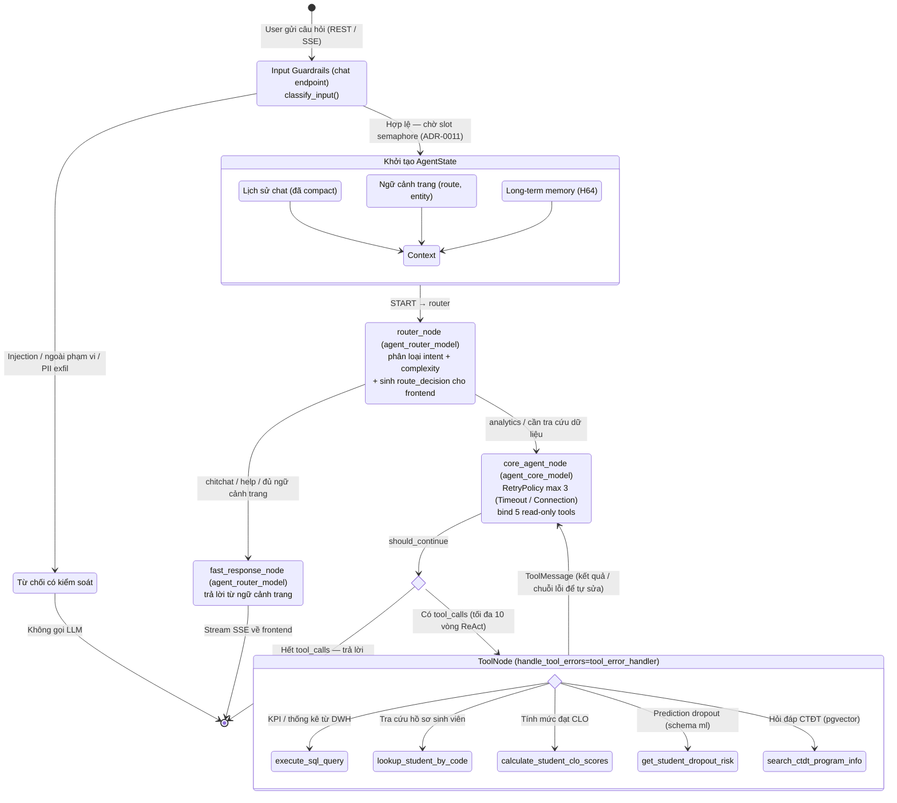

# 🧠 Agent Flow Diagram — EduInsight

Tài liệu này mô tả luồng ra quyết định (Reasoning) và thực thi (Acting) của **LangGraph Agent** trong EduInsight, đúng theo hiện trạng code tại `backend/app/agent/`. Agent áp dụng model tiering ([ADR-0003](../decisions/0003-openai-model-tiering.md)): node router/fast-response dùng `agent_router_model`, node core dùng `agent_core_model` — hai biến cấu hình độc lập, hỗ trợ provider OpenAI-compatible hoặc Gemini.

## Luồng tổng thể

## Giải thích luồng hoạt động

1. **Input Guardrails (trước khi vào graph):** Chat endpoint gọi `classify_input()` để chặn prompt injection, câu hỏi ngoài phạm vi học vụ, yêu cầu không an toàn và yêu cầu khai thác PII. Câu hỏi bị chặn nhận phản hồi từ chối chuẩn hóa mà **không tốn lượt gọi LLM nào**.
2. **Concurrency limiter:** Mỗi request agent phải lấy slot từ semaphore in-process (`max_concurrent_agent_runs`, [ADR-0011](../decisions/0011-agent-concurrency-limiter.md)) để bảo vệ backend khi nhiều người chat đồng thời.
3. **Khởi tạo AgentState:** Câu hỏi mới được gộp với lịch sử chat (đã compact để tiết kiệm token), ngữ cảnh trang hiện tại (route, entity đang xem) và tóm tắt long-term memory của người dùng (H64).
4. **Router Node (điều phối):** Dùng `agent_router_model`, phân loại câu hỏi theo `intent_category` (chitchat / analytics / report / navigation / help), độ phức tạp và nhu cầu gọi tool. Router đồng thời sinh **`route_decision`** trả về frontend: `inline` (trả lời ngay tại trang) hay `full_chat` (điều hướng sang `/chatbot`, giữ nguyên ngữ cảnh). Nếu router lỗi, hệ thống fallback an toàn về `fast_response`.
5. **Fast Response Node:** Trả lời câu hỏi đơn giản trực tiếp từ ngữ cảnh trang, không đi vào vòng lặp tool — nhanh và rẻ.
6. **Core Agent Node (não bộ):** Dùng `agent_core_model` với 5 tool read-only được bind sẵn. System prompt được chèn **role guardrail block** theo vai trò người dùng (RBAC) ở phía server. Node có `RetryPolicy` tối đa 3 lần cho lỗi mạng tạm thời.
7. **Vòng lặp ReAct:** Sau khi tool chạy xong, kết quả (hoặc chuỗi báo lỗi) quay lại Core Agent để đánh giá đã đủ thông tin chưa; nếu chưa thì gọi tool tiếp. Vòng lặp bị chặn cứng ở **10 lần gọi tool** để không lặp vô hạn.
8. **Kết thúc:** Khi không còn `tool_calls`, câu trả lời cuối đi qua output guardrails (mask PII) rồi stream về frontend bằng SSE (`astream_events`); phiên hội thoại được lưu lại.

## Tool boundary

| Tool | Nguồn dữ liệu | Trách nhiệm | Cơ chế an toàn |
|:--|:--|:--|:--|
| `execute_sql_query` | schema `dwh` | KPI, trend, thống kê lịch sử | Chỉ `SELECT`, sanitize query, whitelist bảng analytics, giới hạn số dòng, lọc theo scope khoa của người dùng |
| `lookup_student_by_code` | OLTP/DWH | Tra cứu hồ sơ sinh viên theo mã | Kiểm tra scope RBAC trước khi trả dữ liệu |
| `calculate_student_clo_scores` | OLTP/DWH | Tính và giải thích mức đạt CLO theo sinh viên–môn | Kiểm tra scope RBAC |
| `get_student_dropout_risk` | schema `ml` | Đọc prediction dropout kèm model run, version, yếu tố đóng góp | Chỉ đọc kết quả batch scoring có sẵn |
| `search_ctdt_program_info` | pgvector | RAG hỏi đáp chương trình đào tạo | Nhận diện/chuẩn hóa alias tên ngành trước khi search |

Mọi tool đều chạy trong ngữ cảnh RBAC của người dùng hiện tại (`set_agent_tool_context`) và được đo thời gian thực thi phục vụ observability.

## Xử lý lỗi ba tầng

1. **Tầng Tool:** tool trả về chuỗi `ERROR: ...` thay vì raise; `ToolNode(handle_tool_errors=tool_error_handler)` chuyển exception còn sót thành text để LLM đọc và **tự sửa** (self-correction) ở vòng lặp kế tiếp.
2. **Tầng Node:** `core_agent_node` có `RetryPolicy(max_attempts=3)` cho `TimeoutError`/`ConnectionError`; mọi node đều catch exception và trả về partial state kèm thông báo fallback thay vì crash graph.
3. **Tầng Graph/Endpoint:** router lỗi → fallback `fast_response`; lỗi credentials/rate-limit được map thành HTTP status phù hợp (503/429/500) với thông báo an toàn theo môi trường.

## Ranh giới với các thành phần khác

- **ML:** Agent **không** tự tính xác suất pass/trượt/dropout. Pipeline ML chạy batch scoring ngoài LangGraph; Agent chỉ truy xuất và diễn giải prediction đã có version và thời điểm chấm ([ADR-0006](../decisions/0006-ml-agent-boundary.md)).
- **Report Agent:** luồng xây báo cáo bằng ngôn ngữ tự nhiên (`report_service.py`, `report_tools.py`) là flow riêng ngoài graph này, với nguyên tắc **mọi thao tác ghi phải qua bước xác nhận** của người dùng.
- **RBAC:** frontend chỉ ẩn/hiện UI; kiểm tra quyền cuối cùng nằm ở backend — trong system prompt (role guardrail block) và trong từng tool.

## Đối chiếu mã nguồn

| Thành phần | File |
|:--|:--|
| Lắp ráp graph, `should_continue`, giới hạn 10 vòng ReAct | `backend/app/agent/graph.py` |
| `router_node`, `core_agent_node`, `fast_response_node`, danh sách `TOOLS`, model tiering | `backend/app/agent/nodes.py` |
| 5 tool read-only + sanitize SQL + scope RBAC | `backend/app/agent/tools.py` |
| `AgentState` (TypedDict, reducer `add_messages`) | `backend/app/agent/state.py` |
| Phân loại router, `RouteDecision` (inline / full_chat) | `backend/app/agent/route_decision.py` |
| Input/output guardrails, role guardrail block, mask PII | `backend/app/agent/guardrails.py` |
| Compact history, long-term memory (H64) | `backend/app/agent/memory.py` |
| `tool_error_handler`, map lỗi → HTTP status | `backend/app/agent/errors.py` |
| Chat endpoint: guardrails, semaphore, SSE `astream_events` | `backend/app/api/v1/endpoints/chat.py` |
