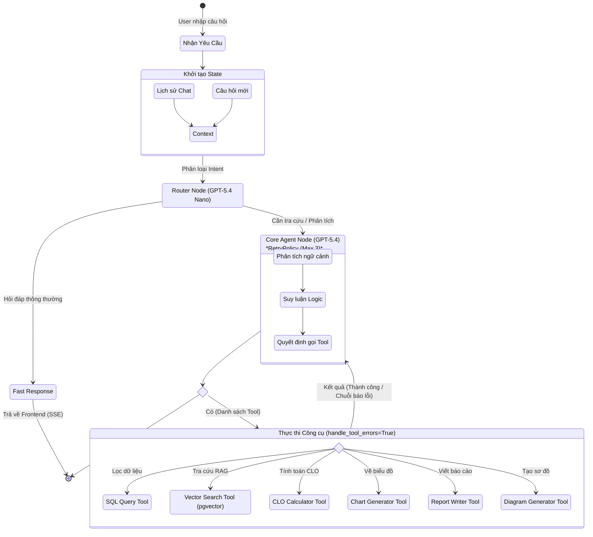

# 🧠 Agent Flow Diagram — EduInsight (D3)

Biểu đồ này mô tả chi tiết luồng ra quyết định (Reasoning) và thực thi (Acting) bên trong **LangGraph Agent** của dự án EduInsight, áp dụng chiến lược Phân cấp Model (GPT-5.4 Nano & GPT-5.4).

## Giải thích luồng hoạt động:
1. **Khởi tạo State:** Agent nhận câu hỏi mới và kết hợp với lịch sử chat để tạo thành `State` (Memory).
2. **Router Node (Vệ sĩ & Điều phối):** Sử dụng `GPT-5.4 Nano` (siêu rẻ, siêu tốc độ). Nếu câu hỏi đơn giản (VD: "Chào bạn", "Tóm tắt đoạn văn trên"), nó xử lý và trả về luôn. Nếu câu hỏi khó (VD: "Tỷ lệ trượt Toán là bao nhiêu?"), nó chuyển cho `Core Agent Node`.
3. **Core Agent Node (Não bộ):** Sử dụng `GPT-5.4`. Tại đây, AI sẽ suy luận (Reasoning) xem cần gọi những công cụ nào.
4. **Tool Node (Thực thi):** Chạy các hàm Python tương ứng (SQL, Vector Search, Vẽ chart).
5. **Vòng lặp ReAct:** Sau khi Tool chạy xong, kết quả được gửi ngược lại `Core Agent Node` để AI đánh giá xem đã đủ thông tin trả lời chưa. Nếu chưa đủ, nó tiếp tục gọi Tool khác. Nếu có lỗi, AI tự động nhận lỗi và viết lại lệnh đúng.
6. **Kết thúc:** Khi không cần gọi Tool nữa, AI sinh ra câu trả lời cuối cùng và stream về cho người dùng.
