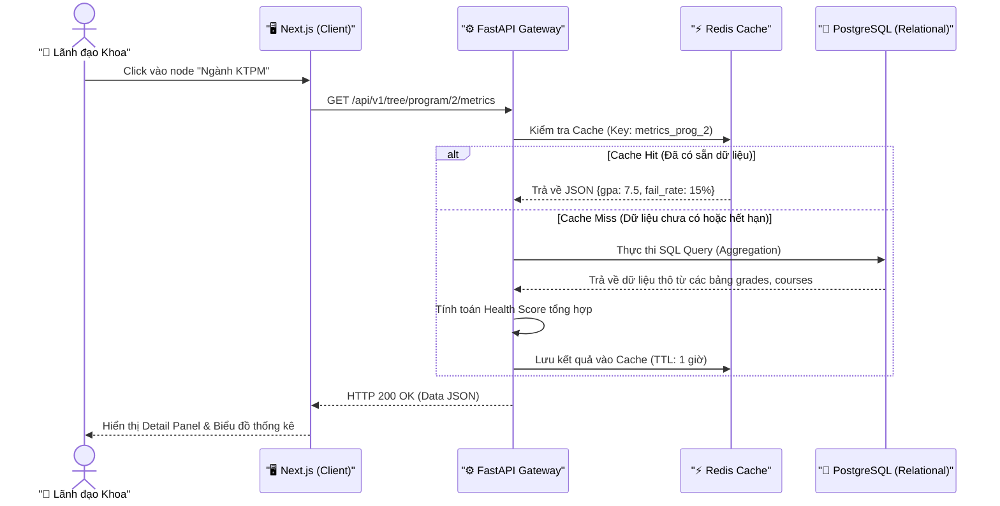
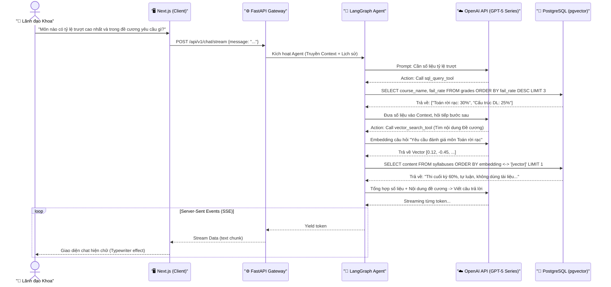
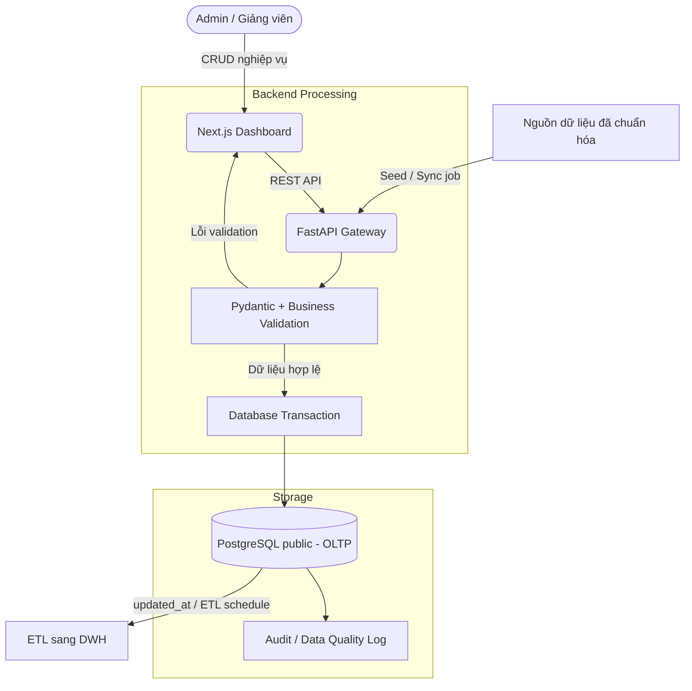
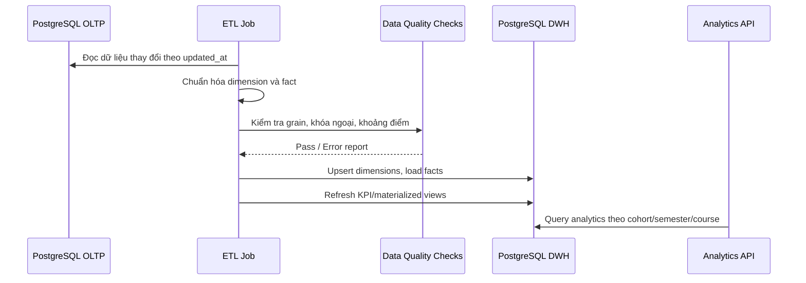
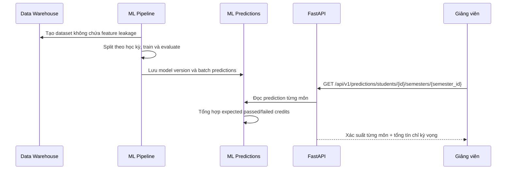

# 🔄 Data Flow Diagram — EduInsight (D3)

Biểu đồ này mô tả chi tiết cách dữ liệu luân chuyển giữa các tầng (Frontend -> API Gateway -> AI Agent -> Database) trong các luồng nghiệp vụ chính của hệ thống EduInsight.

## 1. Luồng truy vấn Dữ liệu Cơ bản (Academic Tree Navigation)
Đây là luồng khi người dùng tương tác với giao diện Cây học thuật (Tree UI) và xem các chỉ số thống kê cơ bản mà không cần gọi đến AI.

## 2. Luồng AI tương tác ngữ cảnh (Contextual AI Chat & Hybrid Search)
Đây là luồng dữ liệu phức tạp nhất, kích hoạt khi người dùng đặt câu hỏi sâu yêu cầu phân tích chéo giữa số liệu điểm (Relational) và nội dung đề cương môn học (Vector).

## 3. Luồng Ghi nhận và Đồng bộ Dữ liệu

Dữ liệu nghiệp vụ được ghi nhận qua CRUD API hoặc seed/sync job đã được kiểm soát. Mọi đường ghi dữ liệu đều phải validation, có transaction và để lại dấu vết phục vụ đối soát.

## 4. Luồng ETL sang Data Warehouse

## 5. Luồng dự đoán pass/trượt và tổng tín chỉ bằng ML

