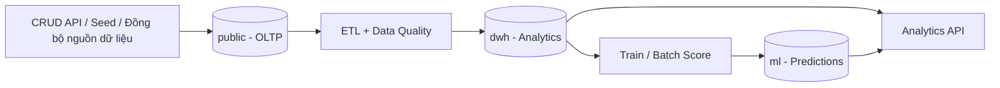

# Kế hoạch Hiện đại hóa Database, DWH và ML

> **Trạng thái:** Kế hoạch thống nhất cho toàn team  
> **Mục tiêu:** sửa nền tảng database một lần có kiểm soát, sau đó mọi thay đổi được phân phối bằng Alembic migration  
> **Áp dụng cho:** Backend, Data/ML, Frontend và DevOps

## 1. Quyết định đã chốt

### Bài toán dự đoán

Hệ thống dự đoán ở hai cấp:

1. **Cấp môn học/enrollment:** xác suất pass và xác suất trượt của từng môn sinh viên đang học.
2. **Cấp sinh viên-học kỳ:** tổng tín chỉ pass/trượt kỳ vọng, được tổng hợp từ prediction từng môn.

```text
expected_passed_credits = SUM(course_credits * pass_probability)
expected_failed_credits = SUM(course_credits * fail_probability)
high_risk_failed_credits = SUM(course_credits WHERE fail_probability >= threshold)
```

Không huấn luyện model regression riêng để đoán trực tiếp tổng tín chỉ trong MVP. Dự đoán từng môn trước giúp hệ thống giải thích được môn nào đóng góp vào rủi ro và vẫn tổng hợp được tổng tín chỉ.

### Nguồn định nghĩa database

- SQLAlchemy ORM trong `backend/app/models/` là nguồn định nghĩa cấu trúc chính.
- Mọi thay đổi cấu trúc phải có Alembic migration.
- `backend/db/schema.sql` chỉ là tài liệu tham chiếu hoặc file bootstrap được sinh/đồng bộ từ migration; không được phát triển độc lập với ORM.
- Seed data chạy bằng script có version, không phụ thuộc vào Docker init SQL.

### Chiến lược chuyển đổi

Vì dự án chưa có dữ liệu production cần bảo toàn, team thực hiện **một lần reset database local có kiểm soát** sau khi migration baseline mới được merge. Sau mốc đó, pull code chỉ cần chạy migration, không reset volume.

## 2. Kiến trúc database đích

Một PostgreSQL instance được tách thành ba schema bắt buộc và một schema tùy chọn:

| Schema | Trách nhiệm | MVP |
|:-------|:-------------|:---:|
| `public` | OLTP: CRUD, enrollment, điểm, CLO/PLO và audit | Bắt buộc |
| `dwh` | Star schema, dữ liệu lịch sử, feature và KPI analytics | Bắt buộc |
| `ml` | Model run, prediction từng môn và tổng hợp tín chỉ | Bắt buộc |
| `staging` | Dữ liệu tạm trước validation/transform | Tùy chọn; dùng khi import phức tạp |



## 3. Cấu trúc dữ liệu đích

### Schema `public`

Giữ các entity nghiệp vụ hiện tại, đồng thời sửa và bổ sung:

| Thay đổi | Lý do |
|:---------|:------|
| Chốt quan hệ Program-Course many-to-many qua `program_courses` | Một môn có thể thuộc nhiều chương trình |
| Đồng bộ ORM với schema thực tế | Loại bỏ tình trạng ORM yêu cầu `courses.program_id` nhưng SQL không có |
| Thêm `grade_components.assessed_at`, `recorded_at` | Tạo feature theo đúng thời điểm, tránh leakage |
| Thêm `enrollments.registered_credits`, `completed_at` | Lưu lịch sử tín chỉ tại thời điểm đăng ký |
| Lưu đầy đủ TX1-TX4, điểm thi và trạng thái vắng | Cung cấp feature dự đoán trước điểm cuối kỳ |
| Sửa seed cohort bằng natural key/code | Tránh sai liên kết do hard-code ID |

### Schema `dwh`

| Bảng | Grain |
|:-----|:------|
| `dim_student` | một sinh viên |
| `dim_course` | một môn học |
| `dim_section` | một lớp học phần |
| `dim_semester` | một học kỳ |
| `dim_program` | một chương trình |
| `dim_cohort` | một khóa |
| `fact_enrollment_outcome` | một sinh viên trong một lớp học phần |
| `fact_grade_component` | một điểm thành phần của enrollment |
| `fact_student_semester` | một sinh viên trong một học kỳ |
| `fact_clo_achievement` | một enrollment và một CLO |
| `etl_run` | một lần chạy ETL |
| `data_quality_result` | một kiểm tra chất lượng dữ liệu |

`fact_student_semester` là bảng tổng hợp phục vụ cả analytics và đánh giá prediction:

```text
student_key
semester_key
registered_credits
passed_credits
failed_credits
attempted_course_count
passed_course_count
failed_course_count
gpa_before_semester
gpa_semester
```

### Schema `ml`

| Bảng | Grain / mục đích |
|:-----|:-----------------|
| `model_run` | một lần train model, feature set và evaluation metrics |
| `enrollment_prediction` | prediction của một enrollment tại một prediction cutoff |
| `student_semester_prediction` | prediction tổng hợp tín chỉ của một sinh viên-học kỳ |

`ml.enrollment_prediction`:

```text
model_run_id
enrollment_id
prediction_cutoff
pass_probability
fail_probability
predicted_status
explanation
scored_at
```

`ml.student_semester_prediction`:

```text
model_run_id
student_id
semester_id
registered_credits
expected_passed_credits
expected_failed_credits
high_risk_failed_credits
risk_level
scored_at
```

## 4. Kế hoạch chuyển đổi theo phase

### Phase 0 - Freeze và thống nhất

- Tạm dừng thêm bảng/cột mới ngoài kế hoạch này.
- Chọn `backend/app/models/` làm ORM duy nhất; loại bỏ hoặc ngừng dùng `backend/app/models.py`.
- Chốt Program-Course many-to-many.
- Chốt bảng và tên cột theo tài liệu này.

**Gate:** PR kiến trúc được review bởi Backend owner và AI/Data owner.

### Phase 1 - Sửa OLTP và migration baseline

- Đồng bộ ORM với schema SQL.
- Sửa seed cohort và script đồng bộ dữ liệu.
- Thêm timestamp cho grade component và snapshot tín chỉ enrollment.
- Tạo Alembic baseline migration thực sự trong `backend/migrations/versions/`.
- Đổi PostgreSQL image sang bản hỗ trợ pgvector nếu RAG tiếp tục dùng pgvector.

**Gate:** DB mới tạo được hoàn toàn từ migration + seed script; CRUD API và tests chạy qua.

### Phase 2 - Reset local database một lần

Sau khi Phase 1 được merge, toàn team thực hiện:

```powershell
git pull
docker compose down -v
docker compose up --build
```

`docker compose down -v` xóa database local. Chỉ chạy trong đợt chuyển đổi được thông báo, không dùng trong quy trình pull hằng ngày.

**Gate:** mọi thành viên xác nhận cùng Alembic revision và seed row counts.

### Phase 3 - Xây DWH và ETL

- Tạo schema `dwh`.
- Load dimensions trước, facts sau.
- ETL idempotent: chạy lại không tạo duplicate.
- Đối soát số enrollment, tổng tín chỉ pass/trượt và fail rate giữa `public` và `dwh`.

**Gate:** KPI DWH khớp OLTP trên dataset demo; có log `etl_run` và `data_quality_result`.

### Phase 4 - Xây ML prediction

- Tạo schema `ml`.
- Train model pass/trượt từng enrollment bằng split theo học kỳ.
- Không sử dụng final grade, is_passed hoặc dữ liệu phát sinh sau prediction cutoff làm feature.
- Lưu prediction từng môn.
- Tổng hợp thành expected passed/failed credits.

**Gate:** API trả prediction từng môn và tổng tín chỉ; có model version, metrics và explanation.

### Phase 5 - Tích hợp UI, Agent và vận hành

- Dashboard hiển thị prediction từng môn và tổng tín chỉ kỳ vọng.
- Agent chỉ giải thích dữ liệu từ DWH/ML, không tự tạo xác suất.
- CI kiểm tra migration, seed, ETL idempotency và data reconciliation.

## 5. Quy trình làm việc sau đợt reset

### Thành viên pull code bình thường

```powershell
git pull
docker compose up --build
```

Backend entrypoint chạy `alembic upgrade head` để cập nhật database mà không mất dữ liệu.

### Khi thay đổi database

1. Sửa ORM model.
2. Tạo Alembic migration.
3. Review migration SQL và downgrade.
4. Chạy migration trên database sạch và database đang có dữ liệu.
5. Cập nhật seed/ETL/tests nếu cần.
6. Ghi breaking change trong PR description.

### Các lệnh kiểm tra bắt buộc

```powershell
docker compose exec backend alembic current
docker compose exec backend alembic history
docker compose exec backend pytest
```

## 6. Phân công đề xuất

| Workstream | Owner chính | Reviewer | Deliverable |
|:-----------|:-----------:|:--------:|:------------|
| Chốt ORM + Alembic baseline | Hưng | Hoàng | Migration baseline, CRUD pass |
| Seed/sync + data quality | Hưng | Hoàng | Seed idempotent, reconciliation report |
| DWH + ETL | Hưng | Hoàng | Star schema, ETL runner |
| Feature engineering + model | Hoàng | Hưng | Model run, evaluation, prediction tables |
| Prediction UI | Hiếu | Hoàng | Môn có rủi ro + tổng tín chỉ kỳ vọng |
| Setup guide + rollout verification | Cả team | Hưng | Mọi máy cùng revision và row counts |

## 7. Definition of Done toàn bộ chuyển đổi

- Chỉ còn một ORM model source.
- Có Alembic baseline và ít nhất một migration test.
- Database sạch được dựng bằng migration + seed, không phụ thuộc chỉnh tay.
- Team đã hoàn thành một lần reset local được thông báo.
- DWH ETL chạy lặp lại không tạo duplicate.
- KPI quan trọng khớp giữa OLTP và DWH.
- Prediction từng môn và tổng tín chỉ pass/trượt được lưu trong schema `ml`.
- Prediction có model version, cutoff, scored time và explanation.
- README/Project Setup mô tả đúng quy trình pull, reset và migration.
