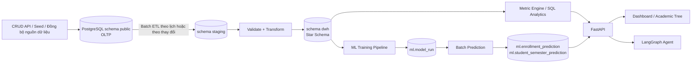

# Kiến trúc Data Warehouse và Machine Learning cho EduInsight

## 1. Mục tiêu

EduInsight là một sản phẩm learning analytics, vì vậy hệ thống cần phân biệt rõ ba loại workload:

1. **OLTP:** CRUD sinh viên, môn học, lớp học phần, điểm và cấu hình CLO/PLO.
2. **OLAP/DWH:** tổng hợp dữ liệu lịch sử để phân tích theo học kỳ, khóa, ngành, môn và CLO/PLO.
3. **Machine Learning:** dự đoán xác suất pass/trượt từng môn, sau đó tổng hợp tổng tín chỉ pass/trượt kỳ vọng của sinh viên trong học kỳ.

LLM/AI Agent có nhiệm vụ diễn giải và điều phối công cụ. LLM không thay thế mô hình dự đoán ML và không tự tạo ra xác suất rủi ro.

## 2. Phạm vi MVP

### Trong phạm vi

- Xây dựng DWH dạng star schema trong schema PostgreSQL riêng tên `dwh`.
- Đồng bộ dữ liệu từ schema nghiệp vụ sang DWH bằng batch ETL.
- Dashboard và SQL analytics đọc từ DWH thay vì aggregate trực tiếp trên các bảng CRUD.
- Huấn luyện một mô hình dự đoán xác suất pass/trượt của từng lớp học phần.
- Tổng hợp prediction từng môn thành tổng tín chỉ pass/trượt kỳ vọng.
- Hiển thị xác suất, tổng tín chỉ kỳ vọng và các yếu tố giải thích chính.
- Lưu lịch sử lần chạy mô hình để có thể kiểm tra và tái lập kết quả.

### Ngoài phạm vi MVP

- Streaming data hoặc dự đoán real-time.
- Auto-retraining hoàn toàn tự động.
- Feature store, model registry hoặc hệ thống MLOps độc lập.
- Dự đoán bỏ học toàn chương trình nếu chưa có nhãn lịch sử đáng tin cậy.

## 3. Câu hỏi phân tích và bài toán dự đoán

### Câu hỏi DWH cần trả lời

- GPA và tỷ lệ trượt thay đổi thế nào theo học kỳ, khóa, ngành và môn?
- Môn nào là bottleneck và có ảnh hưởng đến các môn tiên quyết phía sau?
- CLO/PLO nào giảm liên tục qua nhiều học kỳ?
- Kết quả của cùng một môn khác nhau thế nào giữa các khóa hoặc lớp học phần?

### Bài toán ML MVP

**Bài toán:** binary classification dự đoán `is_passed` cho từng sinh viên trong từng lớp học phần.

**Nhãn huấn luyện:**

```text
is_passed = 1 nếu final_grade >= 5.0
is_passed = 0 nếu final_grade < 5.0
```

Từ xác suất từng môn, hệ thống tổng hợp:

```text
expected_passed_credits = SUM(course_credits * pass_probability)
expected_failed_credits = SUM(course_credits * fail_probability)
```

**Thời điểm dự đoán:** sau khi đã có một phần dữ liệu trong học kỳ, nhưng trước khi có điểm cuối kỳ.

**Feature MVP:**

| Nhóm | Feature ví dụ |
|:-----|:--------------|
| Lịch sử sinh viên | GPA tích lũy trước học kỳ, số tín chỉ đã học, tỷ lệ trượt lịch sử |
| Tiến độ học phần | điểm quiz/midterm hiện có, tỷ lệ bài đã có điểm, số lần vắng |
| Ngữ cảnh môn học | số tín chỉ, tỷ lệ trượt lịch sử của môn, số lần học lại |
| Ngữ cảnh thời gian | học kỳ, năm học, tuần dự đoán |

> Không sử dụng `final_grade`, `grade_letter`, `is_passed` hoặc điểm cuối kỳ làm feature vì gây data leakage.

## 4. Kiến trúc tổng thể



Để phù hợp timeline và hạ tầng hiện tại, OLTP và DWH cùng chạy trên một PostgreSQL instance nhưng tách schema. Khi hệ thống lớn hơn, schema `dwh` có thể chuyển sang warehouse riêng mà không đổi semantic model.

## 5. Star Schema đề xuất

### Fact tables

| Bảng | Grain | Metric chính |
|:-----|:------|:-------------|
| `dwh.fact_enrollment_outcome` | một sinh viên trong một lớp học phần | final grade, grade 4, passed, attempt number |
| `dwh.fact_grade_component` | một điểm thành phần của một enrollment | score, normalized score, component weight |
| `dwh.fact_clo_achievement` | một enrollment và một CLO | achievement score, achieved |
| `dwh.fact_student_semester` | một sinh viên trong một học kỳ | registered, passed, failed credits và GPA |

### Dimension tables

| Bảng | Thuộc tính chính |
|:-----|:------------------|
| `dwh.dim_student` | student key, cohort, program, status |
| `dwh.dim_course` | course key, credits, department/program |
| `dwh.dim_section` | section key, lecturer, semester |
| `dwh.dim_semester` | year, term, start/end date |
| `dwh.dim_clo` | CLO, course, Bloom level |
| `dwh.dim_date` | ngày, tuần, tháng, quý, năm |

Các fact table dùng surrogate key của dimension. Với MVP, ETL có thể rebuild các bảng tổng hợp từ đầu; chưa cần Slowly Changing Dimension Type 2.

## 6. Luồng ETL

1. Import file hoặc CRUD ghi vào các bảng OLTP.
2. Job ETL đọc các record đã thay đổi dựa trên `updated_at`.
3. Validate khóa ngoại, khoảng điểm và record trùng.
4. Upsert dimension trước, sau đó load fact.
5. Chạy data quality checks.
6. Refresh materialized views/KPI và đánh dấu thời gian `last_refreshed_at`.

**Data quality checks tối thiểu:**

- Điểm nằm trong khoảng hợp lệ và không có `final_grade` vượt thang điểm.
- Mỗi enrollment liên kết được với student, section, course và semester.
- Tổng trọng số grade component của một section hợp lệ.
- Không có duplicate tại đúng grain của fact table.
- Số dòng và tổng metric quan trọng khớp giữa OLTP và DWH.

## 7. Pipeline ML

```mermaid
flowchart LR
    DWH[("DWH facts + dimensions")] --> Dataset["Build time-aware dataset"]
    Dataset --> Split["Train/validation/test split theo thời gian"]
    Split --> Baseline["Baseline: Logistic Regression"]
    Split --> Candidate["Candidate: Random Forest hoặc Gradient Boosting"]
    Baseline --> Evaluate["Evaluate"]
    Candidate --> Evaluate
    Evaluate --> Select["Chọn model theo Recall + PR-AUC + Calibration"]
    Select --> Persist["Lưu model artifact + metadata"]
    Persist --> Score["Batch score enrollment đang học"]
    Score --> Risk[("ml.enrollment_prediction")]
    Risk --> Credit["Aggregate expected pass/fail credits"]
    Credit --> Summary[("ml.student_semester_prediction")]
```



### Nguyên tắc đánh giá

- Chia train/test theo học kỳ để mô phỏng dự đoán tương lai; không random split toàn bộ dữ liệu.
- Ưu tiên **Recall của lớp at-risk** để hạn chế bỏ sót sinh viên cần hỗ trợ.
- Báo cáo thêm Precision, F1, PR-AUC, ROC-AUC và confusion matrix.
- So sánh với baseline rule-based hiện tại.
- Chỉ công bố xác suất khi model có calibration chấp nhận được.

### Explainability và sử dụng có trách nhiệm

- Mỗi prediction phải có `model_version`, `scored_at` và các yếu tố ảnh hưởng chính.
- Cảnh báo là tín hiệu hỗ trợ giảng viên, không phải quyết định kỷ luật tự động.
- Không dùng thuộc tính nhạy cảm như giới tính làm feature trong MVP.
- Theo dõi hiệu năng theo cohort/học kỳ để phát hiện model drift.

## 8. API và giao diện

| Method | Endpoint | Mô tả |
|:-------|:---------|:------|
| `GET` | `/api/v1/analytics/overview` | KPI đọc từ DWH theo bộ lọc |
| `GET` | `/api/v1/analytics/trends` | Trend theo semester/cohort/program/course |
| `GET` | `/api/v1/predictions/students/{id}/semesters/{semester_id}` | Tổng tín chỉ pass/trượt kỳ vọng |
| `GET` | `/api/v1/predictions/enrollments/{id}` | Xác suất pass/trượt và explanation từng môn |
| `POST` | `/api/v1/admin/dwh/refresh` | Chạy ETL thủ công cho demo/admin |
| `POST` | `/api/v1/admin/ml/train` | Huấn luyện model thủ công |
| `POST` | `/api/v1/admin/ml/score` | Chạy batch scoring |

Dashboard cần phân biệt rõ:

- **Descriptive analytics:** điều gì đã xảy ra.
- **Diagnostic analytics:** yếu tố nào liên quan đến kết quả.
- **Predictive analytics:** enrollment nào có nguy cơ trượt.
- **AI-generated narrative:** phần diễn giải do LLM tạo từ dữ liệu và prediction có nguồn.

## 9. Tiêu chí nghiệm thu MVP

- DWH có tối thiểu hai dimension và một fact table chạy được bằng ETL lặp lại.
- Một truy vấn dashboard chứng minh đọc từ DWH và cho kết quả khớp OLTP.
- Mô hình ML được huấn luyện bằng split theo thời gian và có báo cáo metric.
- Prediction không dùng feature gây leakage.
- API trả về prediction từng môn, tổng tín chỉ pass/trượt kỳ vọng, `model_version` và explanation.
- Demo được flow: import dữ liệu -> refresh DWH -> train/score -> xem cảnh báo -> hỏi Agent giải thích.

Kế hoạch chuyển đổi database và rollout cho team được chốt tại [DatabaseModernizationPlan.md](./DatabaseModernizationPlan.md).
