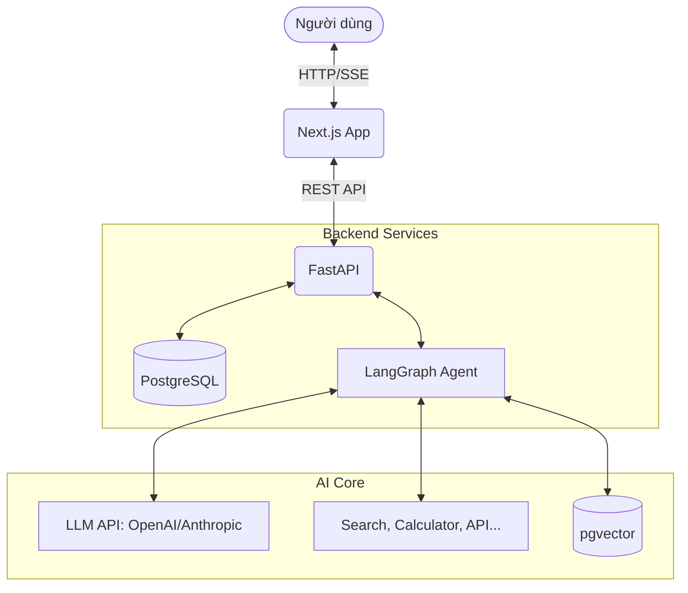

# Thiết kế Kiến trúc Hệ thống (System Architecture)

Dự án AI Agent của chúng ta được xây dựng dựa trên kiến trúc 3 tầng (3-Tier Architecture) hiện đại, đảm bảo tính mở rộng (Scalability), tính bảo trì (Maintainability) và khả năng kiểm thử (Testability).

## 1. Tổng Quan Kiến Trúc (High-Level Architecture)

Hệ thống bao gồm 3 thành phần chính:
1. **Frontend (Tầng Trình Diễn - Presentation Layer):** Xây dựng bằng Next.js (React) cung cấp giao diện tương tác (Chat UI).
2. **Backend (Tầng API - API Layer):** Xây dựng bằng FastAPI, đóng vai trò điều phối, phân quyền và stream dữ liệu.
3. **AI Agent (Tầng Logic AI - Cognitive Layer):** Xây dựng bằng LangGraph, quản lý luồng suy nghĩ, gọi công cụ (Tools) và truy xuất dữ liệu (RAG).

## 2. Chi Tiết Từng Tầng

### 2.1 Frontend (Next.js)
- **Công nghệ:** Next.js (App Router), Tailwind CSS, shadcn/ui.
- **Trách nhiệm:** Render giao diện người dùng, quản lý State của UI (lịch sử chat, loading state), kết nối SSE (Server-Sent Events) để nhận từng ký tự trả về từ AI một cách mượt mà.

### 2.2 Backend (FastAPI)
- **Công nghệ:** FastAPI, Pydantic, SQLAlchemy.
- **Trách nhiệm:**
  - Cung cấp endpoint RESTful (`POST /chat`, `GET /history`).
  - Validation dữ liệu đầu vào.
  - Chuyển đổi dữ liệu từ Agent thành chuẩn SSE stream.
  - Ghi nhận Audit logs và Error handling.

### 2.3 AI Agent (LangGraph)
- **Công nghệ:** LangGraph, LangChain Core.
- **Trách nhiệm:**
  - Nhận câu hỏi từ Backend, phân tích ngữ cảnh.
  - Sử dụng mô hình ReAct (Reasoning and Acting) để quyết định sử dụng công cụ nào.
  - Tra cứu dữ liệu chuyên môn thông qua cơ chế RAG.

## 3. Quản lý Dữ liệu (Database Design)

Chúng ta sử dụng một cơ sở dữ liệu duy nhất kết hợp cả 2 khả năng thông qua PostgreSQL:
1. **Relational Data:**
   - Lưu trữ User accounts, Thông tin Khoa/Ngành/Môn học, Chat Sessions, Message History.
   - Theo dõi API Usage.
2. **Vector Data (với extension `pgvector`):**
   - Lưu trữ các tài liệu (Documents) như Đề cương môn học (Syllabus) đã được nhúng (Embedded) ngay trong cùng database.
   - Cho phép Hybrid Search: Truy vấn thông tin ngữ nghĩa (Vector) kết hợp lọc chính xác bằng SQL (Relational).

## 4. Quyết định Kiến trúc (ADR - Architecture Decision Records)
- **ADR-001:** Chọn FastAPI thay vì Flask/Django vì FastAPI hỗ trợ native async, cực kỳ quan trọng cho tính năng Streaming của AI.
- **ADR-002:** Chọn LangGraph thay vì LangChain tiêu chuẩn vì chúng ta cần AI xử lý vòng lặp có điều kiện (Cyclic Graphs), cho phép Agent sửa sai khi gọi Tool thất bại.
- **ADR-003:** (06/2026) Chọn OpenAI GPT-5 Series thay vì Gemini/Mistral. Áp dụng chiến lược Phân cấp Model: Dùng **GPT-5.4 Nano** (Router/Guard) cho tốc độ và giá siêu rẻ, dùng **GPT-5.4** (Core Brain) cho suy luận phức tạp.
- **ADR-004:** (06/2026) Chọn `pgvector` trên PostgreSQL thay vì dùng ChromaDB riêng lẻ. Quyết định này giúp đơn giản hóa hạ tầng triển khai (chỉ duy trì 1 database) và kích hoạt tính năng Hybrid Search mạnh mẽ (SQL kết hợp Vector).
