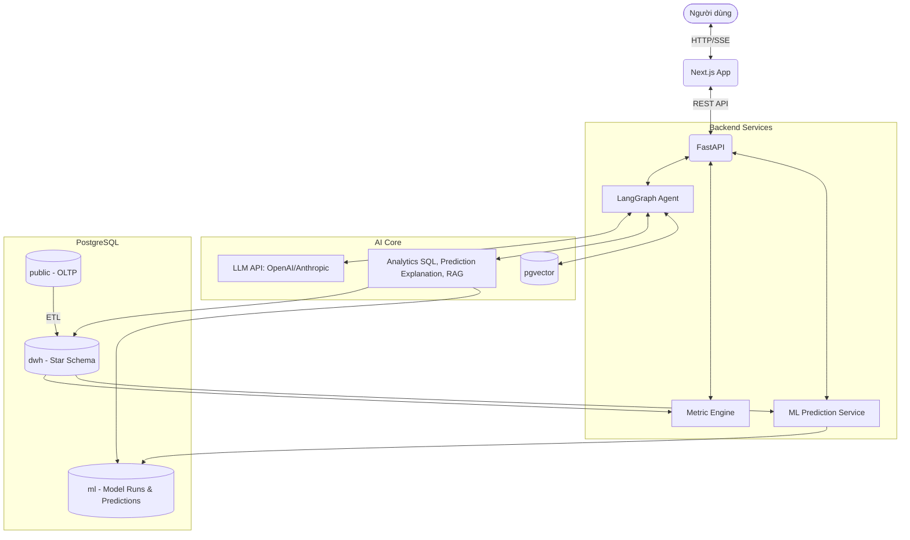
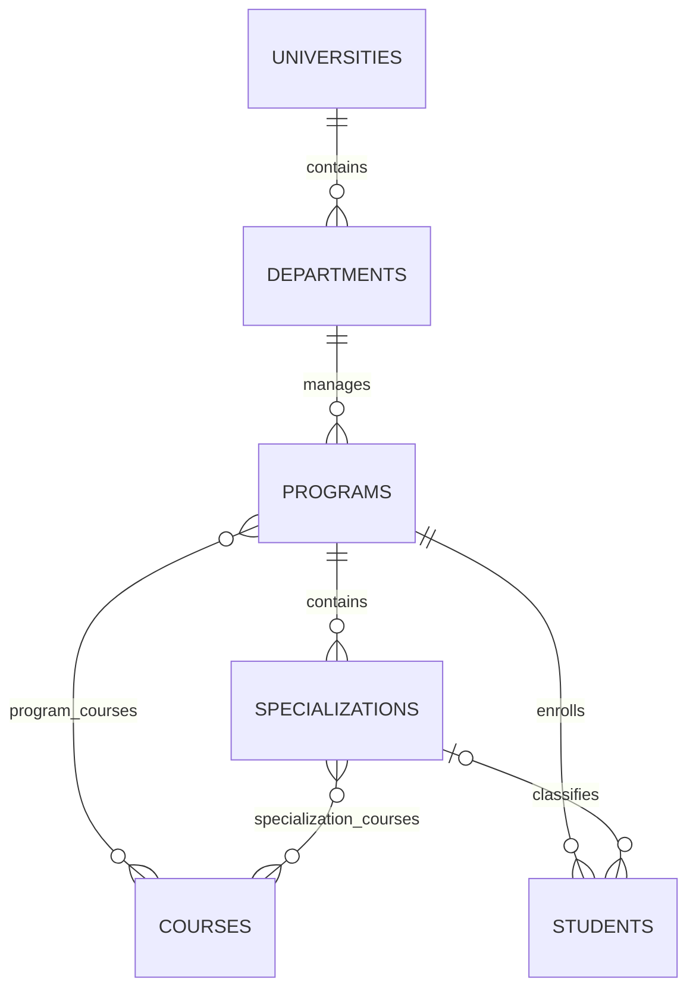
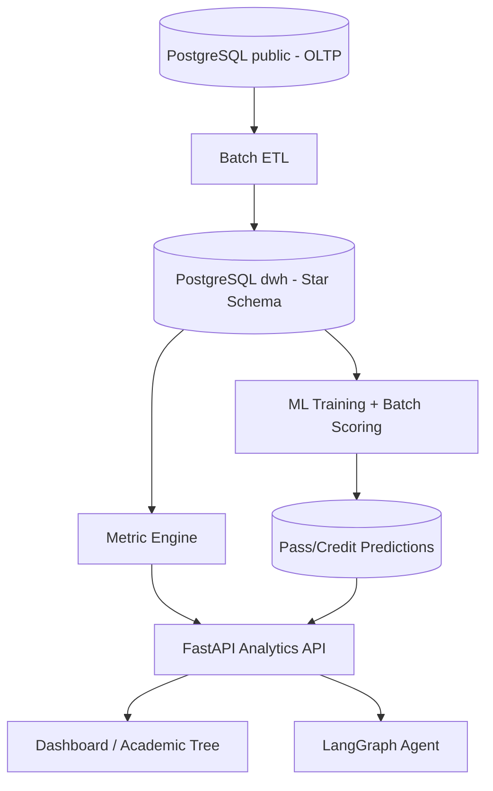

# Thiết kế Kiến trúc Hệ thống (System Architecture)

EduInsight sử dụng kiến trúc ứng dụng nhiều tầng kết hợp nền tảng analytics. Kiến trúc Frontend–Backend–AI Agent được bổ sung lớp OLTP/DWH và ML Prediction để phục vụ đúng bài toán learning analytics.

## 1. Tổng Quan Kiến Trúc (High-Level Architecture)

Hệ thống bao gồm 5 thành phần chính:
1. **Frontend (Tầng Trình Diễn - Presentation Layer):** Xây dựng bằng Next.js (React) cung cấp giao diện tương tác (Chat UI).
2. **Backend (Tầng API - API Layer):** Xây dựng bằng FastAPI, đóng vai trò điều phối, phân quyền và stream dữ liệu.
3. **AI Agent (Tầng Logic AI - Cognitive Layer):** Xây dựng bằng LangGraph, quản lý luồng suy nghĩ, gọi công cụ (Tools) và truy xuất dữ liệu (RAG).
4. **Analytics Platform:** ETL, Data Warehouse và Metric Engine phục vụ phân tích lịch sử.
5. **ML Prediction:** dự đoán pass/trượt từng môn và tổng hợp tổng tín chỉ pass/trượt kỳ vọng.

## 2. Chi Tiết Từng Tầng

### 2.1 Frontend (Next.js)
- **Công nghệ:** Next.js (App Router), Tailwind CSS, shadcn/ui.
- **Trách nhiệm:** Render giao diện người dùng, quản lý State của UI (lịch sử chat, loading state), kết nối SSE (Server-Sent Events) để nhận từng ký tự trả về từ AI một cách mượt mà.

### 2.2 Backend (FastAPI)
- **Công nghệ:** FastAPI, Pydantic, SQLAlchemy.
- **Trách nhiệm:**
  - Cung cấp endpoint RESTful (`POST /chat`, `GET /history`).
  - Validation dữ liệu đầu vào.
  - Chuyển đổi dữ liệu từ Agent thành chuẩn SSE stream.
  - Ghi nhận Audit logs và Error handling.

### 2.3 AI Agent (LangGraph)
- **Công nghệ:** LangGraph, LangChain Core.
- **Trách nhiệm:**
  - Nhận câu hỏi từ Backend, phân tích ngữ cảnh.
  - Sử dụng mô hình ReAct (Reasoning and Acting) để quyết định sử dụng công cụ nào.
  - Tra cứu dữ liệu chuyên môn thông qua cơ chế RAG.

## 3. Quản lý Dữ liệu (Database Design)

Một PostgreSQL instance được tách schema theo workload:

1. **`public` - OLTP:** tài khoản, khoa/ngành/môn, enrollment, điểm, CLO/PLO, chat và audit.
2. **`dwh` - OLAP:** star schema, dữ liệu lịch sử, KPI và feature phục vụ ML.
3. **`ml` - Prediction:** model run, prediction từng môn và tổng tín chỉ kỳ vọng.
4. **`pgvector`:** embedding đề cương cho RAG, độc lập với prediction ML.

### 3.1. Academic hierarchy

`Program` được giữ với nghĩa **Ngành / Chương trình đào tạo**. `Specialization` là
**Chuyên ngành** thuộc một Program; không đảo hai khái niệm này trong API, UI hoặc
Agent prompt.

Trong rollout Sprint 3, `program_courses` tiếp tục là curriculum cấp Ngành để giữ
tương thích với report/view hiện có. `specialization_courses` bổ sung mapping cấp
Chuyên ngành. `students.specialization_id` nullable; migration không được suy đoán
chuyên ngành thật từ tên lớp hoặc tên môn.

## 4. Quyết định Kiến trúc (ADR - Architecture Decision Records)
- **ADR-001:** Chọn FastAPI thay vì Flask/Django vì FastAPI hỗ trợ native async, cực kỳ quan trọng cho tính năng Streaming của AI.
- **ADR-002:** Chọn LangGraph thay vì LangChain tiêu chuẩn vì chúng ta cần AI xử lý vòng lặp có điều kiện (Cyclic Graphs), cho phép Agent sửa sai khi gọi Tool thất bại.
- **ADR-003:** (06/2026) Chọn OpenAI GPT-5 Series thay vì Gemini/Mistral. Áp dụng chiến lược Phân cấp Model: Dùng **GPT-5.4 Nano** (Router/Guard) cho tốc độ và giá siêu rẻ, dùng **GPT-5.4** (Core Brain) cho suy luận phức tạp.
- **ADR-004:** (06/2026) Chọn `pgvector` trên PostgreSQL thay vì dùng ChromaDB riêng lẻ. Quyết định này giúp đơn giản hóa hạ tầng triển khai (chỉ duy trì 1 database) và kích hoạt tính năng Hybrid Search mạnh mẽ (SQL kết hợp Vector).

## 5. Kiến trúc Analytics: DWH và Machine Learning

Kiến trúc 3 tầng phía trên mô tả luồng ứng dụng, nhưng chưa tách workload vận hành và workload phân tích. Với EduInsight, PostgreSQL được tổ chức thành các schema riêng:

- `public`: OLTP cho CRUD và dữ liệu nghiệp vụ hiện tại.
- `staging`: vùng tạm để validate và biến đổi dữ liệu.
- `dwh`: star schema cho dashboard, trend và cross-cohort analytics.
- `ml`: metadata lần huấn luyện, prediction từng môn và tổng tín chỉ pass/trượt kỳ vọng.

**ADR-005:** Dùng một PostgreSQL instance nhưng tách schema OLTP/DWH trong MVP để giữ chi phí và vận hành đơn giản, đồng thời vẫn thể hiện đúng ranh giới kiến trúc analytics.

**ADR-006:** ML dự đoán xác suất pass/trượt từng enrollment, sau đó tổng hợp expected passed/failed credits theo sinh viên-học kỳ. LLM chỉ giải thích prediction và không trực tiếp sinh xác suất.

**ADR-007:** SQLAlchemy ORM trong `backend/app/models/` là nguồn định nghĩa database chính. Sau một lần reset local có kiểm soát, mọi thay đổi schema được phân phối bằng Alembic migration.

**ADR-008:** (20/06/2026) Chuẩn hóa Academic Tree thành `Department -> Program -> Specialization -> Course`. Giữ `program_courses` để tương thích; thêm `specialization_courses` và FK specialization nullable trên sinh viên. Chi tiết contract: [H45-Plan.md](../07-Sprint-Planning/H45-Plan.md).

Thiết kế star schema, pipeline ETL, feature, metric đánh giá và API được mô tả tại [ML_DWH_Architecture.md](./ML_DWH_Architecture.md).
Kế hoạch sửa database và rollout cho toàn team: [DatabaseModernizationPlan.md](./DatabaseModernizationPlan.md).
