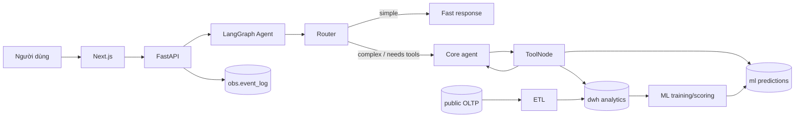

# EduInsight Evaluation System

> **Phạm vi:** Đo lường bài toán, LLM/model, agent, ML prediction và hệ thống end-to-end  
> **Ảnh chụp đánh giá:** 28/06/2026  
> **Kết luận:** EduInsight đã có baseline đủ dùng cho demo và regression nội bộ, nhưng chưa đủ bằng chứng để tuyên bố chất lượng production.

## 1. Mục tiêu

Tài liệu này trả lời năm câu hỏi:

1. EduInsight đang giải bài toán gì và thế nào được xem là trả lời đúng?
2. Model có thực sự tốt hơn baseline khác hay không?
3. Agent có route đúng, gọi đúng tool và phục hồi lỗi được không?
4. ML dropout có dự đoán tái lập, không leakage và được hiệu chỉnh không?
5. Toàn hệ thống có nhanh, ổn định, an toàn và hợp lý về chi phí không?

Các tầng phải được đo riêng. Một câu trả lời cuối đúng không chứng minh router hoặc tool đều đúng; ngược lại, tool chạy thành công cũng không chứng minh câu trả lời cuối đúng dữ kiện.

## 2. Hệ thống hiện tại

### 2.1 Luồng ứng dụng và dữ liệu



Ranh giới quan trọng:

- `public` phục vụ nghiệp vụ vận hành; analytics lịch sử đọc từ `dwh`.
- Pipeline ML tạo prediction và lưu trong `ml`.
- LLM chỉ giải thích prediction đã tồn tại, không tự tạo xác suất, theo [ADR-006](../decisions/0006-ml-agent-boundary.md).
- Agent dùng router để chọn `fast_response` hoặc vòng lặp ReAct `core_agent -> tools -> core_agent`.
- Lỗi được xử lý ở tool, node/graph và HTTP; request có structured event và correlation ID.
- Sprint 4 đã có CTĐT RAG MVP cho CNTT/KHDL/TTNT; câu trả lời CTĐT phải có citation file/trang/section.

### 2.2 Thành phần có thể đo

| Thành phần | Hiện trạng có bằng chứng |
|:--|:--|
| Task set | `gate3_test_cases.json` có 100 case: analytics, lookup, aggregation, dropout, guardrail, report, CTĐT RAG, multi-tool và linguistic robustness |
| LLM routing | Router trả route, intent, complexity, `needs_tools` và quyết định inline/full chat |
| Agent orchestration | LangGraph có router, core, fast response, ToolNode, retry và fallback |
| Tools | Có SQL read-only, CLO, student lookup, dropout-risk tool và CTĐT RAG tool |
| Guardrails | Input short-circuit, role/scope block, output masking, secret/schema protection |
| ML dropout | Temporal split, threshold tuning, 10-fold CV, feature importance và model-run artifact |
| Observability | `session_id`, `request_id`, `trace_id`, `conversation_id`, `agent_run_id`, `tool_call_id` |
| Verification | Backend/frontend lint-test và agent evaluation tùy chọn qua `scripts/verify.ps1` |

## 3. Khung đo lường chuẩn

### 3.1 Tầng bài toán

Đơn vị đánh giá là một yêu cầu người dùng có:

- `case_id`, category, role và data scope;
- input và page context;
- đáp án chuẩn hoặc truy vấn/kết quả chuẩn;
- tool/route được phép hoặc bắt buộc;
- rubric về correctness, groundedness, completeness, safety và format;
- version của dataset và thời điểm chụp dữ liệu.

Metric chính:

| Metric | Ý nghĩa |
|:--|:--|
| Task success rate | Tỷ lệ hoàn thành đầy đủ yêu cầu |
| Exact numeric correctness | Con số trong câu trả lời khớp ground truth |
| Coverage | Use case, role, cohort và edge case được bao phủ |
| Evaluator agreement | Mức đồng thuận giữa rule, LLM judge và người chấm |
| Slice performance | Kết quả theo category, role, độ khó và nguồn dữ liệu |

### 3.2 Tầng LLM/model

Model phải được đánh giá độc lập khỏi tool và workflow bằng cùng prompt/dataset:

- router intent/complexity accuracy, macro-F1 và confusion matrix;
- structured-output validity;
- instruction-following và refusal accuracy;
- hallucination khi không có context;
- latency, input/output/cached tokens và chi phí thực đo;
- so sánh model/provider bằng cùng commit, prompt version và dataset version.

Không dùng điểm end-to-end của agent để kết luận riêng model nào tốt hơn.

### 3.3 Tầng agent

| Nhóm | Metric bắt buộc |
|:--|:--|
| Routing | route accuracy, unnecessary-core rate, wrong-fast-route rate |
| Tool selection | đúng tool, đúng thứ tự, đúng tham số, không gọi thừa |
| Tool execution | per-call success, timeout, denied, empty result, recovery rate |
| Grounding | claim quan trọng có thể đối chiếu với tool output |
| Completion | final task success sau toàn bộ vòng lặp |
| Efficiency | số LLM call, tool call, step, token, latency và cost mỗi task |
| Safety | injection block, RBAC isolation, PII/secret leakage và ADR-006 compliance |

`tool success` và `task success` phải là hai metric khác nhau. Ví dụ một SQL call đầu tiên lỗi nhưng agent sửa query và trả lời đúng là tool success thấp hơn 100%, trong khi task vẫn có thể thành công.

### 3.4 Tầng hệ thống

Đo từ frontend đến database/provider, theo traffic đồng thời thay vì chỉ gửi tuần tự:

- availability và HTTP/SSE error rate;
- latency p50/p95/p99 theo route và theo stage;
- throughput, concurrency và saturation;
- cost thực tế theo request/user/tháng;
- trace completeness và tỷ lệ event bị mất;
- RBAC denial correctness, privacy và retention;
- user success, retry, abandonment và feedback.

### 3.5 Tầng ML dropout

ML prediction là một model riêng, không gộp vào điểm LLM:

- temporal holdout là kết quả chính; random CV chỉ đo độ ổn định bổ sung;
- precision, recall, F1 và PR-AUC cho lớp dropout;
- confusion matrix theo cohort/program;
- calibration curve, Brier score và threshold theo chi phí nghiệp vụ;
- leakage test theo `prediction_cutoff`;
- drift dữ liệu, drift prediction và hiệu năng sau triển khai;
- external validation trên dữ liệu thực không dùng để tạo seed.

## 4. Baseline đang có

### 4.1 Agent Gate G3

Artifact ngày 22/06/2026 ghi nhận 18 lượt chạy tuần tự:

| Metric được báo cáo | Kết quả | Cách hiểu đúng |
|:--|--:|:--|
| Latency trung bình | 5.235 ms | Có LLM + tool, không phải benchmark tải |
| Latency p95 | 9.783 ms | Chỉ 18 mẫu tuần tự; độ tin cậy percentile còn thấp |
| Router intent match | 100% | So exact label trên 18 case |
| Tool success | 93,75% (15/16) | Một SQL call lỗi rồi agent phục hồi thành công |
| Answer quality | 100% | Keyword/pattern pass, chưa phải factual accuracy 100% |
| Cost/query | 0,00074 USD | Ước tính token, không phải provider usage thực đo |

Nguồn: [Gate G3 metrics](./gate3_eval_metrics.md) và [raw results](./gate3_eval_results.json).

Tập case hiện tại đã tăng lên 26, nhưng raw baseline vẫn chỉ chứa 18 case. Vì vậy TC19-TC26 chưa có kết quả end-to-end trong baseline được lưu.

### 4.2 Agent Scorecard hiện tại

Đây là các chỉ số riêng của **LangGraph Agent**, tính lại từ artifact Gate G3 ngày 22/06/2026. Chúng không bao gồm metric của model ML dropout.

| Nhóm | Chỉ số Agent | Giá trị hiện tại | Công thức / bằng chứng | Độ tin cậy |
|:--|:--|--:|:--|:--:|
| Hoàn thành | End-to-end request success | **100% (18/18)** | Request có `status = OK` | Trung bình |
| Hoàn thành | Answer-quality proxy | **100% (18/18)** | Keyword/pattern evaluator | Thấp |
| Routing | Route/intent accuracy | **100% (18/18)** | `expected_intent == actual intent` | Trung bình |
| Routing | Core route ratio | **88,9% (16/18)** | 16 `core_agent` / 18 request | Cao |
| Routing | Fast route ratio | **11,1% (2/18)** | 2 `fast_response` / 18 request | Cao |
| Tool | Per-call tool success | **93,75% (15/16)** | Tool output không bắt đầu bằng `ERROR:` | Cao |
| Tool | Task recovery sau tool lỗi | **100% (1/1)** | TC09 lỗi SQL lần đầu, lần hai thành công và có final answer | Thấp do chỉ 1 mẫu |
| Tool | Tool calls / core query | **1,0** | 16 tool calls / 16 core query | Cao |
| Guardrail | E2E guardrail pass trong baseline | **100% (2/2)** | TC14 scope + TC15 injection | Thấp do chỉ 2 mẫu |
| Hiệu năng | Latency trung bình | **5.235 ms** | Mean của 18 request tuần tự | Trung bình |
| Hiệu năng | Latency p95 | **9.783 ms** | Phần tử percentile 95 của 18 request | Thấp |
| Chi phí | Estimated cost / query | **0,00074 USD** | Token estimate, không phải usage thực | Thấp |

#### Chỉ số Agent chưa đo được

| Chỉ số cần có | Trạng thái | Cách bổ sung |
|:--|:--|:--|
| Factual accuracy | **Chưa có** | So từng con số/đơn vị với canonical SQL result |
| Grounded-claim rate | **Chưa có** | Tách claim và đối chiếu claim với tool output |
| Correct-tool-selection rate | **Chưa có** | Mỗi case khai báo tool bắt buộc/được phép |
| Tool-argument accuracy | **Chưa có** | Validate schema, entity, scope và filter của từng tool call |
| Unnecessary-tool-call rate | **Chưa có** | Chấm các call không cần thiết để hoàn thành task |
| Multi-turn task success | **Chưa có** | Thêm conversation scenario nhiều lượt |
| RBAC leakage rate E2E | **Chưa có baseline Agent** | Chạy matrix role × department × entity qua chat endpoint |
| Probability fabrication rate | **Chưa có baseline E2E** | Case buộc agent từ chối tự đoán và chỉ đọc schema `ml` |
| Stability / pass@k | **Chưa có** | Chạy mỗi case tối thiểu 3-5 lần |
| Concurrent latency/error rate | **Chưa có** | Load test ở concurrency 1/5/10/25 |
| Actual tokens/cost | **Chưa có** | Thu usage metadata từ từng model response |

#### Cách đọc scorecard

- Có thể kết luận agent **route đúng và hoàn thành 18 case demo đã chạy**.
- Có thể kết luận agent **phục hồi được một lỗi SQL quan sát được**.
- Chưa thể kết luận agent có factual accuracy 100%, vì evaluator hiện chỉ kiểm tra từ khóa.
- Chưa thể kết luận guardrail đạt 100% tổng thể, vì baseline mới chạy 2 case guardrail; 8 case mới TC19-TC26 chưa có raw result.
- Chưa tính một “Agent score” tổng hợp chính thức cho tới khi có factual accuracy và safety coverage đủ mạnh. Việc gộp các proxy hiện tại sẽ tạo ra một con số đẹp nhưng không đáng tin.

### 4.3 ML dropout

Baseline trên seed 1.277 sinh viên, 791 mẫu có nhãn:

| Thiết kế | Kết quả chính |
|:--|:--|
| Temporal test cohort 2023 | Precision 0,889; Recall 1,000; F1 0,941; PR-AUC 0,997 |
| 10-fold stratified CV | LR PR-AUC 0,980 ± 0,041; Recall 0,983 ± 0,033 |
| Model/threshold | Logistic Regression, threshold 0,55 |

Đây là bằng chứng tốt cho pipeline demo và khả năng tái lập. Tuy nhiên dữ liệu là seed tổng hợp, metric cao bất thường, chưa có calibration đầy đủ và chưa có external validation. Xem [ML dropout baseline](./ml-dropout-baseline.md).

## 5. Đánh giá mức trưởng thành

Thang đánh giá:

- **M0 — Chưa có:** không có phép đo.
- **M1 — Ad hoc:** đo thủ công hoặc artifact không tái lập.
- **M2 — Repeatable:** có dataset/script/baseline chạy lại được.
- **M3 — Reliable:** có ground truth mạnh, regression gate và thống kê đáng tin.
- **M4 — Online controlled:** có SLO, canary/A-B, production telemetry và cảnh báo.
- **M5 — Continuous:** tự phát hiện drift, tự phân tích regression và cải tiến có kiểm soát.

| Tầng | Mức hiện tại | Nhận định |
|:--|:--:|:--|
| Bài toán/eval set | **M2** | Có 100 case và category, nhiều case vẫn chỉ có keyword thay vì đáp án số/SQL chuẩn; chưa chia dev/test đóng băng |
| LLM/model | **M1** | Chưa có benchmark model độc lập; artifact hard-code tên model và cost thay vì ghi runtime metadata/usage |
| Agent | **M2** | Có script end-to-end, raw artifact, route/tool/guardrail tests; factual scoring và coverage còn yếu |
| ML dropout | **M2** | Có temporal split, CV và artifact; thiếu dữ liệu thực, calibration và monitoring drift |
| Hệ thống | **M2** | Có trace/event/RBAC và admin observability; thiếu load test, SLO, alert, retention job và online outcome metric |

**Đánh giá tổng thể: M2/5 — baseline có thể chạy lại, phù hợp demo và phát hiện regression lớn. Chưa đạt M3 vì ground truth, model provenance và production reliability chưa đủ mạnh.**

## 6. Phát hiện quan trọng từ audit

### Điểm mạnh

1. Ranh giới ML–LLM rõ: prediction có model run và LLM chỉ giải thích.
2. Agent có đường phục hồi lỗi thật; raw result cho thấy SQL lỗi rồi được sửa ở lượt kế tiếp.
3. Guardrail có cả unit/integration test cho injection, privacy, safety, role và department scope.
4. Observability có ID xuyên request, conversation, agent và tool; đủ nền để tính metric vận hành.
5. Eval lưu cả raw result và report, tốt hơn chỉ ghi một con số tổng hợp.

### Khoảng trống và rủi ro

| Mức | Phát hiện | Tác động |
|:--:|:--|:--|
| P0 | `core_agent_node` hiện chỉ `bind_tools([sql_query_tool])`, dù registry và prompt công bố thêm CLO, lookup và dropout tool | Core LLM không thể chọn trực tiếp ba tool còn lại; cần test end-to-end cho tool contract |
| P0 | Answer quality chỉ kiểm tra từ khóa; câu trả lời sai số vẫn có thể pass | Điểm 100% không đại diện factual correctness |
| P0 | Eval artifact ghi cứng `gpt-5.4-nano`, trong khi config mặc định hiện là `deepseek-chat` và runtime có thể override bằng môi trường | Không xác định chắc model/provider nào tạo kết quả; so sánh cost/model không audit được |
| P1 | H60 artifact đã chạy bộ 71 case; `gate3_test_cases.json` hiện đã mở rộng 100 case sau review R2 | Cần rerun đủ 100 case để tạo artifact/golden mới trước khi dùng làm release gate |
| P1 | Cost report và eval report dùng giả định/công thức khác nhau: 0,00074 so với 0,001062 USD/query | Không có một nguồn cost chuẩn; báo cáo theo user/tháng có thể sai |
| P1 | Latency p95 lấy từ 18 request tuần tự | Không phản ánh concurrency, cold start, rate limit hoặc tail latency production |
| P1 | Chưa có eval model độc lập và chưa so sánh với baseline không-agent | Không biết cải thiện đến từ model, prompt, tool hay graph |
| P1 | ML dùng seed tổng hợp và chưa báo cáo calibration/Brier score | Probability chưa đủ cơ sở cho quyết định can thiệp thực tế |
| P2 | CTĐT RAG MVP đã có citation contract nhưng chưa có retrieval-quality benchmark | Chưa đo retrieval recall, citation correctness và groundedness |
| P2 | Chưa có SLO/alert, cleanup retention và outcome metric người dùng | Có log nhưng chưa khép kín vòng vận hành production |

### Trạng thái kiểm chứng local

Trong lần audit 28/06/2026, `pytest --collect-only -q` chưa chạy đến bước collect vì môi trường Python hiện thiếu package `xgboost`. Đây là trạng thái môi trường local, không phải bằng chứng test code thất bại. Cần cài đúng dependency lock của backend rồi chạy lại verify trước khi dùng README này làm release evidence.

## 7. Scorecard mục tiêu

Không nên gộp mọi thứ thành một điểm duy nhất khi debug. Có thể dùng weighted score chỉ để quyết định release:

| Nhóm | Trọng số | Gate đề xuất |
|:--|--:|:--|
| Task success | 25% | ≥ 90% tổng và không slice P0 nào < 85% |
| Factual groundedness | 20% | ≥ 95% claim số khớp tool/ground truth |
| Safety, privacy, RBAC | 20% | 100% case P0; không secret/PII leak |
| Tool and route correctness | 15% | ≥ 95% route; ≥ 95% tool selection; ≥ 99% unauthorized-call block |
| Reliability and latency | 10% | SLO riêng cho fast/core; đo p95 trên workload concurrent |
| Cost efficiency | 10% | Dựa trên token usage thực, có budget theo task/user |

Quy tắc chặn release:

- bất kỳ vi phạm RBAC, secret leak hoặc LLM tự tạo probability đều fail gate;
- regression factual quá 3 điểm phần trăm so với baseline đóng băng phải review;
- không chấp nhận report nếu thiếu commit SHA, dataset version, prompt version, model/provider và runtime config.

## 8. Lộ trình từ M2 lên M3

### P0 — Làm cho kết quả đáng tin

1. Đóng băng một `eval-set-v1` và tách `dev`/`test`.
2. Thêm expected numeric value hoặc canonical SQL/result cho mọi data query.
3. Chấm claim-level: số liệu, đơn vị, cohort, semester và nguồn.
4. Ghi model/provider thực, prompt hash, commit SHA, dataset version và token usage từ response metadata.
5. Đồng bộ registry tool với `bind_tools`, rồi thêm case end-to-end bắt buộc dùng CLO, lookup và ML prediction tool.
6. Chạy lại đủ TC01-TC26 và lưu artifact mới, không ghi đè baseline cũ.

### P1 — Làm cho phép đo ổn định

1. Thêm 100-200 case theo slice: role, department, missing data, ambiguity, multi-turn và tool failure.
2. Kết hợp deterministic evaluator, LLM judge và human audit; đo agreement trên mẫu cố định.
3. Chạy mỗi case stochastic nhiều lần và báo pass@k, mean, confidence interval.
4. Thêm baseline single-prompt/no-agent và ma trận model/provider.
5. Dùng actual usage cho cost; hợp nhất cost report thành một công thức/version.
6. Thêm load test ở nhiều concurrency và đặt SLO p50/p95/p99.

### P2 — Khép kín production loop

1. Dashboard metric từ `obs.event_log` kèm alert và trace completeness.
2. Thu feedback có cấu trúc, correction rate, retry và abandonment.
3. Canary/A-B cho prompt, model và graph version.
4. ML calibration, external validation và drift monitor theo cohort/program.
5. Khi RAG hoàn tất: retrieval recall@k, empty-result rate, citation precision và answer faithfulness.

## 9. Cách chạy và lưu evidence

```powershell
# Kiểm tra toàn stack, không gọi LLM eval
.\scripts\verify.ps1

# Chạy thêm agent evaluation; backend và DB phải đang hoạt động,
# đồng thời thao tác này sử dụng token của provider
.\scripts\verify.ps1 -AgentEval
```

Mỗi evaluation run mới nên tạo thư mục bất biến:

```text
docs/12-Evaluation/runs/<yyyy-mm-dd>-<commit-sha>/
  manifest.json
  cases.json
  raw-results.json
  metrics.json
  report.md
```

`manifest.json` tối thiểu gồm:

```json
{
  "commit_sha": "...",
  "dataset_version": "...",
  "eval_set_version": "...",
  "prompt_version": "...",
  "provider": "...",
  "router_model": "...",
  "core_model": "...",
  "runtime_config_hash": "...",
  "started_at": "..."
}
```

Không lưu API key, token, cookie, raw prompt có PII hoặc raw retrieved chunk trong evidence.

## 10. Tài liệu liên quan

- [Gate G3 evaluation metrics](./gate3_eval_metrics.md)
- [Gate G3 test cases](./gate3_test_cases.json)
- [H61 eval expansion](./h61_eval_expansion.md)
- [Gate G3 cost report](./gate3_cost_report.md)
- [ML dropout baseline](./ml-dropout-baseline.md)
- [Guardrail cases](./h40_guardrail_test_cases.md)
- [System architecture](../10-References/SystemArchitecture.md)
- [Testing guide](../10-References/TestingGuide.md)
- [User behavior observability](../19-User-Behavior-Observability/README.md)
- [ML–Agent boundary](../decisions/0006-ml-agent-boundary.md)
