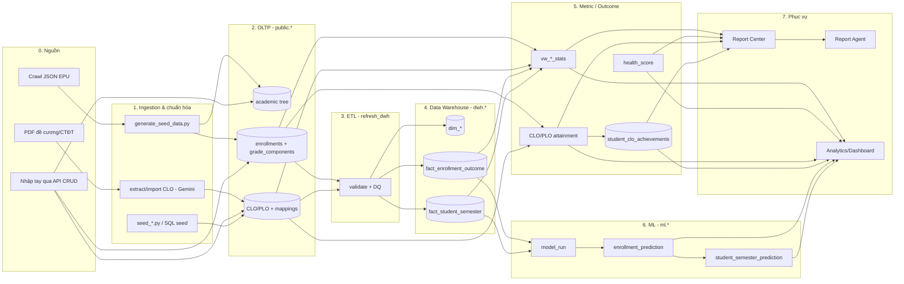
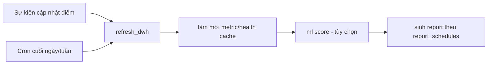

# Data Pipeline — Pipeline dữ liệu end-to-end của EduInsight

> Tài liệu này hợp nhất **toàn bộ vòng đời dữ liệu** của hệ thống thành một pipeline duy nhất:
> từ nguồn thô → OLTP → ETL → Data Warehouse → tầng metric/outcome → ML → phục vụ (Report, Agent, Dashboard).
> Mỗi tầng được **gắn trực tiếp với code/bảng/endpoint đã có**, kèm phần **còn thiếu cần bổ sung** để pipeline thật sự hoàn chỉnh.
>
> Tài liệu nền tảng (đọc kèm): [10-References/ML_DWH_Architecture.md](../10-References/ML_DWH_Architecture.md) (star schema, ML),
> [10-References/DataFlowDiagram.md](../10-References/DataFlowDiagram.md) (sequence diagram), [16-Report-Center](../16-Report-Center/README.md) (tầng phục vụ báo cáo),
> [15-Implementation-TODO](../15-Implementation-TODO/README.md) (backlog).

## 1. Mục tiêu

- Cho người mới một **bản đồ dữ liệu** rõ ràng: dữ liệu vào từ đâu, biến đổi qua những tầng nào, ai đọc ở cuối.
- Chuẩn hóa **hợp đồng dữ liệu** (data contract) giữa các tầng: khóa, `updated_at`, idempotency, grain.
- Tách bạch **đã có** vs **cần xây** để biến tập hợp script rời rạc hiện tại thành pipeline có điều phối, có giám sát, có chất lượng.
- Gắn pipeline với chức năng sản phẩm: Health Score, Report Center, Report Agent, dự đoán rủi ro.

## 2. Bức tranh tổng thể



**Nguyên tắc xuyên suốt:** OLTP là *system of record* (nguồn chân lý). DWH/metric/ML/report là **dẫn xuất** — có thể tính lại hoàn toàn từ OLTP. Không tầng nào được "đẻ" số liệu mới ngoài nguồn.

## 3. Hiện trạng — cái gì ĐÃ CÓ (map vào code thật)

| Tầng | Thành phần đã có | Vị trí |
| --- | --- | --- |
| 0. Nguồn | Crawl JSON `epu_data_batch.json`; PDF đề cương; API CRUD | `crawl/`, sidebar nhập liệu |
| 1. Ingestion | `generate_seed_data.py` (JSON→SQL), `map_course_departments.py` (GPT-4o-mini), `extract_clo_pdf.py` + `import_clo_from_pdfs.py` + `generate_synthetic_clos.py` (Gemini), `seed_clo_mappings.py`, `seed-outcomes.sql`, `apply_seed_updates.py`, `seed_users.py` (auto khi khởi động) | `backend/scripts/`, `backend/db/` |
| 2. OLTP | academic tree, people, teaching, assessment | migration `54025928d213_baseline_oltp_schema.py`; `app/models/*` |
| 3. ETL | `refresh_dwh()` idempotent + DQ reconciliation | `app/analytics/etl.py:131`; `POST /api/v1/admin/dwh/refresh` |
| 4. DWH | `dwh.dim_*`, `dwh.fact_enrollment_outcome`, `dwh.fact_student_semester`, `dwh.etl_run`, `dwh.data_quality_result` | migration `8b2d4c7e91af`, `c9e3f1a2b845` |
| 4. Metric | `vw_section/course/program/department_stats`; health score OBE (0.3 GPA + 0.3 pass + 0.4 CLO), TTLCache 1h; CLO/PLO attainment SQL | `a9a181de6ed9_create_views.py`; `app/analytics/health_score.py`; `app/reports/service.py` |
| 5. ML | `ml.model_run`, `ml.enrollment_prediction`, `ml.student_semester_prediction`; train/score/aggregate | migration `8b2d4c7e91af`; `app/ml/scoring.py`, `app/ml/aggregation.py`; `POST /admin/ml/{train,score,aggregate}` |
| 6. Phục vụ | Report Center + Agent + Dashboard | `app/reports/`, `app/agent/`, `/analytics/*`, `/predictions/*` |

> **Kết luận hiện trạng:** Khung pipeline đã đầy đủ tầng. Điểm yếu là **điều phối** (chạy tay, rời rạc), **độ phủ DQ** còn mỏng, và một số bảng outcome chưa được **vật chất hóa/đồng bộ** (xem §8).

## 4. Chi tiết từng tầng

### 4.0 — Nguồn dữ liệu (Sources)

| Nguồn | Định dạng | Đặc tính | Đi vào |
| --- | --- | --- | --- |
| Crawl EPU | JSON (sinh viên + điểm lồng nhau) | Batch, offline | Toàn bộ cây học vụ + điểm |
| Đề cương/CTĐT | PDF | Bán cấu trúc, cần OCR/LLM | CLO, mapping CLO→PLO |
| Nhập tay | JSON qua API CRUD | Lẻ, realtime | Từng bảng |

### 4.1 — Ingestion & chuẩn hóa

Quy ước hiện tại: **2 pha** cho điểm/enrollment — `generate_seed_data.py` (JSON→`init-data.sql`) rồi nạp lúc init container; `apply_seed_updates.py` UPSERT các trường biến đổi (`gpa_cumulative`, `grade_4`). CLO theo 3 đường: trích PDF (Gemini) → sinh tổng hợp khi thiếu → mặc định template. Tất cả script đều **idempotent (ON CONFLICT/UPSERT)** để chạy lại an toàn.

Chuẩn hóa chính: parse mã học kỳ `"HK1 (2021-2022)" → year/term`, làm sạch điểm chữ, quy đổi thang 4, tính GPA tích lũy, tách điểm thành phần (TX1–4, cuối kỳ) kèm trọng số.

### 4.2 — OLTP (`public.*`) — System of Record

Cây học vụ: `University → Department → Program → Course (M2M program_courses) → Section (theo Semester+Teacher) → Enrollment → GradeComponent`. Chuẩn đầu ra: `CLO (theo Course)`, `PLO (theo Program)`, ma trận `clo_plo_mappings (contribution 1-3)`, `grade_component_clo_mappings (weight)`. Mọi bảng nghiệp vụ có `updated_at` (qua `TimestampMixin`) làm mốc cho ETL gia tăng.

### 4.3 — ETL → DWH (`refresh_dwh()`)

Luồng trong `app/analytics/etl.py`: mở `dwh.etl_run` (status=running) → UPSERT dimensions → load facts (`fact_enrollment_outcome`, `fact_student_semester` gộp theo SV×kỳ) → chạy **data quality** (đối soát số lượng enrollment OLTP vs DWH, ghi `dwh.data_quality_result`) → nếu lệch thì `failed` + raise; nếu khớp thì `success` + `rows_processed`. Chỉ chạy trên PostgreSQL.

### 4.4 — Tầng Metric / Outcome

- **Views thống kê** (`vw_*_stats`): đếm/độ trượt/GPA theo 4 cấp, lọc `status='completed'`.
- **Health Score** (`health_score.py`): `health = 0.3·gpa + 0.3·(1-fail_rate) + 0.4·clo_attainment`, phân tầng Healthy/Warning/Critical, cache TTL 1h theo `{level}_{node_id}`.
- **CLO attainment**: điểm CLO mỗi SV `= Σ(score·w_map·w_type)/Σ(w_map·w_type)`; đạt khi `≥ 4.0`; tỷ lệ đạt = % SV đạt. **PLO attainment** = rollup có trọng số `Σ(clo_att·contribution)/Σ(contribution)`.
- `student_clo_achievements`: bảng **đã khai báo** để lưu mức đạt CLO theo từng SV (điểm vật chất hóa của tầng outcome).

### 4.5 — ML (`ml.*`)

`model_run` (versioning + metrics + artifact_uri) → `enrollment_prediction` (xác suất đạt/trượt theo mốc thời gian) → `student_semester_prediction` (tín chỉ kỳ vọng đạt/trượt, risk_level). Train/score/aggregate qua `/admin/ml/*`; đọc qua `/predictions/*`.

### 4.6 — Phục vụ (Serving)

- **Report Center**: `generate_report()` đọc OLTP + chạy CLO/PLO SQL → `metrics_json` + (tùy chọn) LLM diễn giải → lưu `reports`.
- **Report Agent**: tool đọc snapshot báo cáo, giải thích metric, đề xuất hành động (có pending-action cần xác nhận).
- **Dashboard/Analytics**: `/analytics/overview|trends|refresh-status`, `/analytics/health/*`, `/predictions/*`.

## 5. Hợp đồng dữ liệu (Data Contracts)

| Quy ước | Nội dung |
| --- | --- |
| Khóa nghiệp vụ | `student_code`, `course.code`, `(program_id,code)` cho PLO, `(course_id,code)` cho CLO… |
| Mốc thay đổi | mọi bảng nghiệp vụ có `updated_at` → ETL gia tăng lọc theo mốc |
| Idempotency | mọi bước ghi dùng UPSERT/ON CONFLICT; chạy lại không nhân đôi |
| Grain | enrollment (1 dòng/đăng ký), student×semester (fact_student_semester), enrollment×CLO (achievement) |
| Ngưỡng | CLO/PLO đạt ≥ 70%; CLO score đạt ≥ 4.0; rủi ro SV GPA < 2.0 |
| Không bịa số | LLM/agent chỉ diễn giải metric có sẵn, không tạo chỉ số mới |

## 6. Chất lượng dữ liệu & truy vết (DQ & Lineage)

- **Đã có**: đối soát số lượng enrollment trong `refresh_dwh()`; log `dwh.etl_run` + `dwh.data_quality_result`.
- **Lineage**: mỗi report lưu `metrics_json` (ảnh chụp số liệu) + `semester_*`; mỗi tool-call của agent ghi `report_agent_tool_calls`.
- **Còn mỏng** (xem §8): chưa kiểm range điểm, FK mồ côi, tỷ lệ thiếu điểm, độ phủ mapping CLO→PLO, mapping component→CLO — các chỉ số này chính là `data_quality` mà Report Center cần để gắn nhãn độ tin cậy.

## 7. Điều phối & lịch chạy (Orchestration)



- **Hiện tại**: tất cả chạy **tay** (`/admin/dwh/refresh`, `/admin/ml/score`, nút "Chạy ngay" của schedule).
- **Mục tiêu**: một **worker/cron** gọi đúng chuỗi `refresh_dwh → (invalidate cache) → ml score → generate_report` theo `report_schedules.frequency` và trigger `after_grade_update`. Hợp đồng API `POST /reports/schedules/{id}/run` đã sẵn để worker tái dùng.

## 8. Khoảng trống & VIỆC CẦN LÀM

### P0 — Khép kín vòng dữ liệu

- [ ] **Vật chất hóa `student_clo_achievements`**: thêm bước trong `refresh_dwh()` (hoặc job riêng) ghi mức đạt CLO mỗi SV từ `grade_components × mappings`. Hiện attainment tính on-the-fly trong report; cần lưu để ML và dashboard dùng lại.
- [ ] **Bổ sung fact còn thiếu** mà [ML_DWH_Architecture](../10-References/ML_DWH_Architecture.md) đã thiết kế nhưng chưa tạo: `dwh.fact_grade_component`, `dwh.fact_clo_achievement`, `dwh.dim_clo`, `dwh.dim_date`.
- [ ] **Mở rộng DQ checks**: range điểm [0..max], FK mồ côi, tỷ lệ thiếu điểm theo lớp, độ phủ mapping CLO→PLO & component→CLO → ghi `data_quality_result` và **đẩy `data_quality` vào `metrics_json`** của report (Report Center đang cần để hiện độ tin cậy).

### P1 — Tự động hóa & gia tăng

- [ ] **Scheduler/worker** chạy chuỗi ETL→metric→(ML)→report theo lịch + `after_grade_update`; tái dùng `POST /reports/schedules/{id}/run`.
- [ ] **ETL gia tăng** theo `updated_at` thay vì nạp lại toàn bộ; lưu `last_refreshed_at`.
- [ ] **Invalidte health cache** sau mỗi ETL (hiện TTL 1h có thể trả số cũ ngay sau khi nhập điểm).

### P2 — Ingestion sản phẩm hóa & quan sát

- [ ] **API import file** (Excel/CSV điểm, PDF đề cương) thay cho script offline — gắn nút "Upload CTĐT" thành luồng thật, validate trước khi ghi OLTP.
- [ ] **Observability**: trang `/analytics/refresh-status` hiển thị lần ETL gần nhất, kết quả DQ, độ trễ; cảnh báo khi DQ fail.
- [ ] **Lineage rõ ràng**: gắn `etl_run_id`/phiên bản dữ liệu vào report snapshot để truy vết "report này dựa trên lần làm mới nào".

## 9. Thứ tự phụ thuộc (chạy đúng thứ tự)

```text
seed_users (auto)
  → generate_seed_data → init-data.sql (OLTP)
  → seed-outcomes.sql / import_clo_from_pdfs / generate_synthetic_clos (CLO/PLO)
  → seed_clo_mappings (component→CLO)
  → refresh_dwh (DWH + DQ)
  → [materialize student_clo_achievements]   ← P0 cần thêm
  → ml train/score/aggregate (tùy chọn)
  → generate_report / health score (phục vụ)
```

## 10. Definition of Done

- Có thể tái tạo **toàn bộ** dẫn xuất (DWH, metric, ML, report) từ OLTP chỉ bằng chạy lại pipeline.
- ETL ghi `etl_run` + `data_quality_result` cho mỗi lần chạy; report hiển thị độ tin cậy dựa trên DQ thật.
- `student_clo_achievements` được vật chất hóa và dùng chung cho dashboard + ML + report.
- Một lịch tự động chạy chuỗi ETL→metric→report; nhập điểm mới → báo cáo cập nhật mà không cần thao tác tay.
- Mỗi report truy vết được về phiên bản dữ liệu (lineage).

## 11. Liên kết tài liệu

- [10-References/ML_DWH_Architecture.md](../10-References/ML_DWH_Architecture.md) — star schema, feature ML, danh mục bảng DWH/ML.
- [10-References/DataFlowDiagram.md](../10-References/DataFlowDiagram.md) — sequence diagram ingestion/ETL/prediction.
- [14-Outcome-Workflow](../14-Outcome-Workflow/README.md) — workflow phát hiện → giao việc dựa trên outcome.
- [15-Implementation-TODO](../15-Implementation-TODO/README.md) — backlog triển khai.
- [16-Report-Center](../16-Report-Center/README.md) — tầng phục vụ báo cáo + agent.
