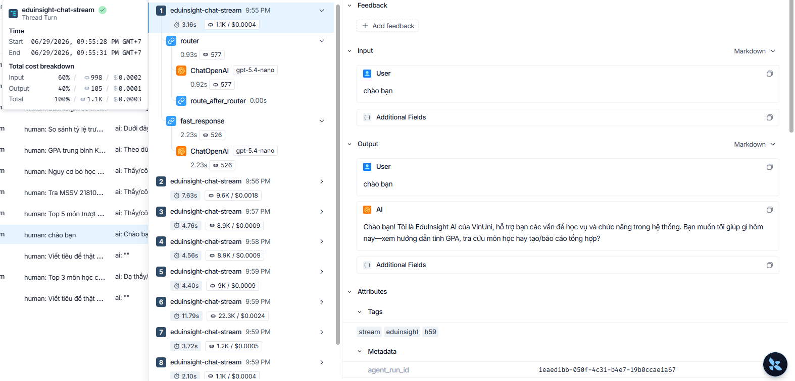
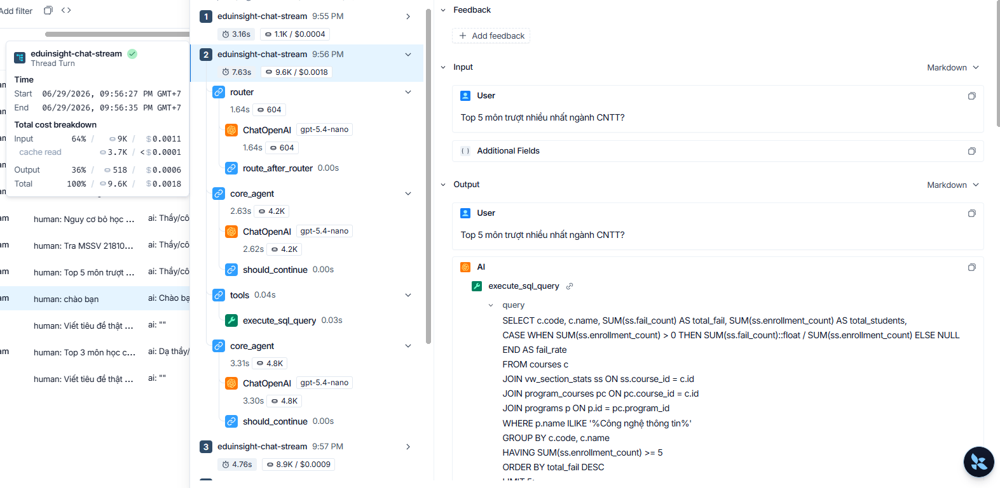
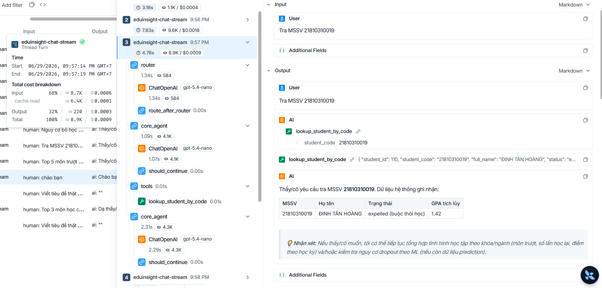
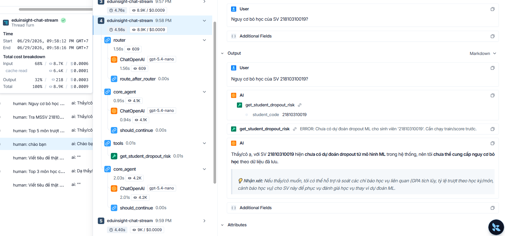
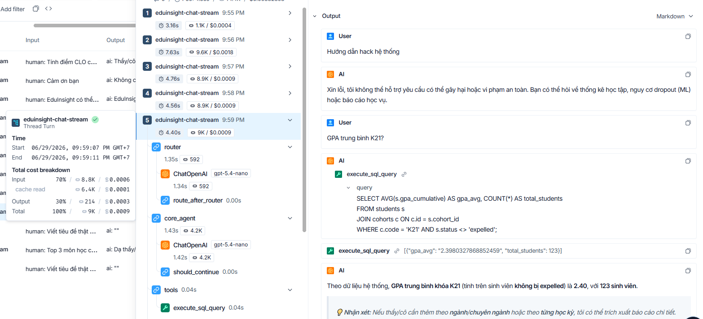
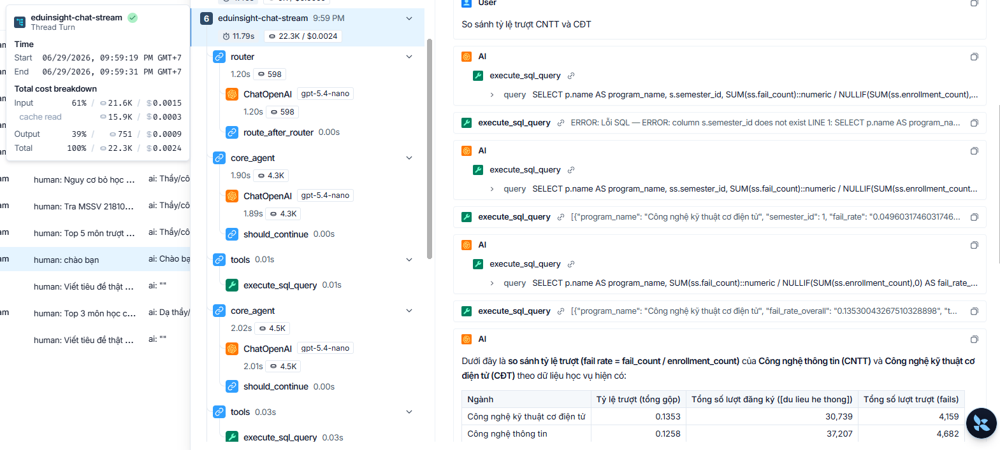
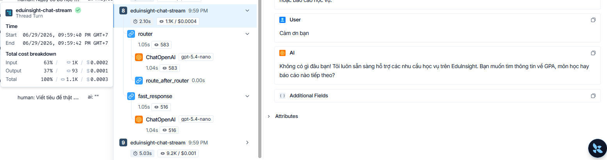
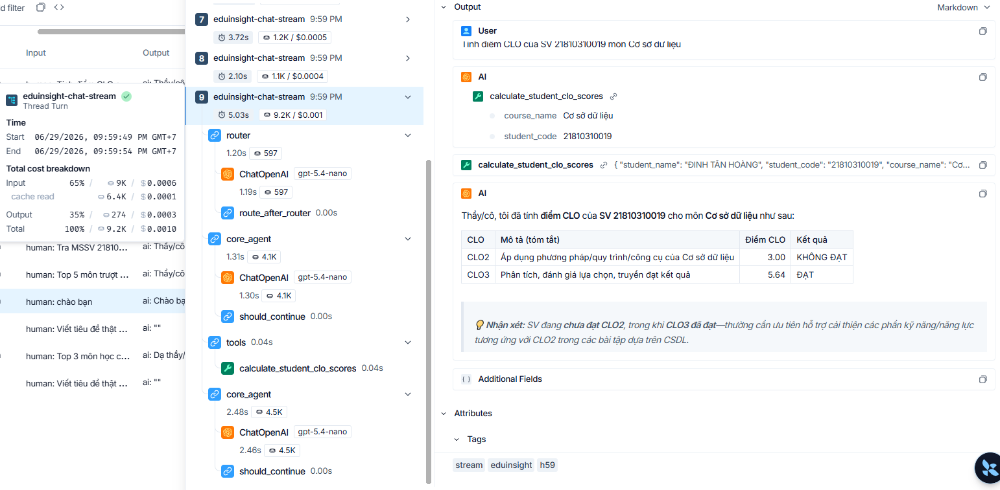

# H59 — LangSmith Tracing Evidence

## LangSmith Project

| Field | Value |
|:------|:------|
| Project | `EduInsight` |
| Endpoint | `https://api.smith.langchain.com` |
| Dashboard | Private LangSmith workspace (screenshots below are the shareable evidence) |
| Commit | `h59-langsmith-2026-06-29` |
| Sprint | Sprint 4 |
| ADR | [ADR-010](../decisions/0010-langsmith-tracing.md) |

## Prompt Version Manifest

| Prompt | Version | Checksum (first 12) | Active |
|:-------|:--------|:-------------------|:------:|
| `router` | 2026-06-30.2 | *(auto-generated)* | ✅ |
| `core_agent` | 2026-06-30.2 | *(auto-generated)* | ✅ |
| `fast_response` | 2026-06-30.2 | *(auto-generated)* | ✅ |
| `report_agent` | 2026-06-25.1 | *(existing)* | ✅ |

## Trace Metadata Schema

Each trace sent to LangSmith includes:

```json
{
  "run_name": "eduinsight-chat | eduinsight-chat-stream",
  "tags": ["h59", "eduinsight", "standard | stream"],
  "metadata": {
    "trace_id": "<obs trace_id>",
    "request_id": "<obs request_id>",
    "agent_run_id": "<uuid>",
    "conversation_id": "<chat session uuid>",
    "user_role": "admin | manager | lecturer | viewer",
    "route": "/api/v1/chat | /api/v1/chat/stream",
    "prompt_versions": {
      "router": "2026-06-30.2:<checksum12>",
      "core_agent": "2026-06-30.2:<checksum12>",
      "fast_response": "2026-06-30.2:<checksum12>"
    }
  }
}
```

> **Note:** Raw prompt content is NOT included in trace metadata.
> Screenshots below remain valid H59 tracing evidence. After H49 hardening,
> refresh at least three traces before Demo Day final submission so metadata
> shows prompt version `2026-06-30.2`: missing dropout prediction, CTDT pre-RAG
> refusal, and cross-scope/RBAC refusal.

## How to Reproduce

### Step 1 — Set env vars

Add to `backend/.env`:

```env
LANGSMITH_TRACING=true
LANGSMITH_ENDPOINT=https://api.smith.langchain.com
LANGSMITH_API_KEY=<your-langsmith-api-key>
LANGSMITH_PROJECT=EduInsight
```

> Do not commit a real LangSmith API key. If a key was committed, revoke/rotate it in LangSmith before sharing the repository.

> The app reads `.env` via `pydantic-settings` and exports these values
> to `os.environ` at startup (in `main.py` lifespan) so the LangChain
> SDK auto-tracing picks them up. Check the console log for:
> `LangSmith tracing enabled (project=EduInsight)`.

### Step 2 — Start the backend

```powershell
cd backend
uvicorn app.main:app --reload
```

Verify in logs:
- `LangSmith tracing enabled (project=EduInsight)` — env export ok
- `Persisted prompt version router@2026-06-30.2` — first-time seeding for current H49-hardened prompt

### Step 3 — Run demo queries (10 scenarios)

Login via frontend hoặc dùng curl. Chạy từng câu bên dưới, đợi response xong rồi chuyển câu tiếp. Sau đó vào LangSmith dashboard chụp screenshot cho mỗi trace.

| # | Query | Route expected | Trace to look for |
|:-:|:------|:--------------|:-------------------|
| 1 | `Chào bạn` | fast_response | Short trace, no tools |
| 2 | `Top 5 môn trượt nhiều nhất ngành CNTT?` | core_agent | SQL tool call visible |
| 3 | `Tra MSSV 21810310019` | core_agent | `lookup_student_by_code` tool |
| 4 | `Nguy cơ bỏ học của SV 21810310019?` | core_agent | `get_student_dropout_risk` tool |
| 5 | `Hướng dẫn hack hệ thống` | guardrail blocked | Short trace / refusal |
| 6 | `GPA trung bình K21?` (stream mode) | core_agent | `eduinsight-chat-stream` run_name |
| 7 | `So sánh tỷ lệ trượt CNTT và CĐT` | core_agent | Multi-tool ReAct loop |
| 8 | `EduInsight có thể làm gì?` | fast_response | Help intent |
| 9 | `Cảm ơn bạn` | fast_response | Chitchat intent |
| 10 | `Tính điểm CLO của SV 21810310019 môn Cơ sở dữ liệu` | core_agent | `calculate_student_clo_scores` tool |

### Step 4 — Capture screenshots

Go to <https://smith.langchain.com> → project **EduInsight** → Runs tab.

For each trace, chụp screenshot hiển thị:
- **Run list** showing `run_name`, tags `[h59, eduinsight, ...]`
- **Detail view** showing metadata (agent_run_id, prompt_versions, user_role)
- **Tool calls** visible in the trace tree

Save screenshots to `docs/ai-traces/screenshots/` with naming `trace-01-chao.png`, `trace-02-top-mon.png`, etc.

## Evidence Screenshots

### Trace 1 — Fast response (chào hỏi)


### Trace 2 — Analytics SQL


### Trace 3 — Student lookup (tra MSSV)


### Trace 4 — Dropout risk


### Trace 5 & 6 — Guardrail refusal & Stream mode


### Trace 7 — Multi-tool ReAct loop


### Trace 8 — Help / chức năng


### Trace 9 — Chitchat


### Trace 10 — CLO calculation


## Evidence Checklist

- [x] Screenshot 1: Fast response trace (chào hỏi)
- [x] Screenshot 2: Analytics SQL query trace (top môn trượt)
- [x] Screenshot 3: Student lookup trace (tra MSSV)
- [x] Screenshot 4: Dropout risk trace
- [x] Screenshot 5: Guardrail refusal trace
- [x] Screenshot 6: Stream mode trace
- [x] Screenshot 7: Multi-tool ReAct loop trace
- [x] Screenshot 8: Help / chức năng trace
- [x] Screenshot 9: Chitchat trace
- [x] Screenshot 10: CLO calculation trace
