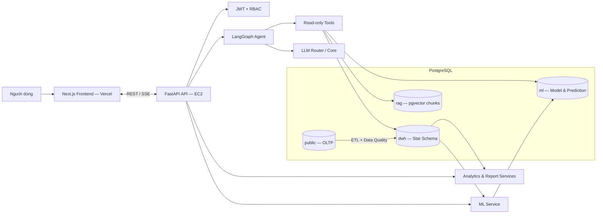
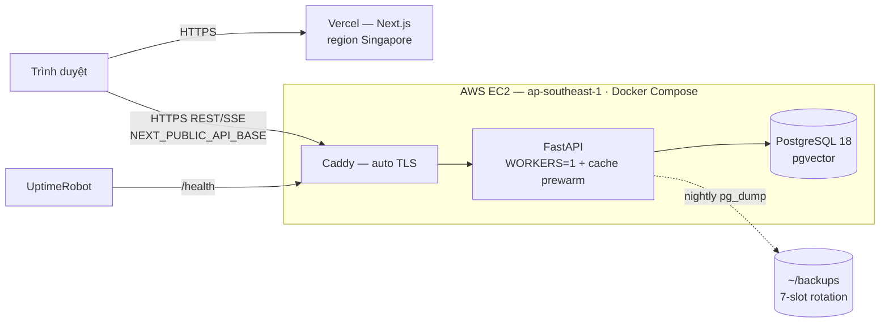

# Kiến trúc hệ thống — EduInsight

> Deliverable #3 (Architecture Diagram) cho Demo Day. Bản chi tiết: [10-References/SystemArchitecture.md](10-References/SystemArchitecture.md) · Kiến trúc ML/DWH: [10-References/ML_DWH_Architecture.md](10-References/ML_DWH_Architecture.md) · ADR: [decisions/](decisions/README.md).

## 1. Tổng quan

EduInsight là nền tảng AI Learning Analytics nhiều tầng: **Frontend → Backend API → (LangGraph Agent · Analytics/Report · ML)** trên một PostgreSQL tách schema theo workload (OLTP / DWH / ML). Nguyên tắc cốt lõi: **LLM chỉ đọc và diễn giải** dữ liệu DWH/ML đã tính sẵn, **không tự sinh xác suất** pass/trượt/dropout.



## 2. Các thành phần

| Thành phần | Công nghệ | Trách nhiệm |
|:--|:--|:--|
| **Frontend** | Next.js 16, React 19, Tailwind 4, shadcn/ui, Recharts | Dashboard đa cấp, Academic Tree, Chat UI (SSE), Report Center |
| **Backend API** | FastAPI, Pydantic v2, SQLAlchemy 2 async | REST/SSE endpoints, xác thực RBAC cuối cùng, điều phối Agent/Analytics/ML |
| **LangGraph Agent** | LangGraph, LangChain Core, ReAct | Định tuyến câu hỏi, gọi tool read-only, RAG CTĐT, xử lý lỗi 3 tầng |
| **Analytics / Report** | ETL idempotent, Metric Engine | DWH star schema, KPI/health score, report snapshot có version |
| **ML Service** | scikit-learn, XGBoost | Train/evaluate/score dropout & pass-risk; lưu model run + prediction có version |
| **Database** | PostgreSQL 18, pgvector, Alembic | 4 schema: `public` (OLTP), `dwh`, `ml`, `rag` |

## 3. Luồng dữ liệu

```text
Dữ liệu học vụ vận hành (public/OLTP)
  → ETL + kiểm tra chất lượng → Data Warehouse (dwh, star schema)
  → mô hình ML chấm điểm rủi ro (ml)
  → dashboard / Academic Tree / báo cáo (Analytics)
  → AI Agent giải thích bằng ngôn ngữ tự nhiên (read-only tools)
  → người phụ trách ra quyết định
```

- **Chat/Agent:** người dùng hỏi → API (JWT+RBAC scope) → Agent định tuyến → tool đọc DWH/ML/RAG (SQL chỉ `SELECT`, read-only, giới hạn dòng) → LLM diễn giải → stream SSE về UI.
- **Prediction:** ETL nạp DWH → ML train/score theo batch → ghi `ml.predictions` (version, thời điểm, yếu tố đóng góp) → Agent/UI chỉ đọc kết quả.
- **RAG CTĐT:** PDF chương trình đào tạo → chunk + embedding → `rag.ctdt_chunks` (pgvector) → tool `search_ctdt_program_info` trả lời kèm citation file/trang/section.

## 4. Tách schema theo workload

| Schema | Trách nhiệm |
|:--|:--|
| `public` | OLTP: người dùng, cơ cấu đào tạo, sinh viên, lớp, điểm, CLO/PLO, chat, báo cáo |
| `dwh` | Dimensions, facts, dữ liệu lịch sử, ETL run, data-quality result |
| `ml` | Model run, prediction theo enrollment/sinh viên, kết quả tổng hợp |
| `rag` | CTĐT chunks + vector index (pgvector) |

## 5. Kiến trúc triển khai (production)



- **Frontend:** Vercel (Singapore) — [c2-app-056.vercel.app](https://c2-app-056.vercel.app).
- **Backend:** AWS EC2 Singapore, Docker Compose (pgvector pg18 + FastAPI + Caddy TLS) — [edu-insight.duckdns.org](https://edu-insight.duckdns.org). Runbook: [../deploy/README.md](../deploy/README.md) · ADR-0012.
- **Độ tin cậy:** cache dashboard dùng chung + prewarm (0.3–0.5s từ VN); backup Postgres hằng đêm (H71); giám sát UptimeRobot; CI Ruff+pytest / ESLint+Vitest.

## 6. Quyết định kiến trúc quan trọng (ADR)

Đọc [decisions/README.md](decisions/README.md) — nổi bật: ranh giới ML/LLM (Agent không tự sinh xác suất), DWH tách khỏi bảng CRUD, pgvector cho RAG CTĐT, hosting AWS EC2 (ADR-0012). Mọi thay đổi database / API contract / hành vi Agent phải đọc ADR liên quan trước.
